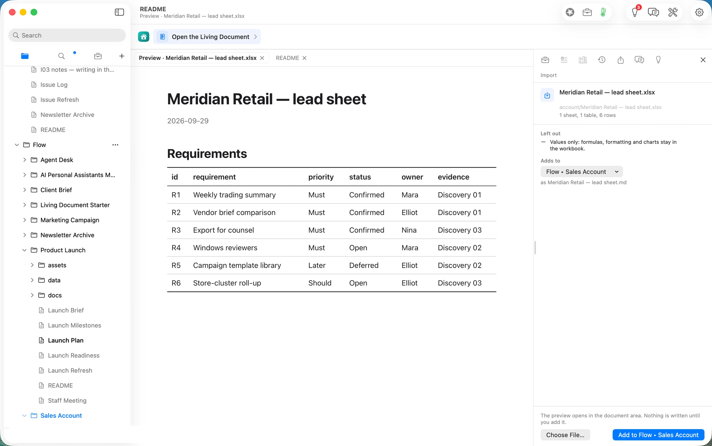
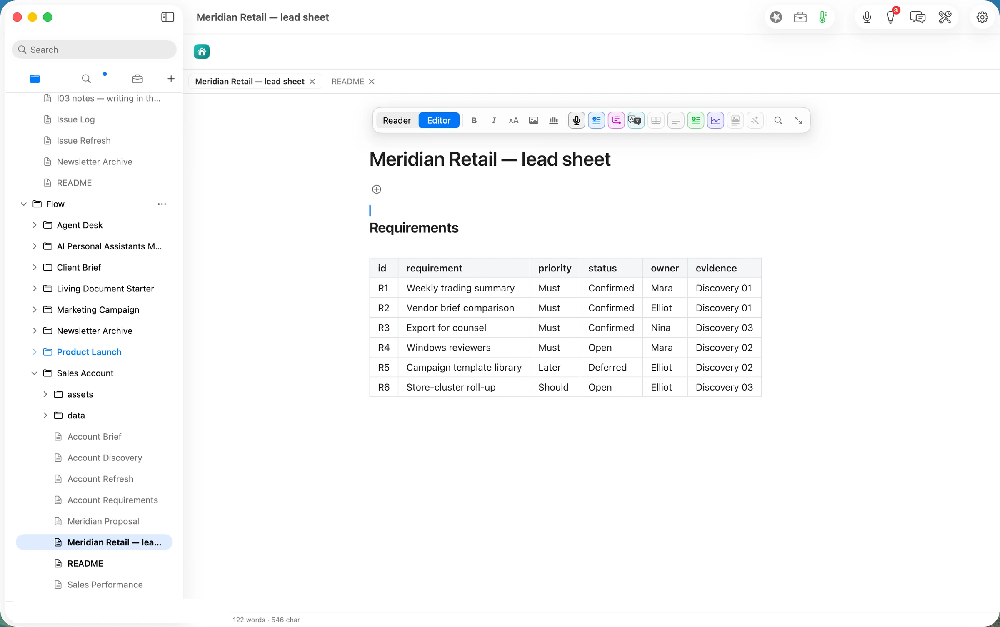
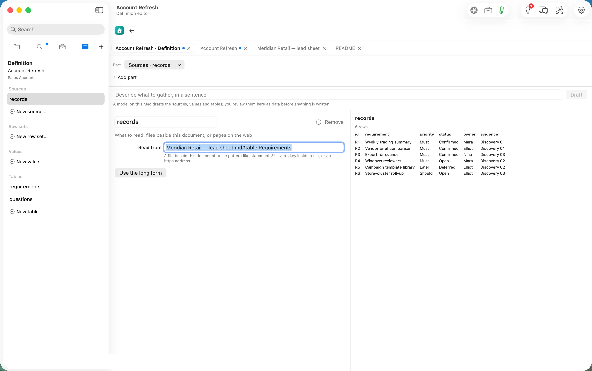
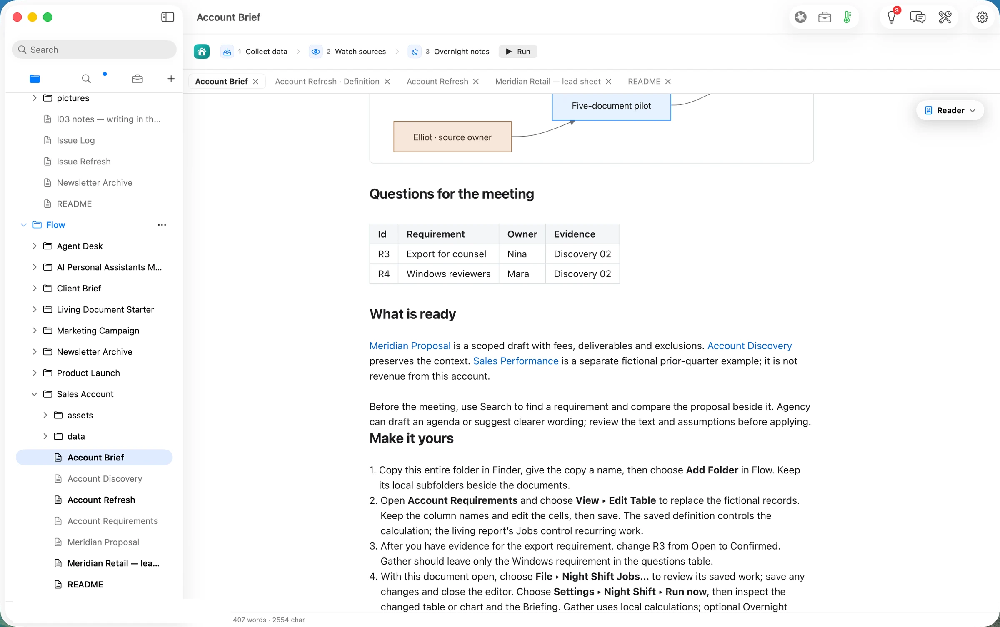
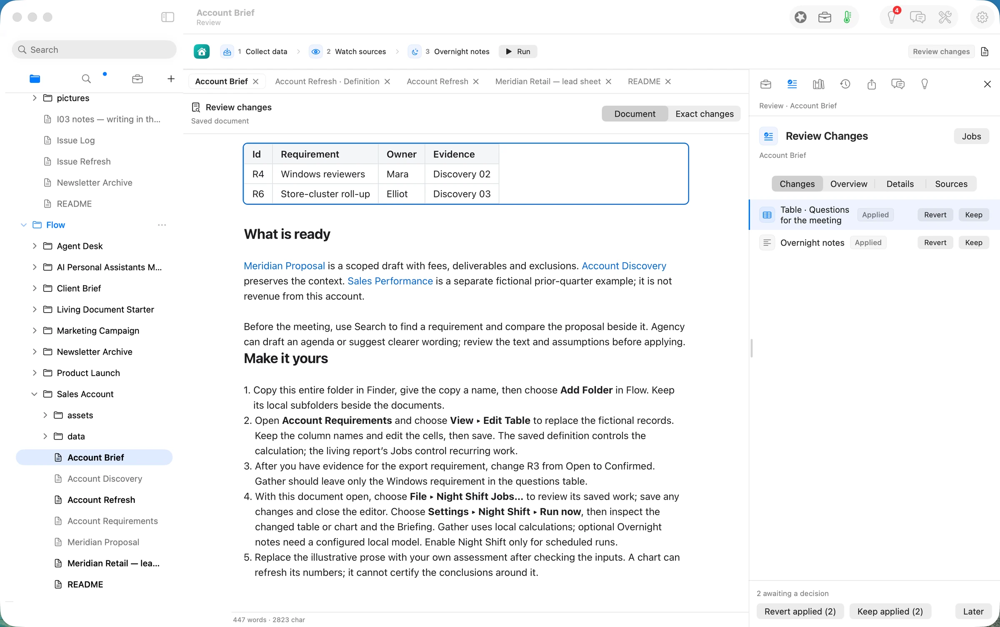
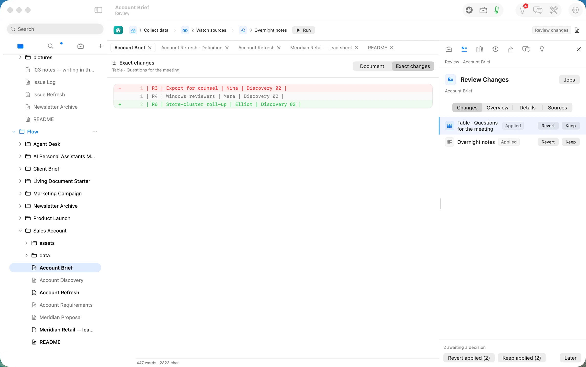
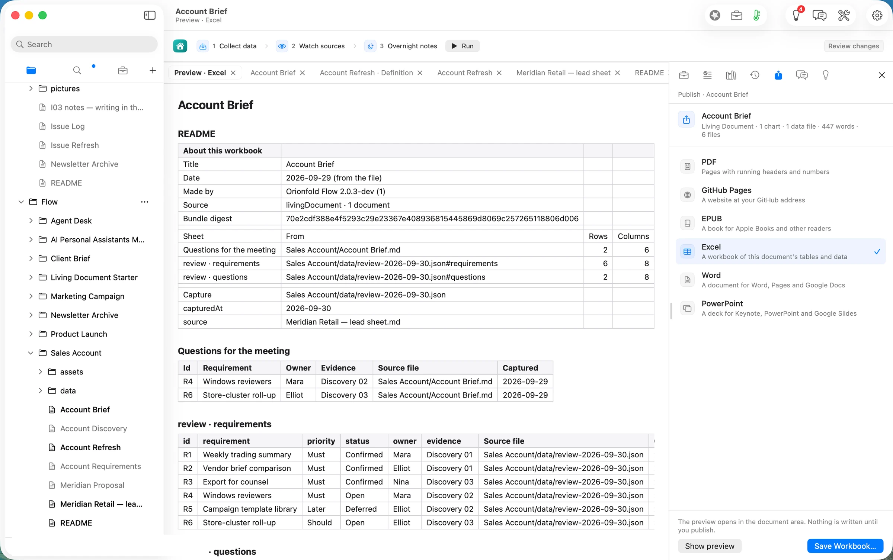
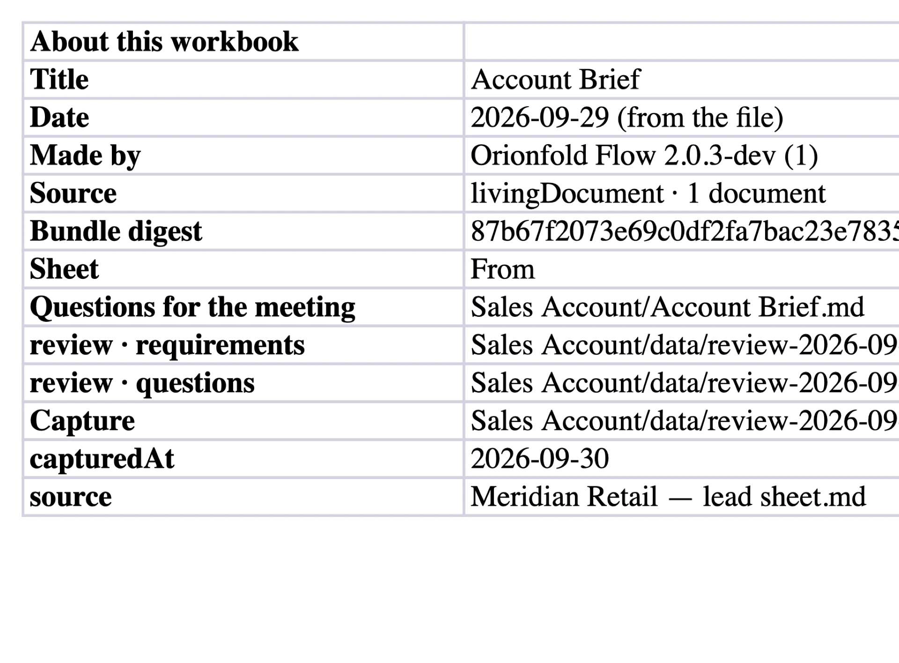

## The press release we would want to write

**Sellers can now keep an account brief current from the lead sheet they already maintain, and send a workbook in which every row says where it came from.** Orionfold Flow imports the Excel lead sheet as an editable table and re-runs the brief's Jobs from it. The brief's "Questions for the meeting" shows only what is still open, a model on the laptop writes a short note on the change, and you keep or revert each change. Publish writes an Excel workbook with a README sheet that names the source file and capture of every sheet. In our walk the refresh took about 17 seconds end to end. The table was rebuilt in under a second, the model used 183 tokens, and the model cost was $0.00.

> "Before a call I don't want to reread discovery notes. I want the two things still open, and proof of where each came from."
> — *Illustrative quote, not from a customer.*

## The answer first

The brief is a document that refreshes from your data, not a page you rewrite before each call.

1. **The lead sheet comes in as a table.** File ▸ Import… turned a 6-row Excel sheet into an editable Markdown table in about a second. It kept the values and said what it left out: formulas, formatting and charts.
2. **Run Jobs redraws the brief from it.** One press ran the brief's three Jobs. They rebuilt the requirements and meeting questions from the sheet, checked the watched sources, and wrote an overnight note on a model on this Mac. The question that had been answered (R3, export for counsel) dropped out, and the new open one (R6, store-cluster roll-up) came in. Both changes waited for a Keep or a Revert, with the exact diff one click away.
3. **The workbook keeps its sources.** Publish ▸ Excel wrote `Account Brief.xlsx`. It opens with a README sheet naming each sheet's source file, row and column counts, and the capture it came from, and every data row carries its source file and capture date.

## The job

**The job:** before each call with an account, know what has changed since the last one: which needs are confirmed, which questions are still open, and who owns each. Then hand a colleague or the customer a sheet they can check.

**The usual way:** update the lead sheet, then re-read the discovery notes and re-type the open questions into a call-prep doc, and paste a table into an email. We did not time the usual way, so we make no claim about it.

**The Flow way:** the path *Account brief before the call*, in three steps: import the lead sheet, Run Jobs, publish Excel.

## Step one: import the lead sheet

The Home screen's Clients filter shows the path. Opening it makes a copy of the Sales Account folder that is yours to change (shot 02). File ▸ Import… took the lead sheet `Meridian Retail — lead sheet.xlsx`. Since the last call, R3 (export for counsel) had moved from Open to Confirmed and a new need, R6 (store-cluster roll-up), had been added.

The preview showed the sheet as it would land before anything was written: one sheet, one table, six rows. Under *Left out* it said "Values only: formulas, formatting and charts stay in the workbook." *Add to Flow ▸ Sales Account* wrote the table as `Meridian Retail — lead sheet.md` about a second later (21:54:55 PDT), with its own history record, and opened it in the editor.

**One-time setup, done once per account.** The brief's refresh is a saved definition, *Account Refresh*. File ▸ Edit Definition… opens it as data: sources, row sets, tables, and a live preview of the rows each part produces. Pointing its one source at the imported sheet (`Meridian Retail — lead sheet.md#table:Requirements`) changed the preview from 5 rows to 6 before anything was saved. The definition uses no model and no web service.

## Step two: Run Jobs

Account Brief shows its Jobs in the row above the document: *1 Collect data*, *2 Watch sources*, *3 Overnight notes*, and *Run*. Before the run, the brief's "Questions for the meeting" listed R3 and R4.

Run was pressed at 21:58:05.9 PDT. By the receipts:

- **Collect data** wrote `data/review-*.json` from the lead sheet 0.8 s later. It holds six requirements and two open questions, R4 and R6.
- **Watch sources** checked the brief's watched files.
- **Overnight notes** ran on Flow Runtime with `qwen3.8-27b-4bit` on this Mac: 127 tokens in, 56 out. Flow traced all 4 numbers in the note to the data before writing it. The last write landed at 21:58:22.9, about 17 s after the press.

A banner then said *Document review ready · 2 awaiting a decision · Run progress 4 of 4 completed* (shot 08).

The review shows each change in the document, marked, and *Exact changes* shows the diff line by line: R3 out, R4 unchanged, R6 in.

Both changes were kept (22:03:43 PDT). The overnight note reads: *"The document lists two questions for the meeting. The first question, labeled R4, concerns Windows reviewers and is assigned to Mara for Discovery 02. The second question, labeled R6, addresses the Store-cluster roll-up and is assigned to Elliot for Discovery 03."* It is accurate to the table, but the phrasing is awkward: the evidence column is a meeting reference, not an assignment. That is why the note waits for a person too.

## Step three: publish Excel with every source kept

File ▸ Publish… opens the Publish task beside the document. Choosing Excel previews the workbook in the document area before anything is written.

*Save Workbook…* wrote `Account Brief.xlsx` (8,739 bytes) at 22:07:00 PDT, about a second after Save. Read back, it has four sheets:

- **README**: title, date, the Flow version that made it, a bundle digest, and one line per sheet with its source path, rows and columns. It also names the capture file and its `source`, the lead sheet.
- **Questions for the meeting**: R4 and R6, from `Sales Account/Account Brief.md`.
- **review · requirements**: all six requirements.
- **review · questions**: the two open ones.

Every data row carries a *Source file* and a *Captured* column, so a colleague who opens the sheet in Excel or Numbers can see where each row came from without Flow.

## The deliverable

- **The brief, current.** `Account Brief.md` in the account's folder, with the meeting questions refreshed from the lead sheet, the overnight note, and the record of what ran (`.flow-receipts`) and what was decided (`.flow-review`) beside it.
- **The workbook.** `Account Brief.xlsx`: four sheets, every row sourced, ready to attach to a follow-up.
- **The inputs, kept.** The imported lead sheet stays a table in the folder. The next call starts from the same place.

## What it costs, measured

| | Machine time | Tokens in / out | Model cost |
|---|---|---|---|
| Import the lead sheet | ~1 s | none | $0.00 |
| Collect data (the saved definition) | 0.8 s | none (no model) | $0.00 |
| Overnight notes (qwen3.8-27b-4bit on this Mac) | ~16 s | 127 / 56 | $0.00 |
| Publish Excel | ~1 s | none | $0.00 |
| **Same tokens on Claude Opus 5.5** ($4 / $20 per M) | | | **$0.0016** |
| **Same tokens on Claude Sonnet 5** ($2 / $10 per M) | | | **$0.0008** |

The honest reading: this path is barely an AI path at all. The refresh that matters, the questions table, is a saved calculation that costs nothing and gives the same answer every time. The model writes one short note. The reasons to work this way are that the brief is always rebuilt from the sheet you already keep, that every change waits for you, and that the workbook you send carries its own sources.

## FAQ

**Does Run Jobs read the account's website?** Not in this path as shipped. The Guide's step says Run Jobs "gathers the account's pages". The saved definition here reads only the records in the folder and uses no web service. A definition can read an `https` address as a source, but this one does not, and we did not test one.

**Do I have to edit the definition every time?** No. It is a one-time change per account: point the source at the imported sheet once. Whether a later import of the same file name replaces the table in place was not tested in this walk.

**Does it connect to my CRM?** No. The input is the Excel lead sheet you export or keep yourself.

**What leaves my Mac?** In this walk, nothing. The calculation is local, and the note was written by a model on the laptop. Keep *this Mac first* in Smart Routing to stay that way.

**What does it cost?** Reading, writing, searching, organising and exporting are free forever. Jobs are Flow Pro, Import is Flow Import, and the Excel workbook is Flow Publish. Flow Pro includes 10 Pro Days to start, then costs $10 a month or $96 a year.

## Evidence

| Claim | Value | Label | Source |
|---|---|---|---|
| Input | `Meridian Retail — lead sheet.xlsx`, 5,309 B, sheet *Requirements*, 6 rows (R3 Confirmed, R6 new vs the Guide's sample) | verified | `articles/_inputs/generate.py` `sales_account()`; `ls -la ~/flow-demo/inputs/09-sales-account/` 20:13 PDT |
| Path copy made | `~/flow-staging/Flow/Sales Account/` created at 21:50 PDT from the Home card | verified | `ls` before and after the click; shot 02 |
| Import preview | "1 sheet, 1 table, 6 rows"; Left out: values only | verified | shot 04 |
| Import written | `Meridian Retail — lead sheet.md` 594 B at 21:54:55 PDT; click at 21:54:54; `document.change` receipt 04:54:55.271Z | verified | `stat`; `.flow-receipts` |
| Definition preview | 5 rows → 6 rows on changing the source | verified | shots from 21:56 (06) and before |
| Definition saved | `records: "Meridian Retail — lead sheet.md#table:Requirements"` at 21:57:04 PDT | verified | `sed -n 1,16p "Account Refresh.md"` |
| Run pressed | 21:58:05.9 PDT | verified | `date` beside `axpress ribbon-run-jobs` |
| Collect data | `nightshift.gather` 04:58:06.680Z (0.8 s); capture 6 requirements, questions R4 + R6, `source` the lead sheet | verified | receipts; `review-2026-09-30.json` read back |
| Overnight notes | `model.route` 04:58:22.190Z; flow-runtime, `qwen3.8-27b-4bit`, localMachine, 127 / 56 tokens; `nightshift.notes` numbers 4, traced 4 | verified | `Account Brief.md.flow-receipts` |
| Refresh end to end | last write 04:58:22.949Z, ≈17 s after the press | verified | receipts |
| Review | "2 awaiting a decision · 4 of 4 completed"; diff R3 −, R6 + | verified | shots 08–10 |
| Kept | 22:03:43 PDT; `.flow-review` packets empty after | verified | `date`; `cat "Account Brief.md.flow-review"` |
| Workbook | `Account Brief.xlsx` 8,739 B at 22:07:00 PDT; sheets README, Questions for the meeting, review · requirements, review · questions; Source file + Captured on every data row | verified | `stat`; openpyxl read-back 22:07 PDT; Quick Look render (shot 14) |
| Model cost | $0.00 | verified | `locality: localMachine` on the only model route |
| Cloud equivalents | Opus 5.5 $0.0016; Sonnet 5 $0.0008 | derived | `ModelPricing.swift` (Opus 5.5 $4/$20, Sonnet 5 $2/$10 per M; file last changed 2026-09-26) × 127 in / 56 out |
| Free and Pro | free forever for reading, writing, searching, organising, exporting; Pro 10 Pro Days, $10/month or $96/year; path needs Flow Pro, Import, Publish | verified | path README "Needs" (shot 02); Home Add-ons prices (shot 01 area, 21:50 PDT) |
| Re-import replaces in place | — | unknown | not tested |
| Reads the account's web pages | no, in this definition | verified | `Account Refresh.md` "uses no model or web service"; its one source is a local file |
| The usual way's time | — | assumed | not measured |
| A seller's time on the path | — | unknown | not measured for a person |
