## The press release we would want to write

**Marketers can now write a launch post where every claim is cited, and publish it in a second language, without pasting their plans into a chatbot.** Orionfold Flow imports the campaign brief and the channel results as documents on your Mac. It drafts the post with a footnote on every figure, shows you exactly what changed, and waits for your approval. Then it translates the approved post and writes a Word file and a web page from the same text. In our test, the cited draft took 48 seconds and the Spanish version 15 seconds, both on an open model running on the laptop, for a model cost of $0.00.

> "Legal used to send the launch post back asking where the 71% came from. Now the answer is the little number next to it."
> — *Illustrative quote, not from a customer.*

## The answer first

A launch post is short, and it is where a made-up number does the most damage. Flow makes the proof part of the draft, not a chase after it.

1. **The brief and the results come in as documents you can cite.** File ▸ Import read the Word brief and the Excel results into the campaign's folder, on this Mac, with no model.
2. **The draft cites every figure, and you approve the exact words.** Expand with Sources wrote 372 words from 8, with 12 footnotes to the two files. All 25 figures in it match their sources. Nothing entered the post until we ticked *I accept changes*.
3. **The second language keeps the proof.** Translate turned the approved post into Spanish in 15 seconds. It kept every figure and all 12 footnotes, and left the English untouched. Publish then wrote a Word file with real footnotes, and a web page preview, from the same Markdown.

## The job

Fieldstone Bikes (fictional) is launching a Q4 campaign: grow e-bike commuter trials in Denver and Salt Lake City by 25% between October 1 and December 15. The marketer has a one-page brief in Word, last quarter's channel results in Excel, and a note to lead with the parking math. The post has to go out in English and Spanish.

The usual way is familiar: copy figures from the workbook into the draft, hope none are transposed, and then send the English to a translator and wait. Proof is a separate chore, done after the writing, if at all. *We did not time the usual way. Any figure for it here would be our assumption.*

## Step one: open the path, bring the inputs in

Home ▸ **Campaign with proof** ▸ Open makes the marketer a copy of the path's folder, with its README and a finished example to compare against.

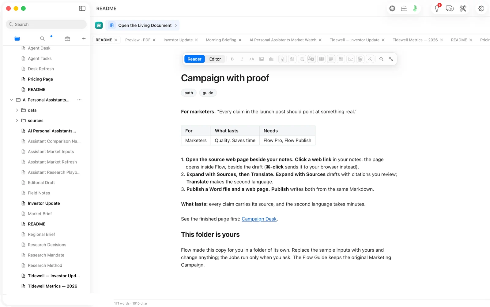

File ▸ Import read `Campaign Brief — Fieldstone Q4.docx` as 4 headings, 2 paragraphs and 5 list items. It said plainly what it left out: underline, colour and highlight in 4 passages. The preview shows the document before anything is written, and *Adds to* names the folder it will land in.

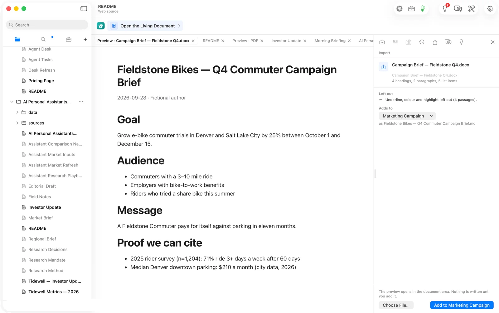

The Q3 results workbook came in as 1 sheet, 1 table, 4 rows: the four channels with trials, spend, cost per trial and conversion.

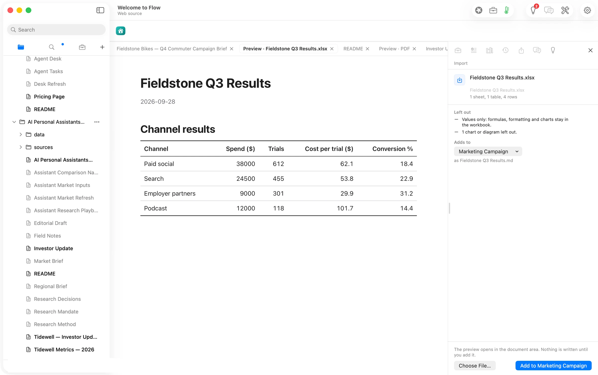

The marketer's notes link to Wikipedia's *Electric bicycle* article for background. Clicking the link opened the page inside Flow, with a Back arrow to return.

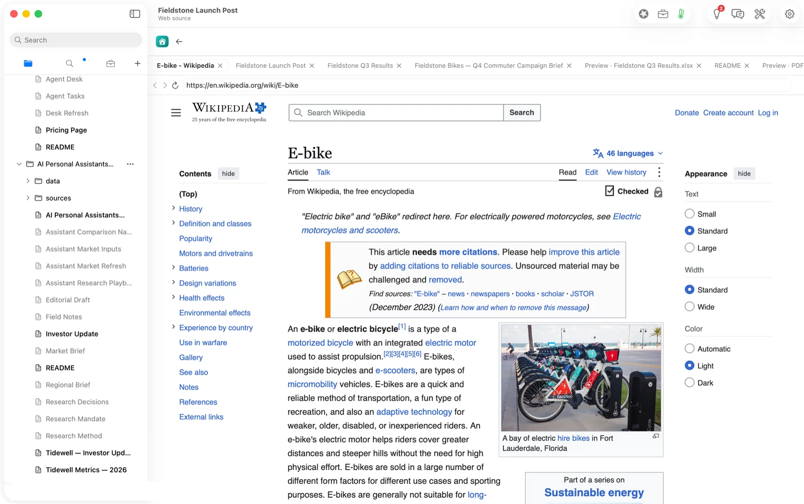

## Step two: the cited draft

We ran Expand with Sources twice. What differed is worth knowing.

**By hand** (Agency ▸ Expand with Sources on the whole document), the small on-device model had to pick its own sources. The draft was weak: it misread the survey, wrote one citation in a broken form, and replaced the Spanish placeholder section. We discarded it with one click. Nothing had touched the file.

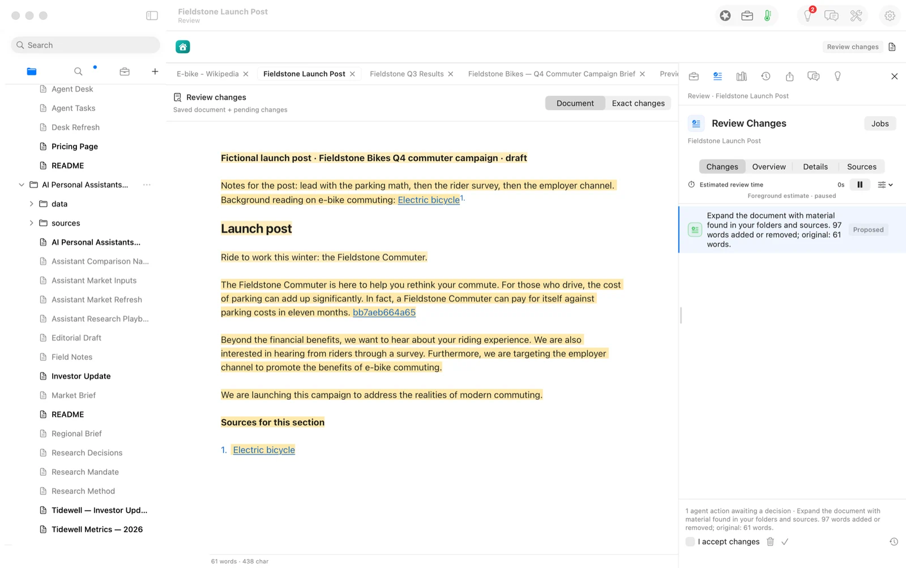

**As a Job**, the document names its section and its two sources in its own front matter. Pressing **Run** in the context row sends the draft to the larger local model with exactly those sources. It took 48 seconds. The draft went from 8 words to 372, with a footnote after each claim: `[^flow-…]` markers that point at the brief and the results file.

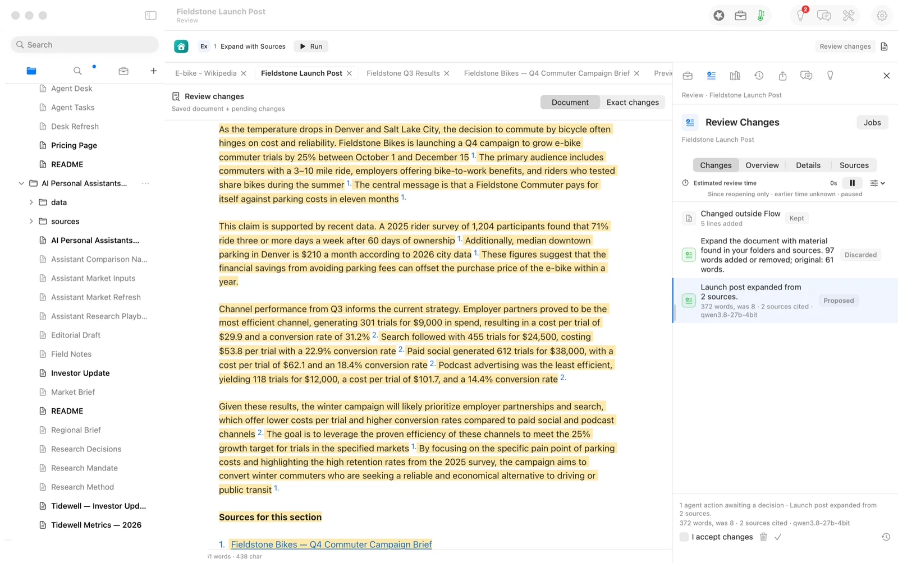

*Exact changes* shows the proposal line by line, so the marketer approves words rather than a summary of them.

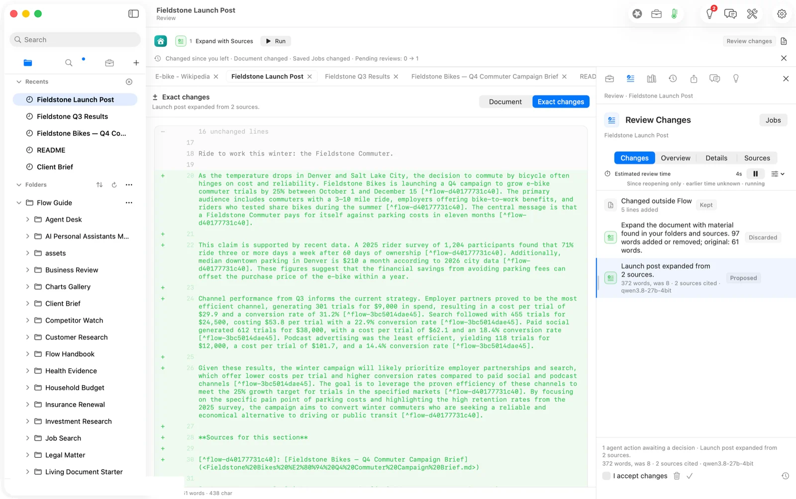

We checked every figure in the draft against the two imports: the four channels' spend ($38,000, $24,500, $9,000, $12,000), trials (612, 455, 301, 118), cost per trial ($62.1, $53.8, $29.9, $101.7) and conversion (18.4%, 22.9%, 31.2%, 14.4%), the survey's 1,204 riders, 71% and 60 days, $210 parking, the 25% goal, October 1 to December 15, the 3–10 mile ride and "eleven months". All 25 hold. Then we ticked *I accept changes* and approved it. Flow recorded three checks on the approval: no unsupported citations, the link list observed, and a human review.

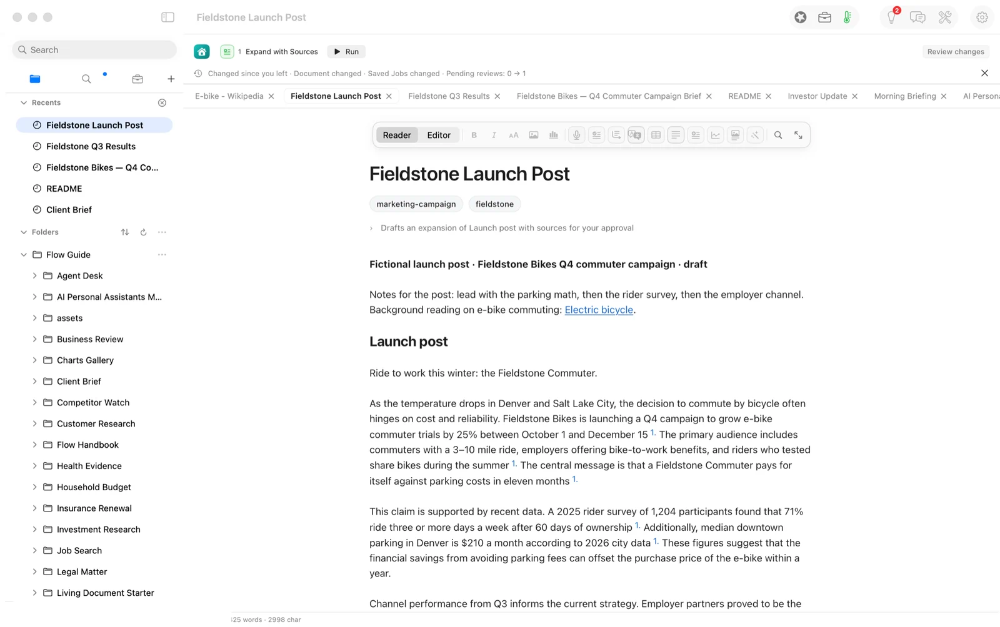

The draft is honest, but it reads more like a campaign memo than launch copy. One sentence ("can offset the purchase price of the e-bike within a year") is an inference with no footnote after it. That is what the review is for. A marketer would tighten the voice and cut or cite that line before it ships.

## Step three: the Spanish version

The notes document has a *Spanish version* section. We pasted the approved English into it, selected that copy, and chose Agency ▸ Translate ▸ Spanish.

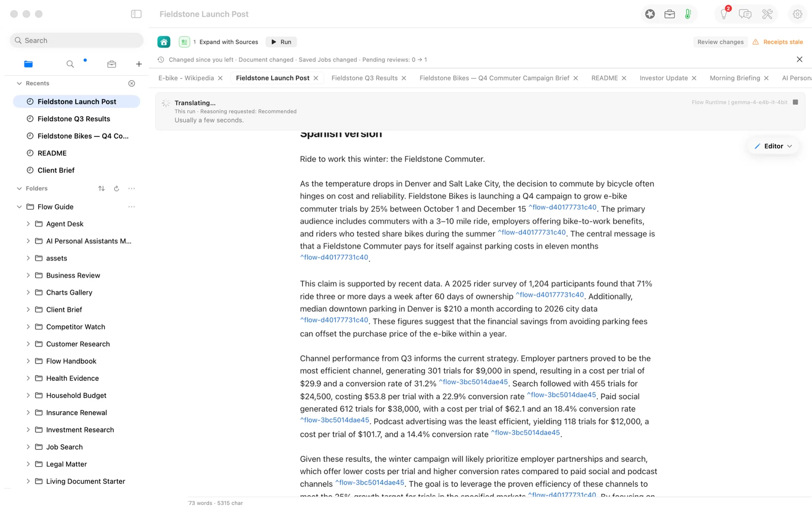

Fifteen seconds later the proposal was in Review. It changed only the selected lines: the 32 lines above were untouched, English included. Every figure came through (the only digits that moved are "Q3/Q4", written out as *tercer/cuarto trimestre*), and all 12 footnotes survived, so the Spanish cites the same sources as the English.

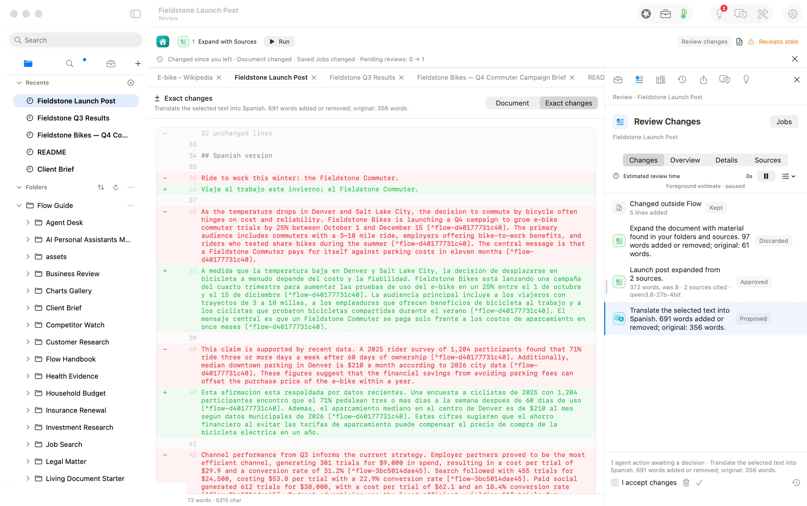

We approved it the same way. The post now holds both languages, 858 words, with 24 footnotes to two sources.

## The deliverable

File ▸ Publish writes the formats from the same Markdown. **Word** first: the preview opens as a tab, and *Save Word File…* wrote an 8.5 KB `.docx`. It holds both languages, with the citations as Word footnotes (the first mention of each source is a real footnote, and later mentions carry the same number), and no raw markers anywhere.

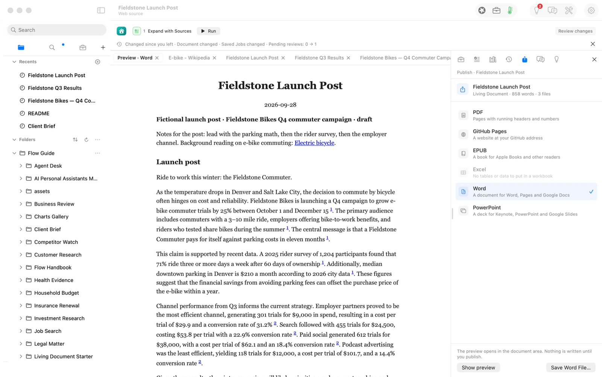

**GitHub Pages** next. *Show preview* renders the web page in the Report theme with a sidebar, footnotes linked. Publishing needs a repository name, and we did not publish: this is a preview, not a live site.

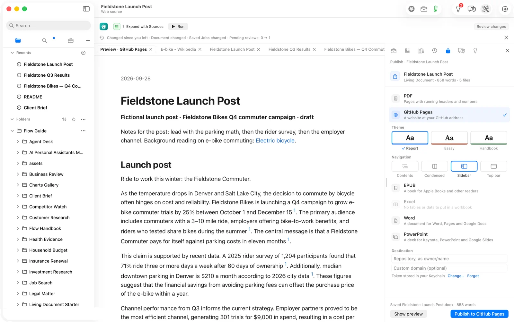

## What it costs, measured

| | Machine time | Tokens in / out | Model cost |
|---|---|---|---|
| Import brief and results (Flow's reader) | seconds | none | $0.00 |
| Expand by hand (discarded) | ~8 s | 2,649 / 220 | $0.00 |
| Expand as a Job: the cited draft | 48 s | 962 / 605 | $0.00 |
| Translate to Spanish | 15 s | 743 / 806 | $0.00 |
| **Same tokens on Claude Opus 5.5** ($4 / $20 per M) | | 4,354 / 1,631 | **$0.050** |
| **Same tokens on Claude Sonnet 5** ($2 / $10 per M) | | | **$0.025** |

The honest reading: the open model saved a few cents. That is not why a marketer runs it locally. The brief is an unreleased campaign plan, and it never left the laptop. Re-runs are free, so a weak draft costs one click to discard, which is how we used the by-hand attempt.

## FAQ

**Does Flow invent the numbers?** It drafts from the files you name, and every figure carries a footnote to one of them. You approve the exact words, and the check that matters is still yours: we compared every figure against the imports, and they held. The one uncited sentence is the kind of line a review should catch.

**Why run it as a Job instead of by hand?** A Job names its sources, so the draft comes from those files and not from whatever the model picks. In our walk the Job's draft was the one worth keeping.

**Is the translation good enough to ship?** It was faithful: the figures and footnotes all came through, and the Spanish reads naturally. A native speaker should still review launch copy. For example, it kept "1,204" where Spanish style writes "1.204".

**Can I use a cloud model?** Yes. Flow names the model and the estimated price before a hosted run. For this post that would have been two to five cents.

**What does it need?** Flow Pro, with Flow Import and Flow Publish: $10 a month or $96 a year each. Markdown documents are never part of a plan.

## Evidence

| Claim | Value | Label | Source |
|---|---|---|---|
| Brief import | 4 headings, 2 paragraphs, 5 list items; underline/colour/highlight left out (4 passages) | verified | Import task, 20:49:53 PDT; shot 03 |
| Results import | 1 sheet, 1 table, 4 rows | verified | Import task, 20:50:24 PDT; shot 04 |
| Expand by hand | gemma-4-e4b-it-4bit, 2,649 / 220 tokens, on this Mac; discarded | verified | `model.route` 03:52:10.5Z |
| Expand as a Job | Run 20:58:43 → draft 20:59:31 (48 s); qwen3.8-27b-4bit, 268/54 + 694/551 tokens | verified | `model.route` 03:59:31.4Z (both entries) |
| Draft size and citations | 372 words (was 8), 2 sources cited, 12 footnotes | verified | Review row (shot 06); proposal text |
| Figures match sources | 25 of 25: spend, trials, cost per trial, conversion for 4 channels; n=1,204; 71%; 60 days; $210; 25%; Oct 1–Dec 15; 3–10 miles; eleven months | verified | read against `Fieldstone Q3 Results.md` and the imported brief, 21:40 PDT |
| Approval checks | unsupported-citations passed, reference-freshness passed, human-review passed | verified | `guardrail.assessment` 04:31:03.8Z |
| Translate | pressed 21:34:19 PDT → receipt 21:34:33.8 (≈15 s); gemma-4-e4b-it-4bit, 743 / 806 tokens | verified | `model.route` 04:34:33.8Z |
| Translation scope | only the selected lines changed; 32 lines above unchanged | verified | Exact changes (shot 11); `readScope` from 3208 |
| Figures and footnotes survive | every number identical except Q3/Q4 written out; 12 of 12 footnotes | verified | script comparing digit runs and `[^flow-` counts, English vs Spanish |
| Translation approved | 858 words after | verified | `guardrail.assessment` 04:35:21.4Z; Publish header |
| Word file | 8,529 B; both languages; 2 footnotes + repeat references; no raw markers | verified | `ls -la` 21:38; `word/document.xml` and `footnotes.xml` read |
| Pages preview, not published | Destination empty; Publish not pressed | verified | shot 13 |
| Model cost | $0.00 | verified | local route; no metered provider used |
| Cloud equivalents | Opus 5.5 $0.050; Sonnet 5 $0.025 | derived | `ModelPricing.swift` v4 (verified 2026-09-22) × 4,354 in / 1,631 out |
| Price of Pro and add-ons | $10/month or $96/year each | verified | Home ▸ Add-ons (article 6, shot 01) |
| The usual way's time | — | assumed | not measured |
| Human review time | — | unknown | not measured for a person |
