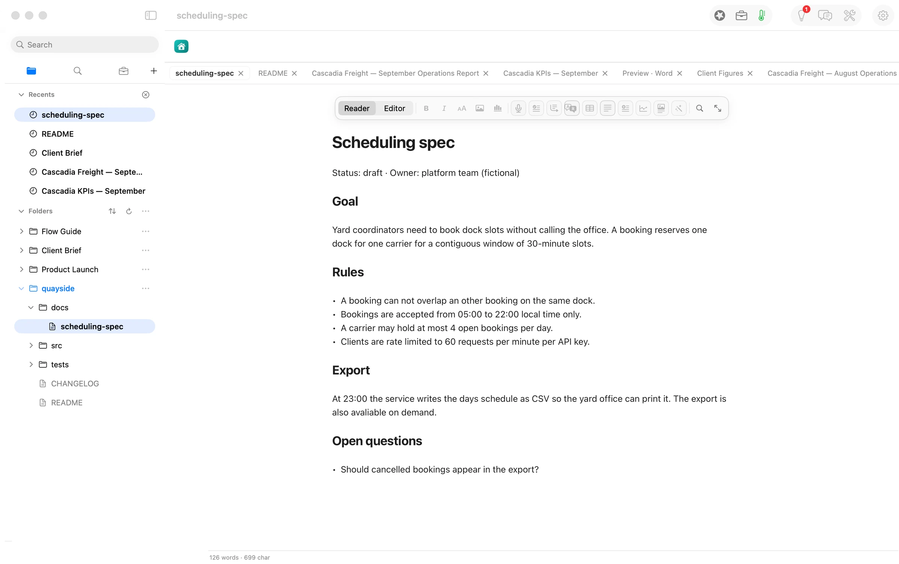
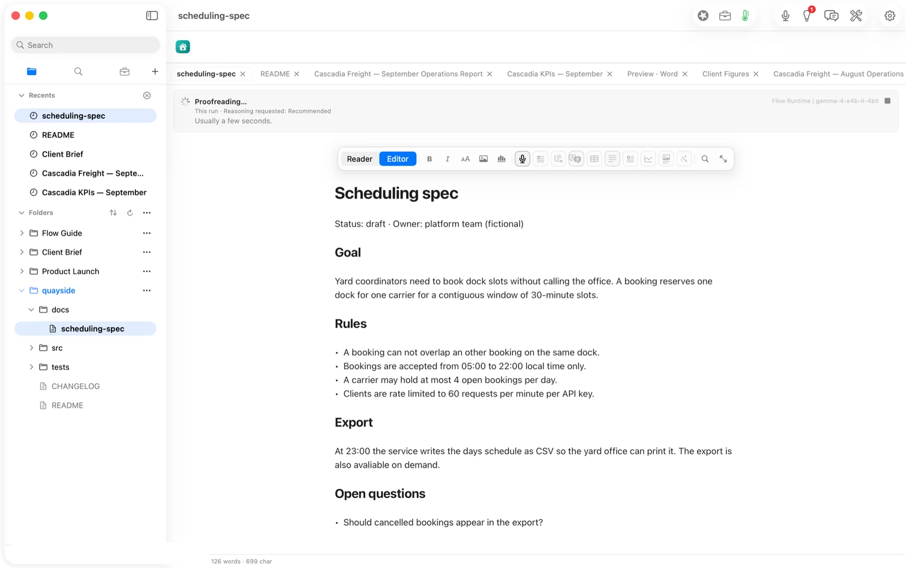
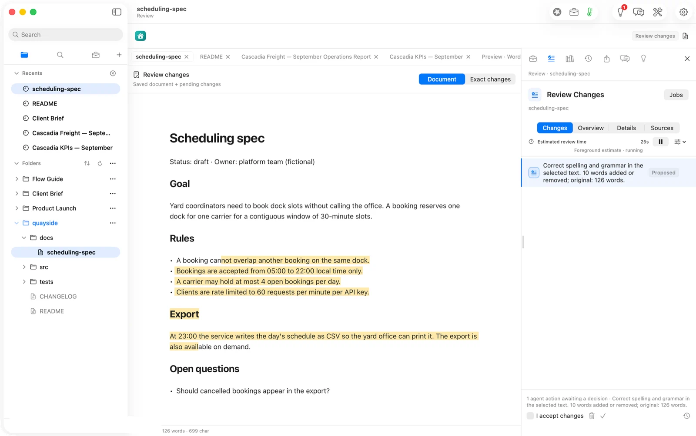
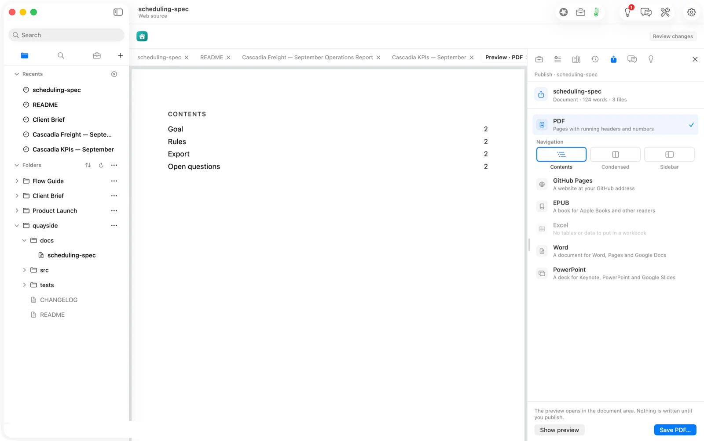
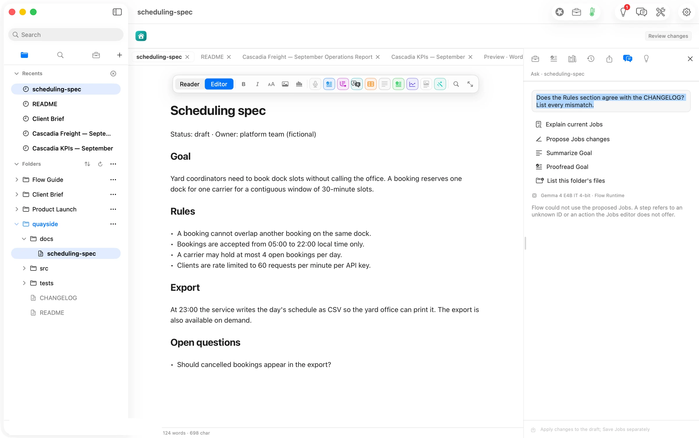
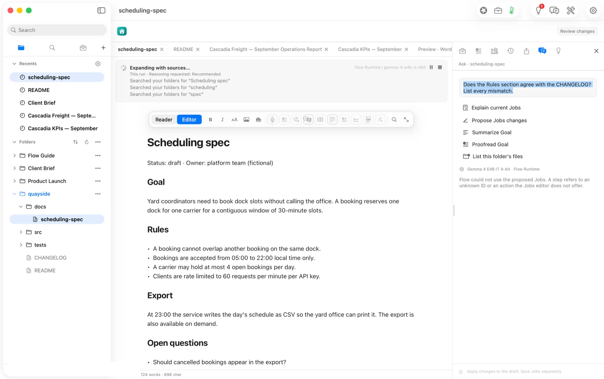
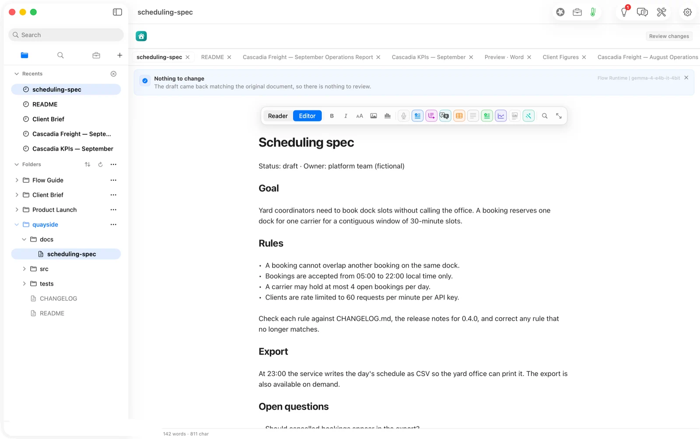
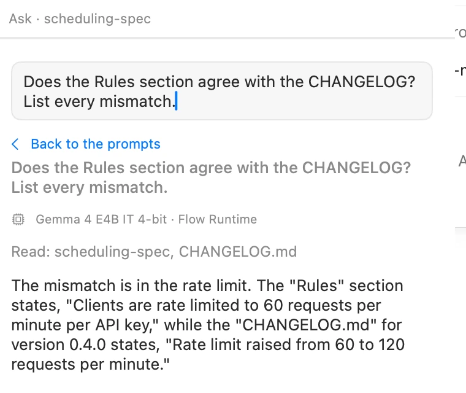

## The press release we would want to write — and cannot yet

**Builders can now keep their specs and README true to the code without handing their repository to anyone.** Flow opens the repo folder in place, proposes every documentation change as a diff you keep or revert, leaves your git history alone, and publishes a site or a PDF.

Half of that is true today, measured below. The half in the title of the path, *stay true to the code*, is not: Flow 2.1 does not compare a document with the code it describes on its own (ISSUES #782, open). Ask can, partly, when you name the file: see the update below.

## The answer first

1. **Flow works in your repository, on your terms.** Add Folder opened the repo in place. Every change landed as an ordinary uncommitted edit in `git status`, which is yours to commit, amend or discard.
2. **Prose fixes are fast, local and exact.** Proofread on Gemma 4 E4B, running on the Mac, returned four corrections in about four seconds. The diff touched two lines, and nothing entered the file until we accepted it.
3. **Drift detection is missing.** The spec says 60 requests a minute and port 8080; the CHANGELOG and `config.py` say 120 and 8000. Expand with Sources searched only the spec's own title words and reported *Nothing to change*, even when the spec asked it in plain words to check the CHANGELOG.

## The job

A two-person team ships Quayside, a small dock-booking service. The code moves every week; `docs/scheduling-spec.md` moves when someone remembers. Release 0.4.0 doubled the rate limit, moved the default port, and added a CSV export endpoint. The spec still describes 0.3.

The job is not "write docs". It is: *before I tag a release, tell me which sentences in my docs are now false, and let me fix them without leaving my repo.*

## What worked

**The repo opened in place.** Nothing was copied or imported. The sidebar shows `docs/`, `src/`, `tests/`, CHANGELOG and README exactly as they sit on disk.

**Proofread, on this Mac.** Smart Routing picked Gemma 4 E4B on Flow Runtime ("this Mac first, free before metered"). The run reported "Usually a few seconds", and it was: the receipt records the model's answer about four seconds after the press.

It proposed four fixes: *can not* → *cannot*, *an other* → *another*, *days* → *day's*, *avaliable* → *available*. We accepted them. `git diff` afterwards shows exactly those two lines changed.

**Publish.** File ▸ Publish wrote a 32 KB PDF with a contents page. (It also wrote a `publish:` block into the spec's front matter, which is a file in someone's repository; see the notes.)

## What did not

We asked the question the path exists to answer, three ways.

On 2.0.3, **Ask (⌘K)** took "Does the Rules section agree with the CHANGELOG? List every mismatch." as a request to *propose Jobs changes*, tried twice, and stopped: "Flow could not use the proposed Jobs." (#781)

**Expand with Sources** searched the folders for "Scheduling spec", "scheduling" and "spec", found nothing that disagreed, and returned the document unchanged.

**Expand with an explicit instruction.** We added a line under Rules: "Check each rule against CHANGELOG.md, the release notes for 0.4.0, and correct any rule that no longer matches." Result: *Nothing to change*, eleven seconds later.

A larger model might do better; we did not test one here. But the gap is not only the model. No Job kind reads code, and Expand chooses its own search terms, so a spec cannot point it at the file that proves it wrong.

## What it cost

| Run | Model | Tokens in / out | Time | Cost |
|---|---|---|---|---|
| Proofread | Gemma 4 E4B, this Mac | 209 / 177 | ~4 s | $0.00 |
| Expand (plain) | Gemma 4 E4B, this Mac | 4,365 / 122 | ~40 s | $0.00 |
| Expand (steered, 2 runs) | Gemma 4 E4B, this Mac | 8,641 / 410 | ~11 s | $0.00 |
| The same proofread on Claude Opus 5.5 | — | 209 / 177 | — | $0.004 |

Proofreading a spec on an open model saves a fraction of a cent per run. As in the client-brief path, the reason to run it locally is not the money. It is that the repository never left the Mac.

## FAQ

**Does Flow commit to my repo?** No. Changes are ordinary edits; `git status` shows them, and you commit. Flow's own records sit beside the file (`.flow-receipts`, `.flow-review`), so add them to `.gitignore` if you don't want them tracked.

**Can Flow keep my docs in sync with my code?** Partly. Ask it, naming the file; Flow answers from both, and every change is still one you approve. No Job checks a document against source files or a changelog on its own yet.

**What do I need?** Flow Pro to proofread and review, and Flow Publish to publish ($10 a month each, or $96 a year).

## Update: build 0249-1 (2026-09-28, in Flow 2.1)

These shipped in **Flow 2.1** (build 3020, 30 September 2026). They were checked on a pre-release build (0249-1) on 28 September; the walk above describes 2.0.3.

- **Ask answers the question now (#781).** The same prompt, "Does the Rules section agree with the CHANGELOG? List every mismatch.", read the spec and `CHANGELOG.md` and answered on Gemma 4 E4B on this Mac: the Rules say 60 requests a minute, the changelog says it rose to 120. It missed the other two drifts we planted, the port (8080 vs 8000) and the missing `/export.csv`. So Flow sees some drift when you ask and name the file. No Job yet checks a spec against code by itself (#782, open). 
- **Publish no longer edits the file (#783).** Its choices now sit in `scheduling-spec.md.flow-publish`, beside `.flow-receipts`, so `git diff` of the spec stays clean. It is still a new untracked file in `git status`.
- **Proofread's highlight marks only changed lines (#785).** Not re-checked on screen.

## Evidence

| Claim | Value | Label | Source |
|---|---|---|---|
| Proofread model and time | gemma-4-e4b-it-4bit, local, ~4 s | verified | `docs/scheduling-spec.md.flow-receipts` `model.route` 20:08:08.371Z; press 13:08:04 PDT |
| Proofread fixes | 4 fixes, 2 lines | verified | `git diff docs/scheduling-spec.md` |
| Guardrails | unsupported-citations passed, human-review passed | verified | `guardrail.assessment` 20:09:03Z |
| Expand found nothing, twice | "Nothing to change" | verified | shot 07; `model.route` 20:10:00Z, 20:11:19Z, 20:12:37Z |
| Drift present | 60 vs 120 req/min; 8080 vs 8000; `/export.csv` missing | verified | fixture files in `~/flow-demo/code/quayside` (built for this walk) |
| Tokens | as tabled | verified | receipts |
| Opus equivalent | $0.004 | derived | ModelPricing v4 × 209/177 |
| Published PDF | 32,775 B | verified | `publish.output` 20:13:40Z |
| A larger model would catch the drift | — | unknown | not tested |
