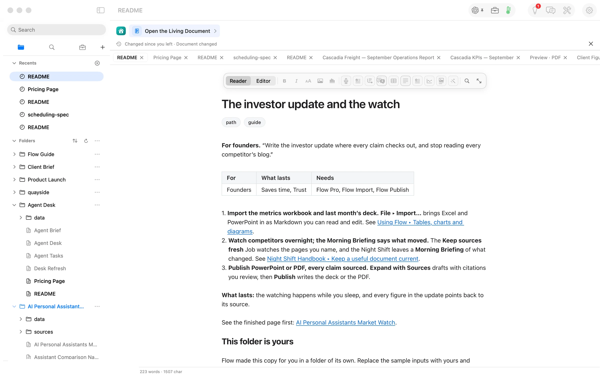
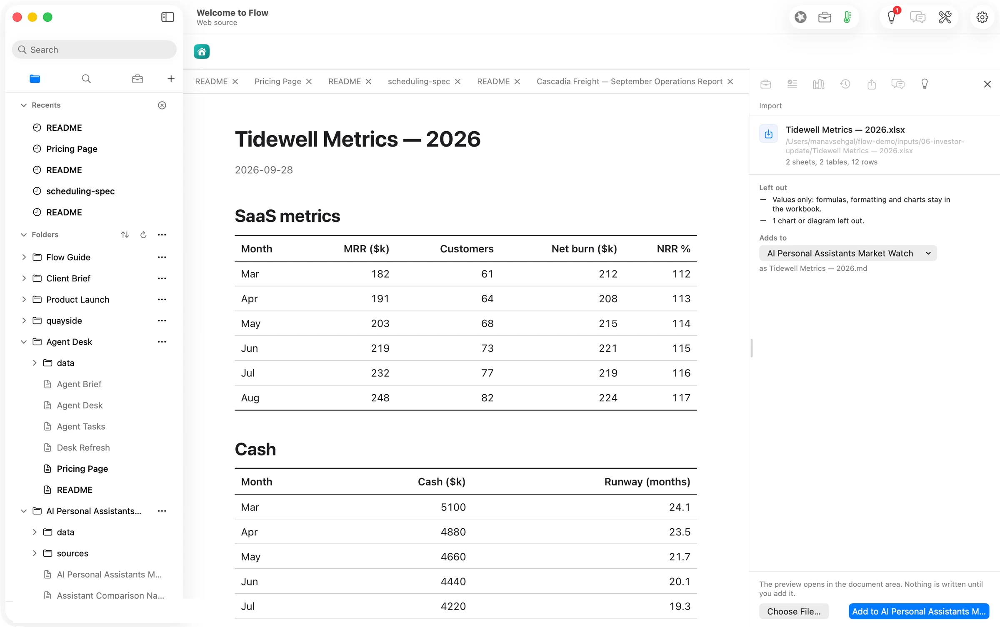
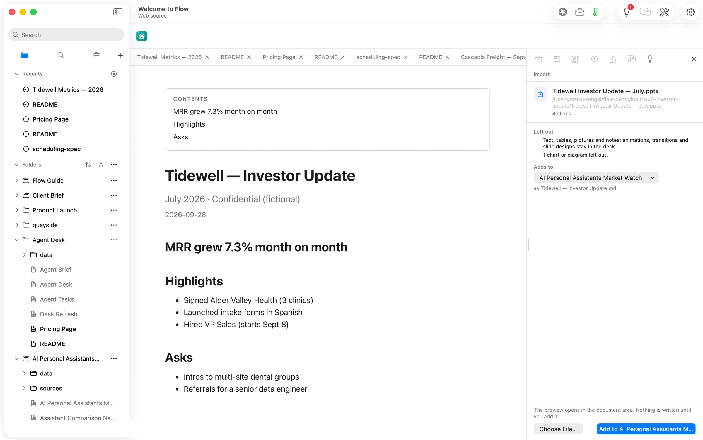
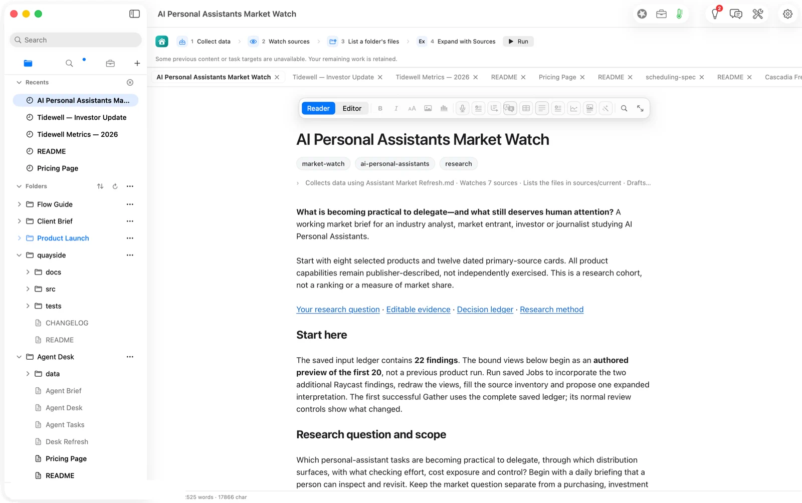
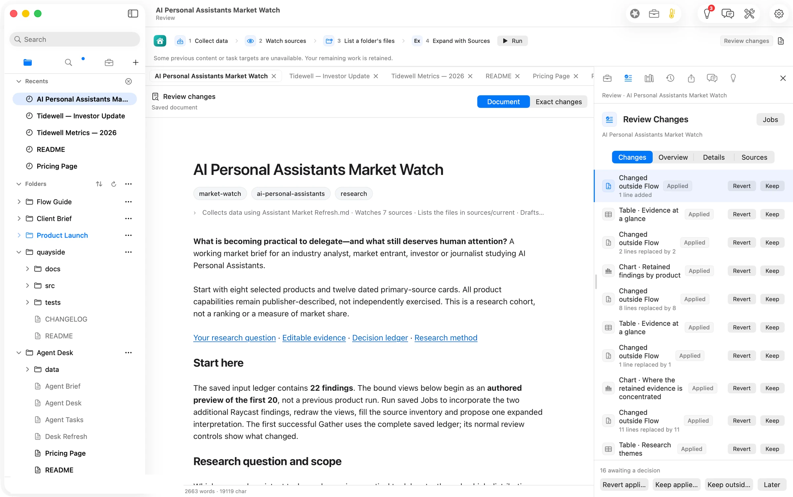
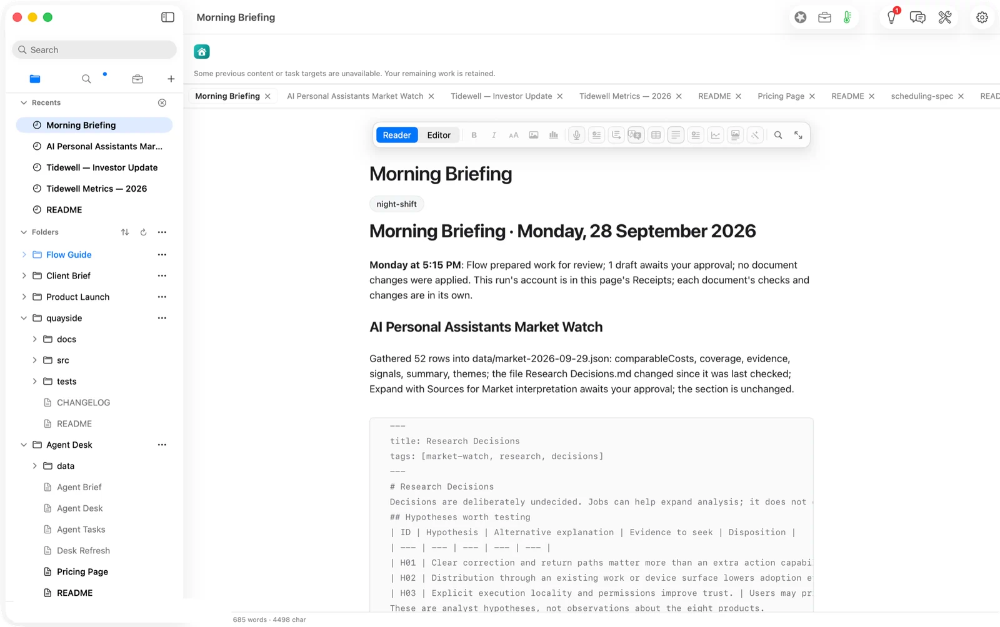
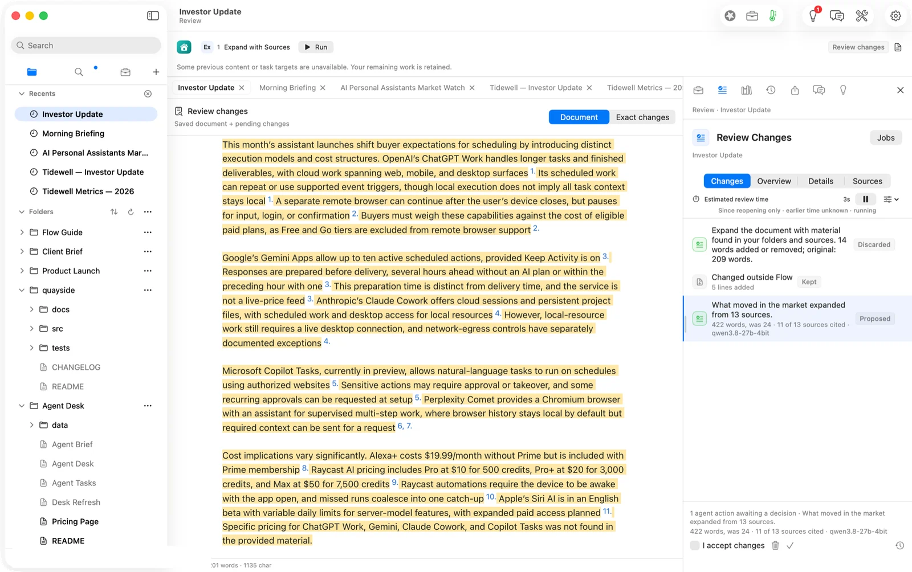
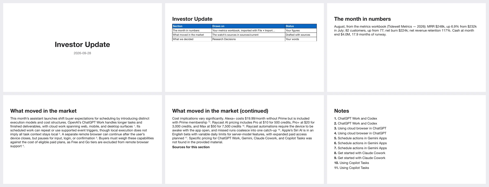

## The press release we would want to write

**Founders can now write the monthly investor update from their own metrics and a market watch that keeps itself current, without pasting a number or a competitor claim by hand.** Orionfold Flow imports the metrics workbook and last month's deck as editable documents. A saved Job checks the pages and files you name for changes and writes a Morning Briefing of what moved. Expand with Sources drafts the market section with a footnote on every claim, and it waits for your approval. Publish turns the update into a PowerPoint deck with its notes and sources included. In our test, the market section went from a one-line question to 422 cited words in 79 seconds, on an open model running on the laptop, at a model cost of $0.00.

> "The numbers were never the hard part. The market paragraph was: an evening of reading competitors' blogs to write four sentences I couldn't source. Now I read what moved, check the footnotes, and send."
> — *Illustrative quote, not from a customer.*

## The answer first

An investor update has two halves. Your numbers, which you already have, and the market, which you have to go and read. Flow does the reading, shows its sources, and leaves you the judgment. Three things make that true.

1. **Your files become the update's figures.** File ▸ Import read an Excel workbook (2 sheets, 12 rows) and a PowerPoint deck (4 slides) into the update's folder as Markdown, on this Mac, without a model. It also said what it left out: formulas, formatting and one chart.
2. **The watch knows what changed.** The Market Watch's saved Jobs checked three live web pages and four local sources in under two seconds. The next run found the one file that had changed. The Morning Briefing said so in a sentence: "the file Research Decisions.md changed since it was last checked; Expand with Sources for Market interpretation awaits your approval."
3. **The market section arrives cited, and waits.** Expand with Sources drafted "What moved in the market" from 13 sources, citing 11 of them, in 79 seconds on a local open model. We checked two of its prices against the source cards before approving it.

## The job

The founder of Tidewell, a small SaaS company (fictional), sends investors an update every month. The numbers live in a metrics workbook. Last month's update lives in a deck. The market section lives nowhere: it is whatever the founder read that week.

That section is where updates go wrong. A competitor's price quoted from memory, a launch that turns out to be US-only, a claim with no link. Investors notice. *How long the old way takes is not something we measured. An evening a month is our assumption, labelled below.*

What the founder needs is a market paragraph they can defend, sentence by sentence, without spending the evening on it.

## Step one: the numbers come in as documents

We opened the path from Home. Flow made a folder with the AI Personal Assistants Market Watch, a Living Document that tracks eight products through twelve dated source cards, and an Investor Update page with three sections: the month in numbers, what moved in the market, and what we decided.

File ▸ Import read the metrics workbook first. The preview shows what arrived and what didn't: *values only; formulas, formatting and charts stay in the workbook; 1 chart or diagram left out.* Nothing is written until you press Add.

The July deck came in the same way, four slides as headings and bullets.

We wrote the month-in-numbers paragraph from the imported tables: MRR $248k, up 6.9% from $232k; 82 customers; net burn $224k; runway 17.9 months. Those are the founder's words, and the founder's figures.

## Step two: the watch, and the Morning Briefing

The Market Watch carries its own Jobs: collect the data, watch seven sources (four files and three public pages from Raycast, Apple and Microsoft), list the source folder, and expand the interpretation.

We pressed Run. The deterministic steps finished in about three seconds. Every change they made arrived in Review Changes to keep or revert: 16 of them, from redrawn charts and a rebuilt table to the folder inventory.

Then we did what a founder does: recorded a decision in the research ledger ("decided: daily briefing") and ran the Jobs again. This time the watch compared every source with what it had seen before. Six were unchanged. One had changed: the ledger we had just edited. The Morning Briefing said exactly that.

*A note on "overnight":* the path runs these Jobs as the Night Shift while you sleep. We pressed Run instead so we could time it. It is the same engine, and the Briefing is the same page.

## Step three: the market section, cited

On the Investor Update itself, we added one Job: Expand with Sources, for the section "What moved in the market", drawing on the watch's sources and the decision ledger. We ran it. Seventy-nine seconds later the review held a draft: *422 words, was 24; 11 of 13 sources cited; qwen3.8-27b-4bit.*

The draft names what each product does and what it costs, with a footnote on each claim. It also says what it couldn't find: "Specific pricing for ChatGPT Work, Gemini, Claude Cowork, and Copilot Tasks was not found in the provided material." That sentence is worth as much as the others. It is the one a founder would otherwise have filled in from memory.

We checked two figures against their source cards before approving: Alexa+ at $19.99 a month without Prime, and Raycast's $10, $20 and $50 tiers. Both matched. We ticked *I accept changes*.

## The deliverable

File ▸ Publish ▸ PowerPoint, Report theme. Flow wrote a 13-slide deck: title, the section table, the month in numbers, the market section across three slides, the decision, then the notes and sources the claims rest on.

## What it costs, measured

| | Machine time | Tokens in / out | Model cost |
|---|---|---|---|
| Import workbook and deck (Flow's reader) | seconds | none | $0.00 |
| Watch: 3 web pages + 4 files checked | under 2 s | none | $0.00 |
| Market Watch run (charts, tables, briefing, interpretation) | 106 s | 6,600 / 896 | $0.00 |
| Investor Update: market section drafted | 79 s | 5,805 / 561 | $0.00 |
| **Same tokens on Claude Opus 5.5** ($4 / $20 per M) | | 12,405 / 1,457 | **$0.079** |
| **Same tokens on Claude Sonnet 5** ($2 / $10 per M) | | | **$0.039** |

The honest reading: the open model saved about eight cents on this update. Nobody changes models for eight cents a month.

The case for running it locally is different. The update draws on the founder's own metrics, and those numbers never left the laptop. The watch can run every night without a bill to forecast, which is what makes "overnight" affordable enough to leave switched on. And a re-run costs nothing, so when a section reads wrong you run it again instead of editing around it.

## FAQ

**Does Flow write my investor update?** No. It drafts the market section you ask for, from sources you can open, and proposes it. Your numbers and your decisions are your words. Nothing enters the update without your tick.

**What does the watch actually watch?** The pages and files you list in the Job. It records a fingerprint of each and reports which ones changed since the last check. It doesn't browse beyond them.

**Can it use a cloud model?** Yes. Flow names the model and the estimated price before a hosted run. For this update that would have been about four to eight cents.

**What does it need?** Flow Pro, with Flow Import and Flow Publish: $10 a month or $96 a year each. Markdown documents are never part of a plan.

**Is the deck ready to send?** It is a clean, sourced deck in the Report theme. Most founders will restyle it. The figures and footnotes are what carry over.

## Evidence

| Claim | Value | Label | Source |
|---|---|---|---|
| Workbook import | 2 sheets, 2 tables, 12 rows; 1 chart left out; reader `flow` | verified | `Tidewell Metrics — 2026.md.flow-receipts`, 00:05:14.2Z; shot 03 |
| Deck import | 4 slides, 3 headings, 5 list items; 1 chart left out | verified | `Tidewell — Investor Update.md.flow-receipts`, 00:05:41.9Z; shot 04 |
| Watch speed | 7 sources checked 00:09:21.842Z → 00:09:23.394Z (1.6 s), incl. 3 live pages of 6,293 / 50,985 / 14,403 B | verified | `nightshift.check` receipts, job `keep-sources-fresh` |
| Watch finds the change | run two: 6 current, Research Decisions changed | verified | receipts from 00:15:36Z; Morning Briefing 17:17:21 (shot 10) |
| Changes to review after run one | 16 (7 applied by Jobs, 9 outside) | verified | Review Changes (shot 08) |
| Market Watch run two | 106 s (00:15:36.4Z → 00:17:21.4Z); 395/51 + 6,205/845 tokens | verified | receipts |
| Interpretation | 691 words (was 156), 11 of 14 sources cited | verified | Review row |
| Market section draft | 79 s (Run 17:26:39 → receipt 00:27:58.5Z); 393/51 + 5,412/510 tokens; 422 words (was 24); 11 of 13 cited | verified | `Investor Update.md.flow-receipts`; shot 14 |
| Two prices match sources | Alexa+ $19.99; Raycast $10/500, $20/3,000, $50/7,500 | verified | `grep` of `sources/current/S09*`, `S12*` |
| Model and locality | qwen3.8-27b-4bit, Flow Runtime, on this Mac | verified | `model.route` payloads |
| Model cost | $0.00 | verified | local route; no metered provider used |
| Cloud equivalents | Opus 5.5 $0.079; Sonnet 5 $0.039 | derived | `ModelPricing.swift` v4 (verified 2026-09-22) × 12,405 in / 1,457 out |
| Published deck | 13 slides, 27,357 B, Report theme | verified | `python-pptx` read; `ls -la`, 17:32:32 |
| Tidewell figures in the update | MRR $248k (+6.9%), 82 customers, burn $224k, NRR 117%, cash $4.0M, runway 17.9 mo | verified | imported tables (fictional data) |
| Price of Pro and add-ons | $10/month or $96/year each | verified | Home ▸ Add-ons (shot 01) |
| The old way takes an evening | — | assumed | not measured |
| Human review time | — | unknown | not measured for a person |
