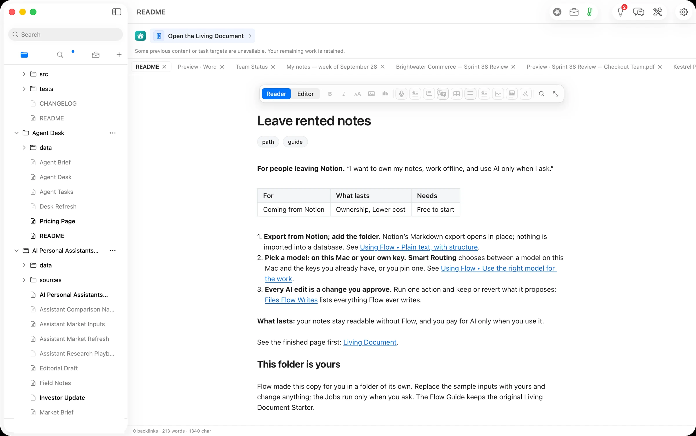
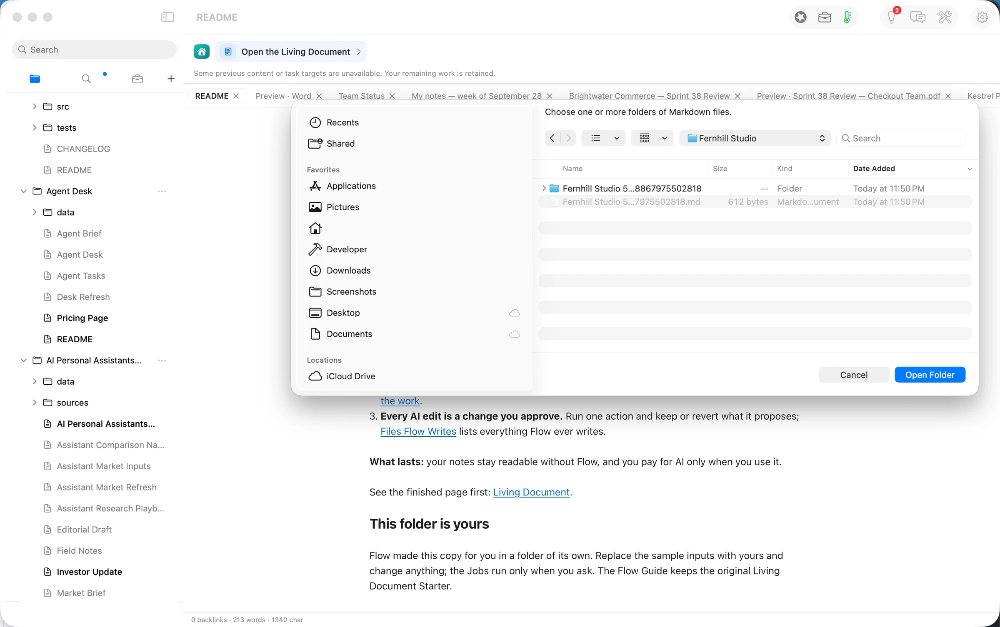
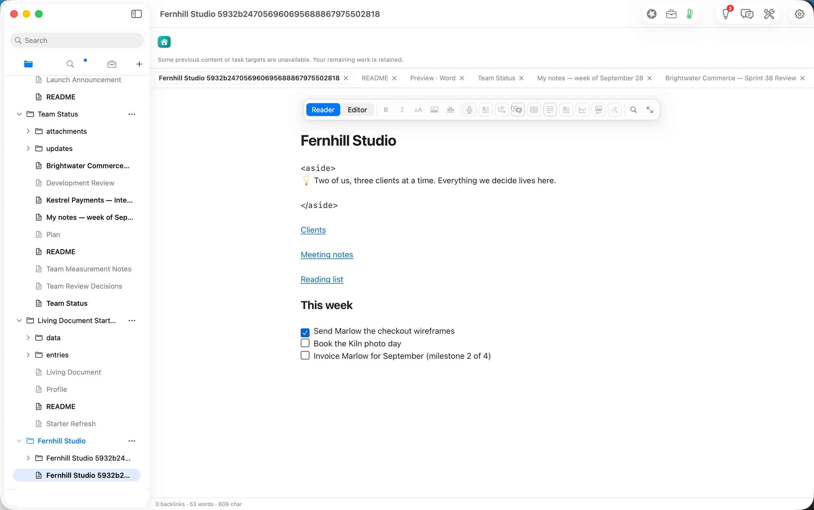
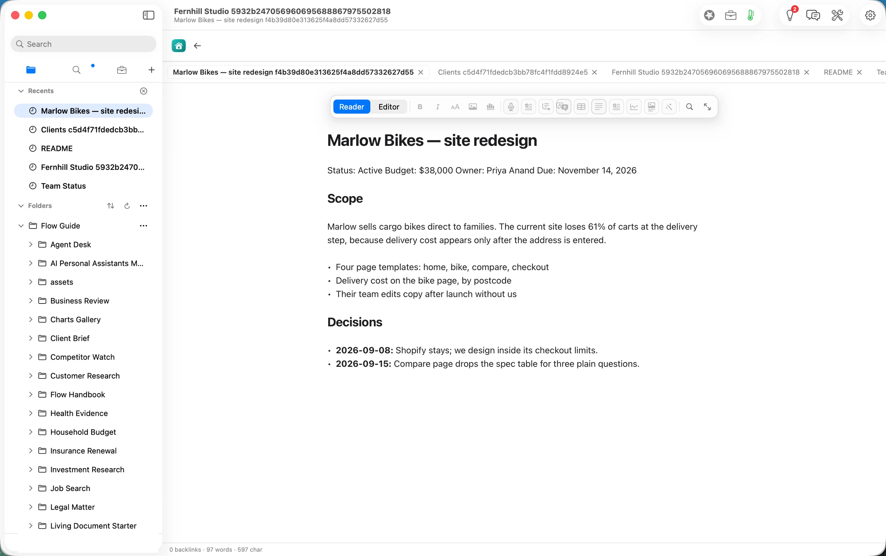
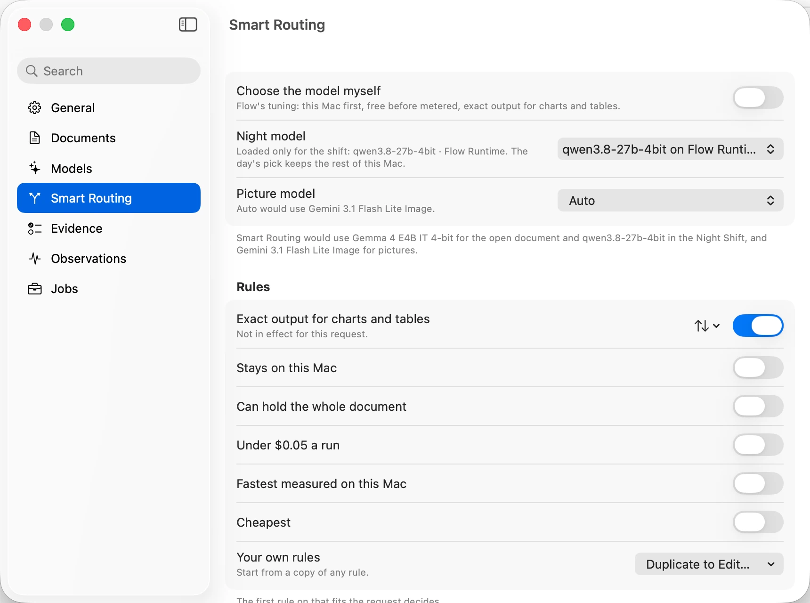
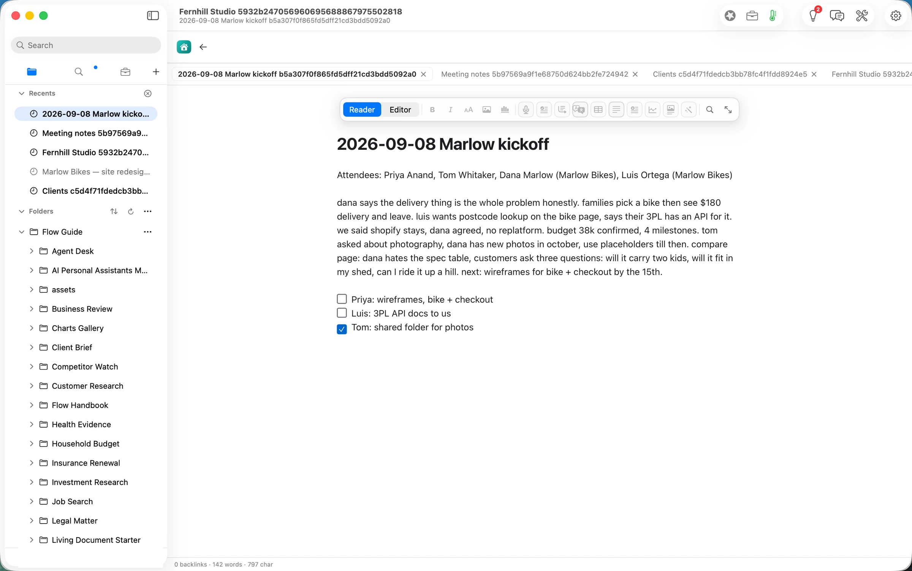
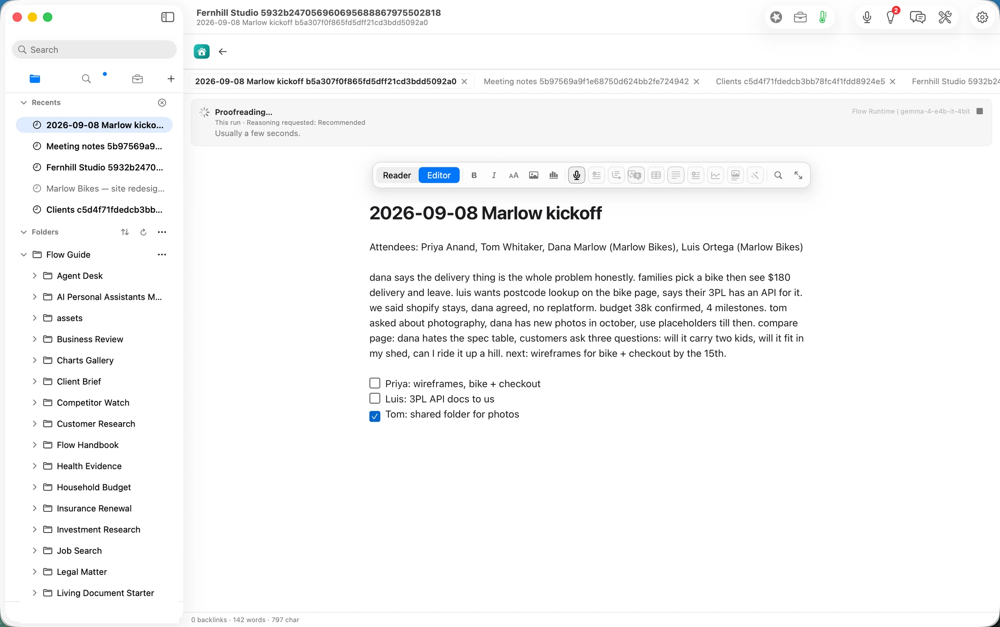
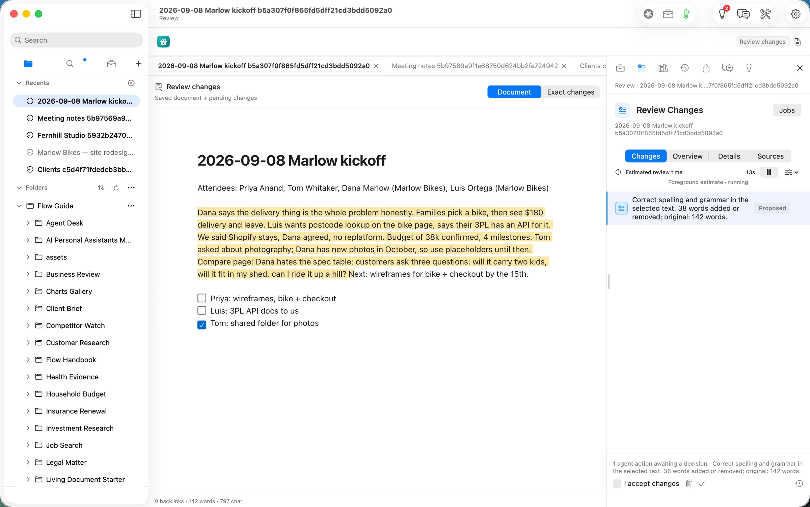
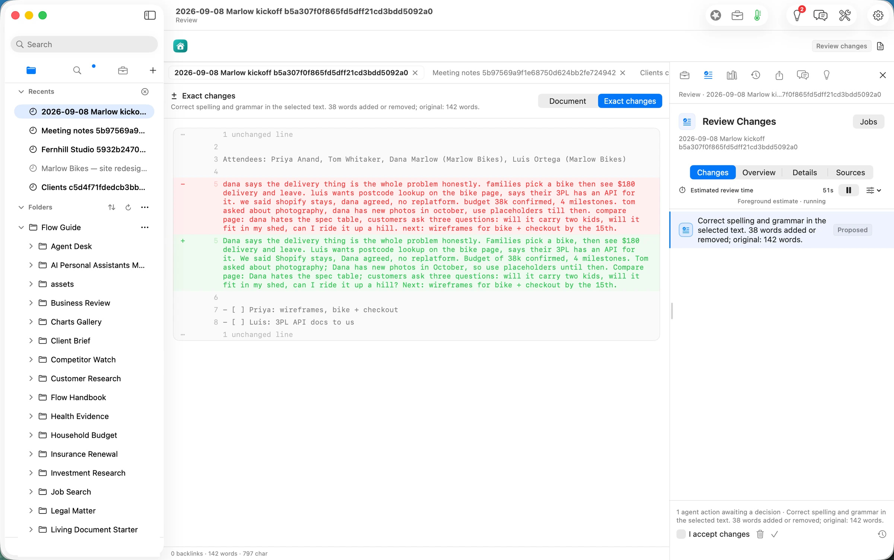
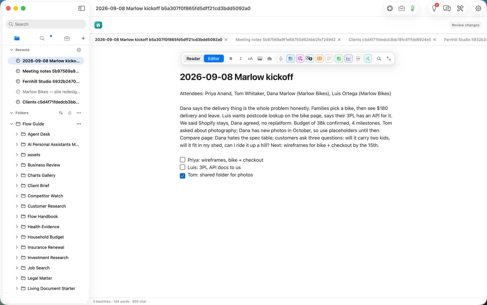

## The press release we would want to write

**People leaving Notion can now take their workspace with them as plain files and still have AI help with it, on their own terms.** Orionfold Flow opens a Notion Markdown export where it lies: no import, no database, no conversion. The pages keep their links to each other. When you want help, you ask for it on one page, a model on your Mac does the work, and the change waits for your approval. In our test, tidying a raw meeting note took about 6 seconds on the laptop, for a model cost of $0.00, and Flow's only additions to the folder were a record of what happened and the note's history.

> "I stopped worrying about what happens to my notes if I stop paying. They're files. The AI is something I call, not something that lives in them."
> — *Illustrative quote, not from a customer.*

## The answer first

A notes app you rent holds three things: your words, the links between them and the AI that reads them. Flow gives you the first two back as files and keeps the third under your control.

1. **Your export opens where it lies.** *Add Folder* on the unzipped export showed Notion's pages as a folder tree, and the links between them opened pages in Flow: from the workspace page to *Clients* to *Marlow Bikes*, two levels down.
2. **Flow picks a model on this Mac first.** Smart Routing's own words: "this Mac first, free before metered". For the open page it chose Gemma 4 E4B, an open model running on the laptop.
3. **Every AI edit is a change you approve.** Proofread rewrote a lower-case meeting dump into sentences in about 6 seconds. It came back as a proposal, with an exact before-and-after, and the file on disk changed only when we pressed approve.

## The job

**The job:** keep a small studio's working notes (clients, meetings, decisions, a reading list) somewhere that will still open in ten years, and still get help tidying them.

**The usual way:** stay in Notion and use its built-in AI, which runs on Notion's servers under Notion's plan. Leaving means an export: a zip of Markdown and CSV files that most apps either import into their own database or show as a pile of files with broken links. We did not time the usual way, so we make no claim about it.

**The Flow way:** the path *Leave rented notes* in three steps: export from Notion and add the folder; pick a model, on this Mac or your own key; approve every AI edit.

## Step one: add the export as a folder

Notion's export has a recognisable shape: every page is a file named with its title and a 32-character ID, each page's children sit in a folder of the same name, links between pages are written as relative paths, and a database becomes a CSV beside one page per row. Our export was a fictional two-person design studio: 12 pages, one database of four books, and three meeting notes.

From Home, the **Own your notes** chip shows the path. **Open** gives you your own copy of the path's guide.

The sidebar's **+ ▸ Add Folder…** takes the unzipped export as it is. Flow read it in place and added it to the sidebar; nothing was copied or converted.

The workspace page opened as Notion wrote it: headings, links and to-dos, with the to-dos as real checkboxes.

The links work. *Clients* opened the clients page, and *Marlow Bikes — site redesign* opened the client's page one level further down, each beside the page it came from.

## Step two: pick a model

Flow decides which model runs each request unless you choose one yourself. **Settings ▸ Smart Routing** states the rule it follows: "this Mac first, free before metered". It also names the pick: *Gemma 4 E4B IT 4-bit* for the open document, a model that runs on the laptop through Flow Runtime. Turn on *Choose the model myself* to pin one, including a cloud model on your own key.

## Step three: approve every AI edit

A meeting note written during the meeting reads like one:

In the editor, **Agency ▸ Proofread** (⌥⌘P) sent the note to the model on the laptop. The run line named it: *Flow Runtime | gemma-4-e4b-it-4bit*.

About 6 seconds later the result came back as a proposal, not an edit: 38 words changed out of 142, highlighted in the page and listed in **Review Changes**.

**Exact changes** shows the one paragraph before and after. It capitalised names and sentences, split the run-ons, and made the customers' three questions into a question. The attendees, the $180 delivery fee, the $38k budget, the four milestones and the date stayed as written, and the to-dos were untouched.

We ticked *I accept changes* and approved. About three seconds later the note on disk was the new text, still plain Markdown:

## The deliverable

The deliverable of this path is the folder itself. After the walk, the export was still 12 Markdown pages and 2 CSV files that any text editor opens. One of them now reads in sentences. Flow added three things, each named on the Handbook page *Files Flow Writes*:

- `…Marlow kickoff….md.flow-receipts`: one line per event: the model run, the change and the checks that passed.
- `…Marlow kickoff….md.flow-review`: the review state for that note.
- `.git`: the folder's version history, in ordinary git, on Flow's own line so that `main` is left for you.

Delete all three and the notes are unchanged; you lose the record and the history, not a word of your writing.

## What it costs, measured

| | Machine time | Tokens in / out | Model cost |
|---|---|---|---|
| Add the export as a folder | seconds | none | $0.00 |
| Follow links between pages | seconds | none | $0.00 |
| Proofread the kickoff note (Gemma 4 E4B on this Mac) | ~6 s | 242 / 213 | $0.00 |
| **Same tokens on Claude Opus 5.5** ($4 / $20 per M) | | | **$0.0052** |
| **Same tokens on Claude Sonnet 5** ($2 / $10 per M) | | | **$0.0026** |

The honest reading: half a cent a page is not why you would leave Notion. The reasons are that the notes are files you keep whatever you pay, that the AI runs where you choose, and that it changes nothing you have not read.

## FAQ

**Do I have to convert the export?** No. Add the unzipped folder. Flow reads Notion's Markdown in place and follows its links between pages.

**Does it work offline?** Reading, writing, searching and following links always do. The Proofread above ran on a model on the laptop, so it did too; keep *this Mac first* in Smart Routing to stay that way.

**Can I use my own API key instead?** Yes. Add a key in Settings ▸ Models and pin the model, or let Smart Routing pick. Flow shows the model and its estimated cost before a run.

**What happens to Notion databases?** Each row is a page you can read and edit, and the table is a CSV file beside them. See the notes below for what does not carry over yet.

**What does it cost?** Reading, writing, searching, organising and exporting are free forever. The AI steps are Flow Pro, with 10 Pro Days included to start, then $10 a month or $96 a year.

## Evidence

| Claim | Value | Label | Source |
|---|---|---|---|
| The export's shape | 12 pages, 2 CSV files (one database of 4 rows), 32-hex IDs in names, `%20` relative links, one `<aside>` | verified | `articles/_inputs/generate.py` `notion_export()`; `find` counts 00:19 PDT |
| Add Folder | added 23:56:31 PDT; sidebar AX `folder:…/Fernhill Studio` "open, expanded" | verified | `axtree.swift` read 23:56 |
| Links open pages | *Clients* 00:11:40, *Marlow Bikes* 00:12:09 PDT, each opened as a note beside its page | verified | build 0247-6; `webprobe --list` shows the note paths; shot 05 |
| Links before the fix | web tab `https://Fernhill%20Studio…/Clients…md`, "This page couldn't be loaded"; same for `Living%20Document.md` | verified | build 0247-5, 23:58 and 00:02 PDT; ISSUES #806 evidence |
| Smart Routing's pick | "this Mac first, free before metered"; Gemma 4 E4B IT 4-bit for the open document | verified | Settings ▸ Smart Routing, shot 06 |
| Proofread | pressed ≈00:15:12 → receipt 07:15:18.3Z (≈6 s); gemma-4-e4b-it-4bit, Flow Runtime, localMachine, 242 / 213 | verified | `…kickoff….md.flow-receipts` `model.route` |
| Size of the change | 38 words added or removed; original 142 words; one paragraph | verified | Review Changes (shots 09–10) |
| Facts held | attendees, $180, 38k, 4 milestones, October, the 15th, three to-dos unchanged | verified | read against the exported file before approving |
| Approval | approved 00:16:56 PDT → `document.change` 07:16:58.8Z; guardrails passed 07:16:59.9Z; 144 words after | verified | receipts; file md5 changed; shot 11 |
| What Flow wrote | `.flow-receipts`, `.flow-review` beside the note; `.git` (17 files) at the export root | verified | `find` 00:19 PDT; Handbook ▸ Files Flow Writes |
| Model cost | $0.00 | verified | local route (`locality: localMachine`) |
| Cloud equivalents | Opus 5.5 $0.0052; Sonnet 5 $0.0026 | derived | `ModelPricing.swift` (Opus 5.5 $4/$20, Sonnet 5 $2/$10 per M) × 242 in / 213 out |
| Free and Pro | free forever for reading, writing, searching, organising, exporting; Pro adds the AI, 10 Pro Days to start; $10/month or $96/year | verified | Guide Changelog.md; Home ▸ Add-ons (article 4 shot 01) |
| The usual way's time | — | assumed | not measured |
| Human review time | — | unknown | not measured for a person |
