## The press release we would want to write

**Households can now close the month's budget from their own bank export, on their own Mac, without a spreadsheet and without handing their statements to a service.** Orionfold Flow's *Household Budget* is a page that reads the CSVs in its `statements` folder and sorts every line with rules you can read. Press Run and it redraws the month against your plan: spending, income, savings rate, category against budget, the merchants that took the most, and the lines no rule caught. In our walk, a 35-line September statement was summed and sorted about a second after Run. Every figure on the page matched our own independent calculation to the cent. A model on the laptop then wrote a paragraph about the month in about 49 seconds, and all 20 figures in it traced back to the data. Teaching it three merchants and running again took one more press. The model cost was $0.00 both times.

> "Close the month without a spreadsheet marathon, and keep my bank files off someone else's server."
> — *The path's own brief, from the Flow Guide. Illustrative, not from a customer.*

## The answer first

The budget is a folder of files: your statements, a page of rules, and the page that draws the month.

1. **Choosing the path makes your copy.** One click on Home made `Household Budget`, a folder of your own with sample statements, the plan, and the page.
2. **Your statement replaces the samples.** We put September's CSV in `statements/` and moved the two sample months out. **This build has no way to do that from inside Flow**, so it is a Finder step (#849).
3. **Run redraws the month.** Run worked out every total from the statement in about a second and redrew the page's four charts and three tables. A laptop model then wrote the *Overnight notes*. You review the eight changes and keep them.
4. **The page tells you what it could not place, and you teach it.** Five lines matched no rule. We added three rules to *Budget Profile*, ran again, and the page placed them. The two lines left (a vet visit and a Zelle payment) are the ones the page says a person should identify first.

**Two cautions before you start.** In this build, the paragraphs at the top of the page still describe the *sample* August after you run it on your own month (#848), so read the charts rather than the opening. And a link from the page to *Budget Profile* does nothing while the Flow Guide is open beside your copy (#847). Open *Budget Profile* from the sidebar instead.

## The job

**The job:** at the end of each month, see where the money went against the plan, find the spending that has no explanation yet, and decide whether next month's plan needs changing. Keep the bank records private.

**The usual way:** a spreadsheet you rebuild or paste into each month, or a budgeting service that connects to your bank. We did not time or price either, so we make no claim about them.

**The Flow way:** the path *Life admin, handled*, in three steps: make a copy of the Household Budget, replace the sample statements with your own, and Run Jobs to redraw the month's totals.

## Step one: make your copy

Home's Life filter shows the path, with its promise underneath: "Saves time", "Private", "Free to start". Clicking the card at 09:27:52 PDT made the copy. The README opened with the three steps and a button, *Open the Living Document* (shot 02).

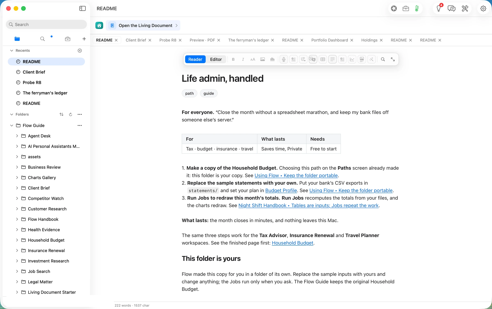

The copy holds the page (*Household Budget*), the plan (*Budget Profile*), the definition that does the arithmetic (*Budget Refresh*), a `data` folder for its captures, and a `statements` folder with two made-up months, July and August 2026. Before you run anything, the page shows the sample August (shot 03).

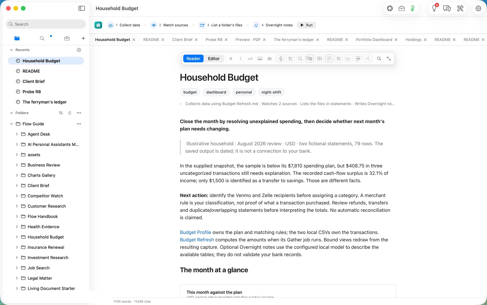

## Step two: put your statement in `statements/`

Our input is an invented September statement from an invented credit union: 35 lines, with the headers `Date`, `Description` and `Amount`, ISO dates, and spending as negative numbers. That is the format *Budget Profile* asks for. We planted five lines that none of the sample rules would place: a school book fair, an airline ticket, a bakery paid through Square, a vet visit, and a Zelle payment to a person.

We first tried the obvious way in: File ▸ Import…. It does not take a CSV. The panel greys the file out and says what it does take: Word documents, Excel workbooks, PowerPoint presentations and PDFs (shot 04). The sidebar takes no file drop either. **So in this build the statement goes in through Finder.** Choose Reveal in Finder from the page's title menu, then drag the CSV into `statements/`, as the README says. We did the same thing with a Finder-equivalent copy at 09:30:29. We moved the two sample months out of the folder rather than deleting them. Filed as #849.

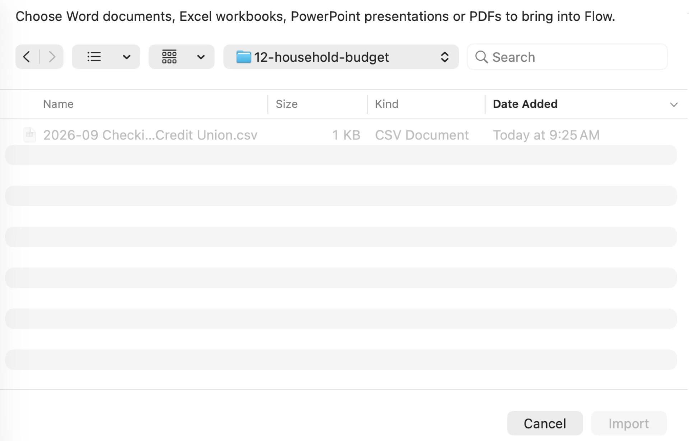

*Set your plan in Budget Profile* is the other half of this step. We left the sample plan (income $9,800, a 20% savings target, eleven category budgets totalling $7,810) as it was for the first run, and came back to the rules afterwards (step four, below).

## Step three: Run, and review what changed

Run is at the end of the page's job ribbon: *Collect data*, *Watch sources*, *List a folder's files*, *Overnight notes*. We pressed it at 09:30:36 PDT. The banner counted the steps as they finished (shot 05).

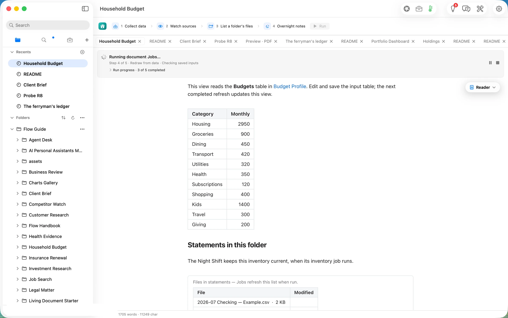

- **The capture was written 1.4 seconds after the press**, at 09:30:37.6. It read the plan's three tables and the one statement, and wrote `data/spending-2026-09-30.json`.
- **The page's views redrew** in about 8 seconds, one per second (the last change at 09:30:44).
- **Overnight notes** ran on the laptop (Flow Runtime, `qwen3.8-27b-4bit`). It took 3,358 tokens in and wrote 198 out, and the paragraph landed at 09:31:25, 49 seconds after the press. Flow checked all 20 figures in it against the tables before writing it.

The banner then read "Document review ready · 8 awaiting a decision", naming the model that wrote (shot 06).

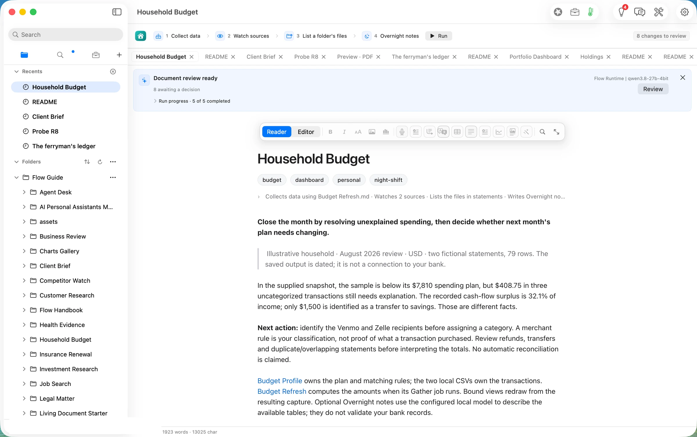

**The month against the plan.** $6,916 spent, 89% of the $7,810 plan. Income of $9,800 was received, as expected. The savings rate is 29.4%, 9.4 points above the 20% target, but only $1,500 was actually moved to savings, 77% of the $1,960 the target implies (shot 07). The page keeps those two facts apart on purpose: money left over is not money saved. We recomputed every one of these figures from the CSV and the rules ourselves, and they match.

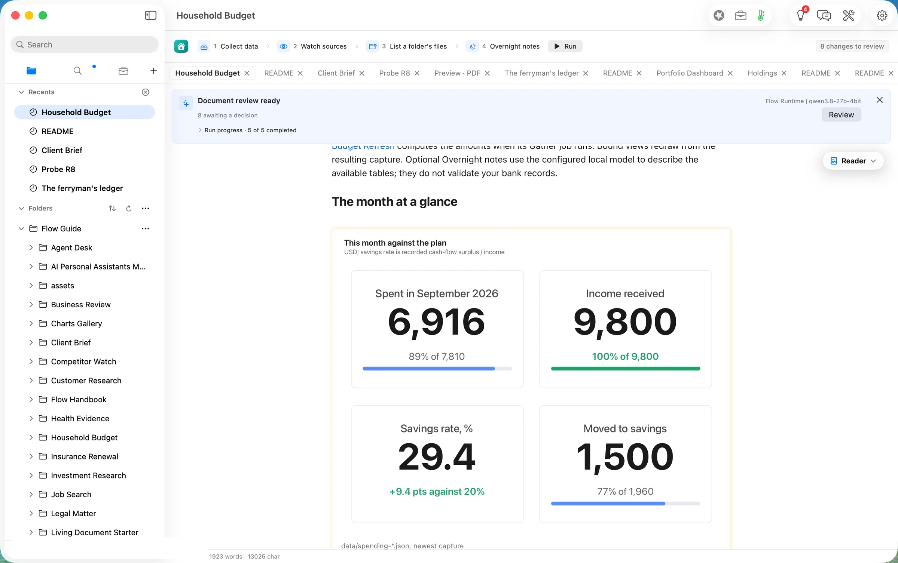

**Categories against their budgets.** Housing is exactly on budget ($2,950). Utilities is a dollar over ($321 of $320). Everything else is under. There is a new bar the sample did not have, *Uncategorized*, at $895 (shot 08).

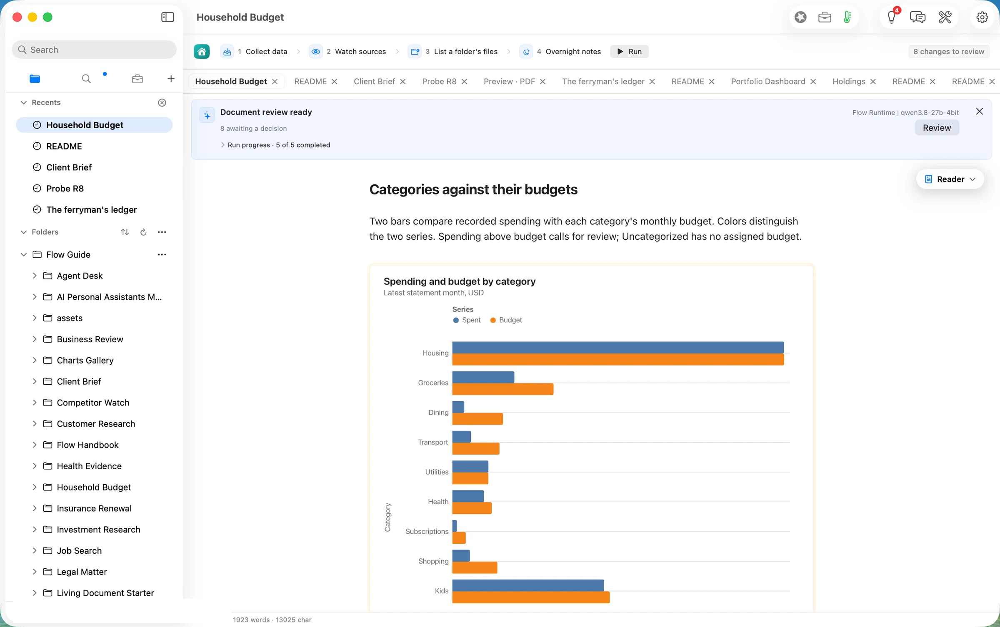

**The last months, stacked** now shows one month, because September is the only statement left in the folder (shot 09). The chart keeps a column for every statement you leave in `statements/`, so it fills in as the months accumulate. **How the month accumulated** is a small line of the running total (shot 10). Its side figure, "Average 5.45k", is the average of a running total, which is not a useful number (#850).

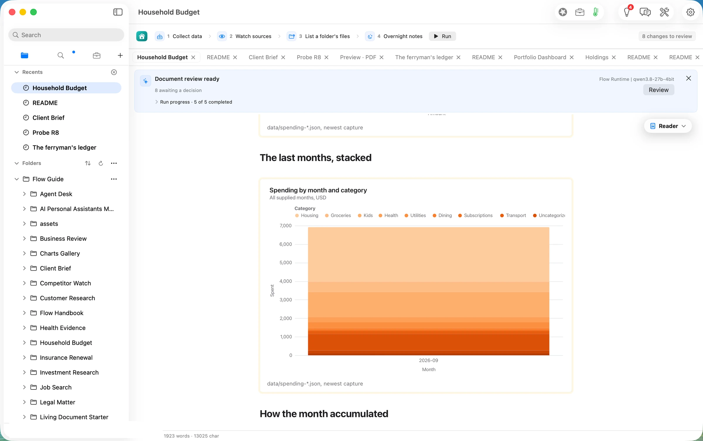

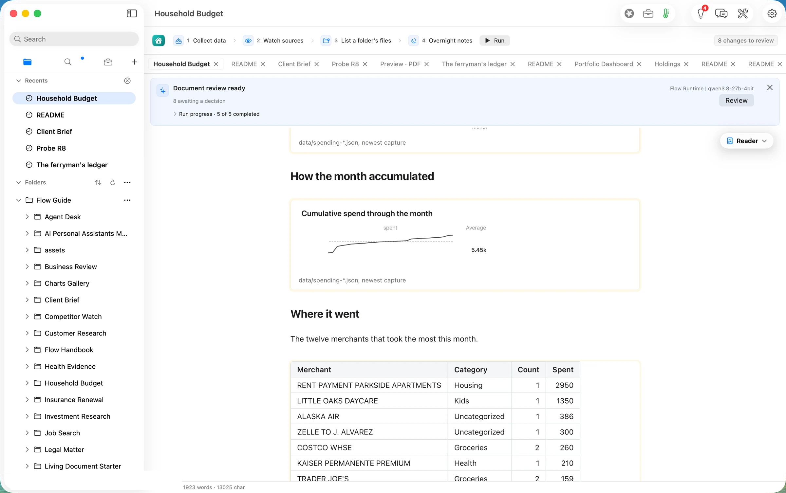

**Review** lists all eight changes, each with Revert and Keep: four charts, *Where it went*, *Lines no rule caught*, the inventory of `statements/`, and the Overnight notes (shot 11). Its Sources tab traces each one to the capture and the files it was built from (shot 12). It names `Budget Profile.md` three times, once for each of its tables, without saying which (#851). We kept all eight at 09:35:05.

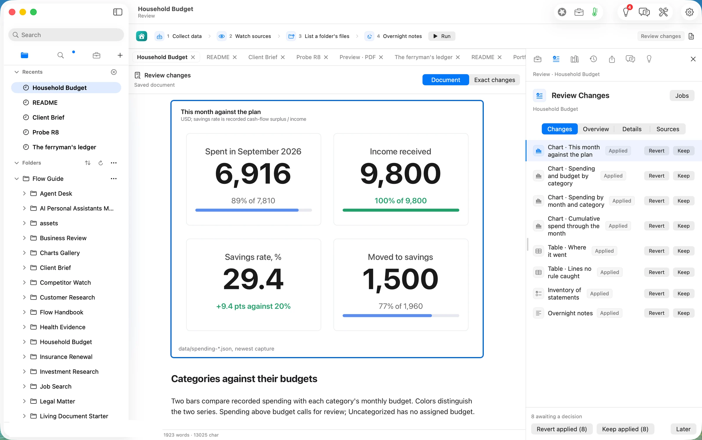

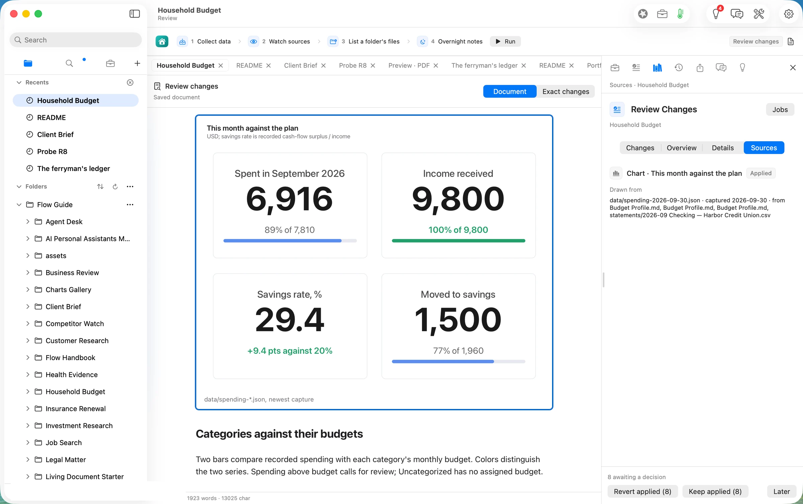

**The Overnight notes** read the tables back in a paragraph (shot 13). We checked each of the twelve figures in it against the capture, and every one is right: $6,916 against $7,810, the 29.4% rate, $1,500 against $1,960, groceries $552 of $900, dining $106 of $450, utilities $321 of $320, $895 uncategorised, rent $2,950, daycare $1,350, the $386 airline ticket, and the $300 Zelle payment.

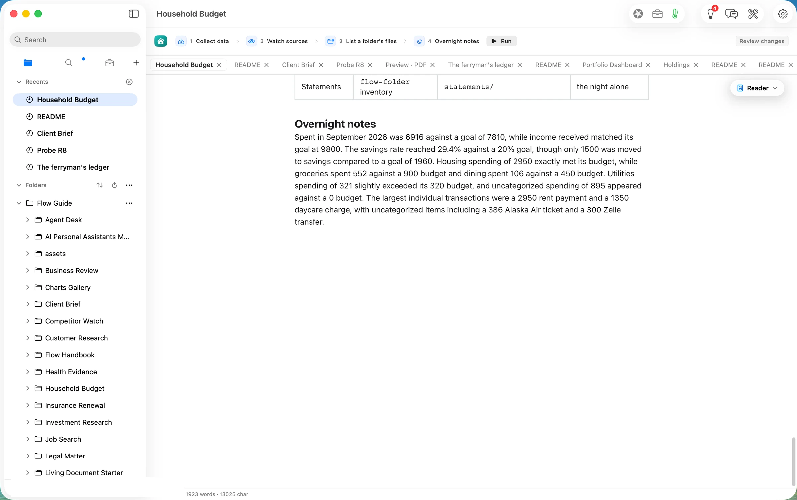

## Step four: teach it the lines it could not place

*Lines no rule caught* lists the five planted lines and says what to do: identify them, add a rule in *Budget Profile*, and run again. Transfers and refunds need a person's review first (shot 14).

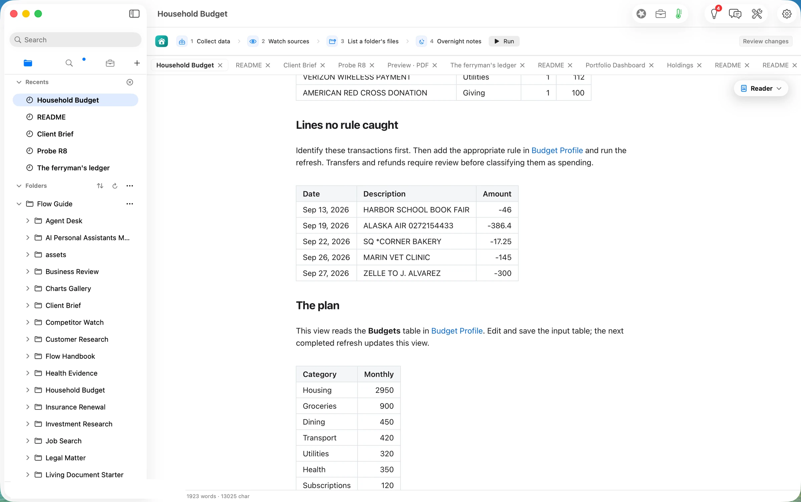

We added three rules to the end of *Budget Profile*'s Rules table, a `match` and a `category` each: `ALASKA AIR → Travel`, `HARBOR SCHOOL → Kids` and `CORNER BAKERY → Dining` (shot 15). The file saved itself at 09:38:57. We left the vet visit alone because the plan has no category that fits, and the Zelle payment because a payment to a person is exactly what the page says to identify before classifying.

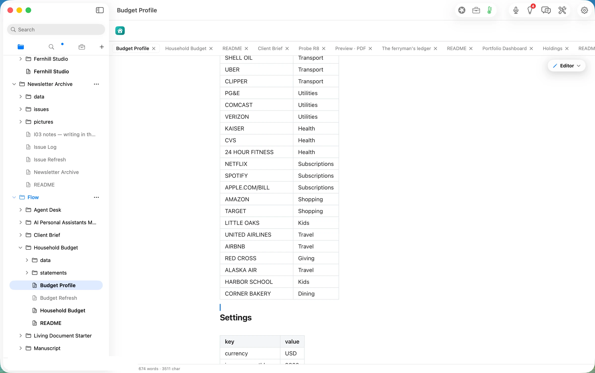

Run again at 09:39:46. The capture was written about a second later (09:39:47.2) and the notes at 09:40:32, 46 seconds after the press (3,544 tokens in, 198 out, on the laptop again). The picture changed where it should (shot 16):

- **Travel is now over budget**: $386 against $300. The airline ticket had been hiding in *Uncategorized*.
- **Kids** rose to $1,396 of $1,400, and **Dining** to $123.
- **Uncategorized** fell from $895 to $445: the vet ($145) and the Zelle payment ($300) (shot 17).
- The monthly total did not move ($6,916), because the rules only move lines between categories.

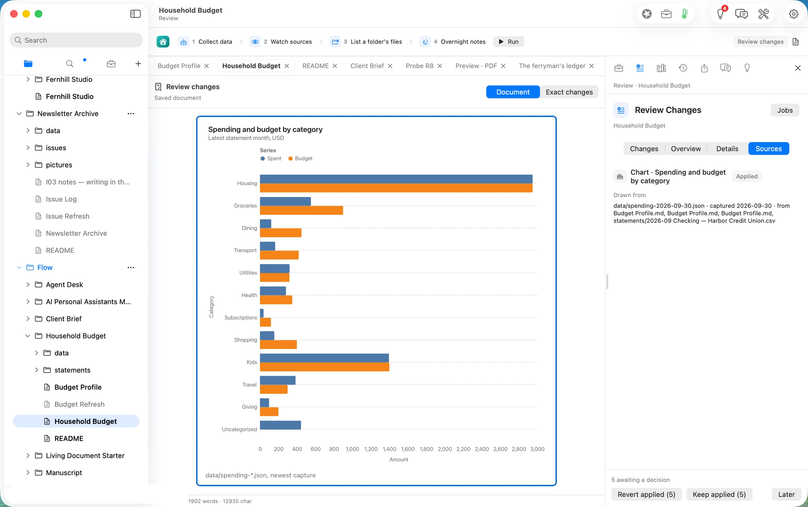

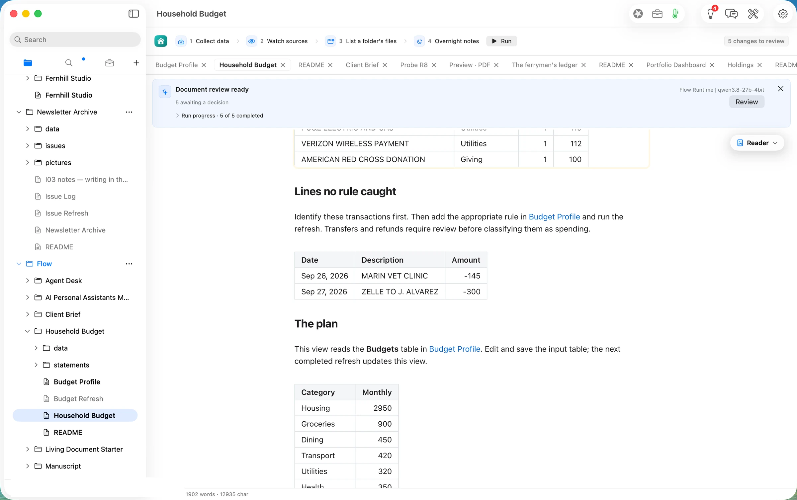

The second notes paragraph was accurate too, but it did not mention that Travel had gone over budget. The chart shows it plainly. The notes describe the tables; they do not promise to flag everything, and the page says as much ("they do not validate your bank records"). We kept the five changes at 09:41:17.

## The deliverable

- **This month's review, redrawn.** The *Household Budget* page, with September against the plan in four charts and three tables, and a paragraph about the month written on the laptop.
- **A capture you can keep.** `data/spending-2026-09-30.json` holds every figure the page shows. The sample's own capture, from 2 September, sits beside it.
- **Rules that stay taught.** The three new rules are rows in *Budget Profile*. Next month's statement is sorted with them.
- **Your statements, as files.** `statements/` holds the CSV exactly as the bank exported it, with its size and a digest recorded on the page's inventory after each run.

## What it costs, measured

| | Machine time | Tokens in / out | Model cost |
|---|---|---|---|
| Make the copy | ~1 s | none | $0.00 |
| Run: capture and redraw (first run) | 1.4 s to the capture, ~8 s to the last view | none | $0.00 |
| Run: Overnight notes (qwen3.8-27b on this Mac), both runs | 49 s and 46 s from the press | 3,358 / 198 and 3,544 / 198 | $0.00 |
| **Same notes on Claude Opus 5.5** ($4 / $20 per M), both runs | | | **$0.0355** |
| **Same notes on Claude Sonnet 5** ($2 / $10 per M), both runs | | | **$0.0178** |

The honest reading: the arithmetic is not a model's job here. It is a definition you can read, run in about a second, and it came out right to the cent. The model's only job is the paragraph. On the laptop that took under a minute, for nothing. The same paragraph from a cloud model would cost under two cents a month. We walked one month; a year of statements, or a bank export in another layout, is not something we measured.

## FAQ

**What leaves my Mac?** Nothing we could find. The run's receipts show the capture read only the plan and the statement in this folder. The one model call was routed to `flow-runtime`, the laptop's own runtime. We did not capture network traffic, so this rests on the receipts, not on a packet trace.

**Does it connect to my bank?** No. It reads the CSV files you put in `statements/`. The page says so: "it is not a connection to your bank".

**My bank's export looks different.** The definition expects `Date`, `Description` and `Amount`, with ISO dates and spending as negative numbers. *Budget Profile* says a bank that exports debits and credits in separate columns has to be converted to that first. We did not test another layout.

**How are lines sorted?** By the Rules table, in order. The first rule whose `match` appears anywhere in the description wins, ignoring capitals. So put more specific rules above general ones.

**What does it cost?** The Home card says "Free to start". Running Jobs is part of Flow Pro, which includes 10 Pro Days to start, then costs $10 a month or $96 a year. We walked on a licensed dev build, so we did not see what an unlicensed first run shows. Reading, writing, searching, organising and exporting are free forever.

## Evidence

| Claim | Value | Label | Source |
|---|---|---|---|
| Input | `2026-09 Checking — Harbor Credit Union.csv`, 1,378 B, 35 lines, sha256 `97e755d1…`; five unmatched merchants | verified | `ls -la`; `shasum -a256` |
| Path copy made | `Household Budget/` with 2 sample CSVs, mtime 09:27:52 | verified | `stat` |
| Import refuses CSV | panel text "Choose Word documents, Excel workbooks, PowerPoint presentations or PDFs"; CSV row greyed, Import disabled | verified | shot 04 |
| No sidebar file drop | the only drop targets register the Flow folder type | verified (read) | `App/FolderDragGrip.swift`, `App/SidebarView.swift` |
| Statement placed | 09:30:29 | verified | `date` |
| Run 1 pressed | 09:30:36.2 | verified | `date` |
| Capture 1 | `nightshift.gather` 16:30:37.591Z; read Budget Profile.md ×3 + the statement | verified | `.flow-receipts` |
| Views redrawn | `document.change` 16:30:37.669Z … 16:30:44.278Z; `current` 16:30:45.398Z | verified | receipts |
| Notes 1 | `model.route` 16:31:25.279Z flow-runtime qwen3.8-27b-4bit 3,358 / 198; `nightshift.notes` traced 20, written | verified | receipts |
| Summary figures | spent 6,916 / goal 7,810; income 9,800; savings rate 29.4 / 20; moved 1,500 / 1,960 | verified | capture `summary`; independent Python recomputation from the CSV and the rules (6,915.79; 29.4; 1,500) |
| Uncategorized, run 1 | 5 lines, $894.65 | verified | capture `uncategorized`; recomputation |
| Kept, run 1 | Keep applied (8) 09:35:04; `assessment.evidence` 16:35:05Z | verified | `date`; receipts |
| Notes 1 figures | all twelve match the capture | verified | read against `byCategory`, `summary`, `topMerchants` |
| Link inert | two `{kind: wiki, target: "Budget Profile"}` events, no tab opened | verified | webprobe `FLOW_LINK_EVENTS`; window title unchanged |
| Rules added | three rows, file saved 09:38:57 | verified | `grep`; `stat` |
| Run 2 | pressed 09:39:46; `nightshift.gather` 16:39:47.151Z; `model.route` 16:40:32.092Z 3,544 / 198 | verified | `date`; receipts |
| Run 2 figures | Travel 386 / 300, Kids 1,396, Dining 123, Uncategorized 445 (2 lines) | verified | capture `byCategory`, `uncategorized` |
| Kept, run 2 | Keep applied (5) 09:41:17 | verified | `date` |
| Nothing left the Mac | only `flow-runtime` model routes; gather read only folder files | verified (receipts); network not captured | receipts |
| Pro needed for Jobs | Flow Pro card lists Jobs; unlicensed behaviour | assumed / unknown | Home Add-ons card; not walked unlicensed |
| Cloud prices | Opus 5.5 $4/$20, Sonnet 5 $2/$10 per M tokens | assumed | rates as used in articles 9–11; not re-verified 09-30 |
| Wall clock | 09:27–09:41 PDT | verified | `date` stamps in the session |
