## The press release we would want to write

**Authors can now take a manuscript from Word to a finished EPUB, with a proofread they approve and a cover of their own, while the book stays in plain files on their Mac.** Orionfold Flow imports each Word chapter as an editable Markdown document in the book's `chapters` folder. A model on the laptop proposes spelling and grammar corrections, which you review line by line before any of them count. Flow then binds the folder into an EPUB with a contents page and a cover generated from your own description. In our walk the chapter was imported in about a second. The proofread took about 9 seconds on the laptop, cost $0.00, and changed exactly the three slips we had planted, without touching the author's voice. The cover cost $0.0336.

> "I finished the draft. I want a clean, proofread book I own, without paying for a whole production pipeline."
> — *The path's own brief, from the Flow Guide. Illustrative, not from a customer.*

## The answer first

The book is a folder of Markdown files. It is not a document locked inside a publishing service.

1. **Each Word chapter comes in as its own document.** File ▸ Import… turned `The Estuary — Chapter 03.docx` into `chapters/The ferryman's ledger.md`. It kept its two section headings and seven paragraphs, and the preview named the destination before anything was written.
2. **Proofread proposes and you decide.** `gemma-4-e4b` on Flow Runtime proposed three corrections: *writen → written*, *Their were → There were*, and *it's painter → its painter*. The exact diff showed nothing else changed. One Keep saved them.
3. **Publish binds the folder.** File ▸ Publish Folder… on `chapters` built a 3-chapter EPUB with a contents page. *Generate…* drew a cover from our title, subtitle, author and one sentence of description.

**One caution before you start.** In this build, one chapter lost its title and author lines while we were getting ready to publish (#836, since fixed), and a paid cover can vanish if you switch tabs before keeping it (#837). Both are explained under Step three, with what to do.

## The job

**The job:** finish a draft by getting a clean, consistent proofread, then produce a book file readers can open in Apple Books or any EPUB reader, with a cover. Keep the text as yours, in files you can still edit, and do not pay a production pipeline to get there.

**The usual way:** a proofreader or a grammar tool working inside Word, then a separate ebook converter or publishing service for the EPUB, then a designer or a stock image for the cover. We did not time or price any of these, so we make no claim about them.

**The Flow way:** the path *Manuscript to book*, in three steps: import the Word manuscript, proofread chapter by chapter, and generate a cover and publish the EPUB.

## Step one: import the Word chapter

Home's Writing filter shows the path. Clicking its card at 08:03 PDT made `Manuscript`, a copy of the Guide's folder that is yours to change (shots 02 and 03). It holds a chapter plan, the book's page, and a `chapters` folder with the novel's first two chapters. The Guide keeps the original.

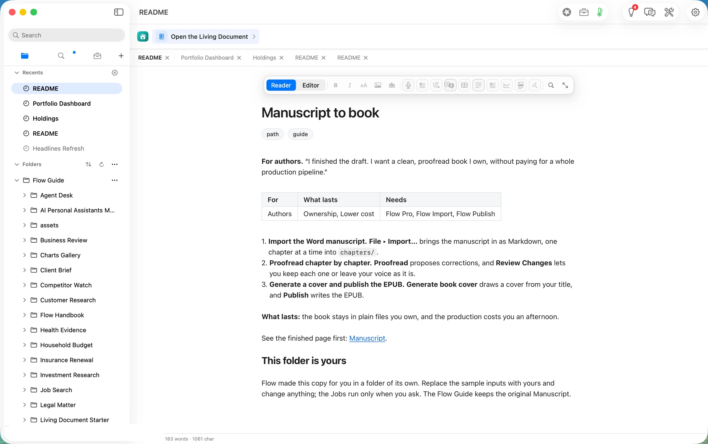

The README says to import the manuscript "one chapter at a time into `chapters/`". Our input is chapter 3 of the invented novel *The Estuary*, "The ferryman's ledger". It is a 37 KB Word file with a title, two headings and seven paragraphs, and it carries three typing slips so the proofread has something real to find.

The Import preview rendered the chapter as it would land, with nothing written yet: "2 headings, 7 paragraphs". The destination was already *Flow ▸ Manuscript ▸ chapters*, "as The ferryman's ledger.md", because the path's README declares that folder as its import target. Under *Left out* it said "Underline, colour and highlight left out (2 passages)". We set no underline, colour or highlight ourselves, so we could not tell what the two passages were. That is filed as #842.

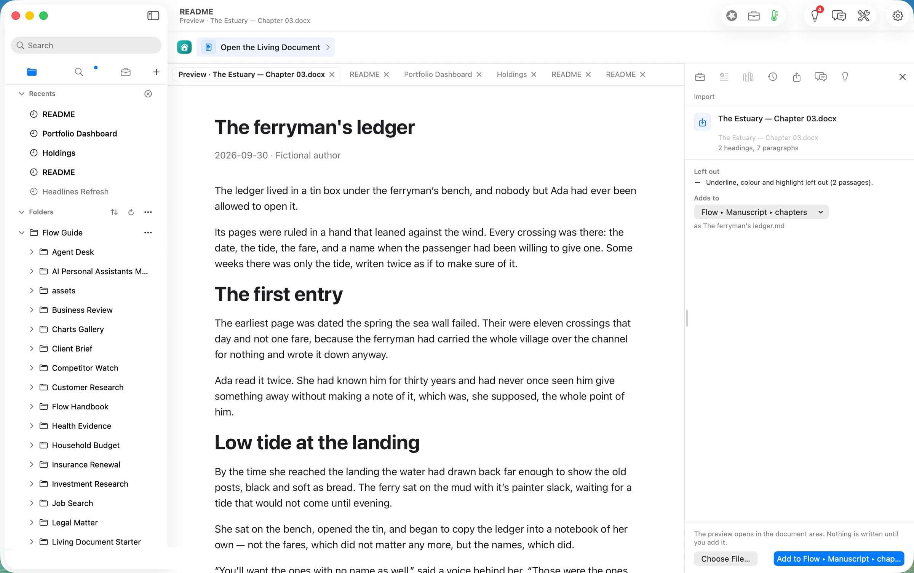

*Add to Flow ▸ Manuscript ▸ chapters* wrote the chapter at 08:04:41 PDT, with its own history record, and opened it in the editor. The Word title became the document's title and the author became a front-matter field. The two Heading 1 sections stayed headings, and all three slips came across as written.

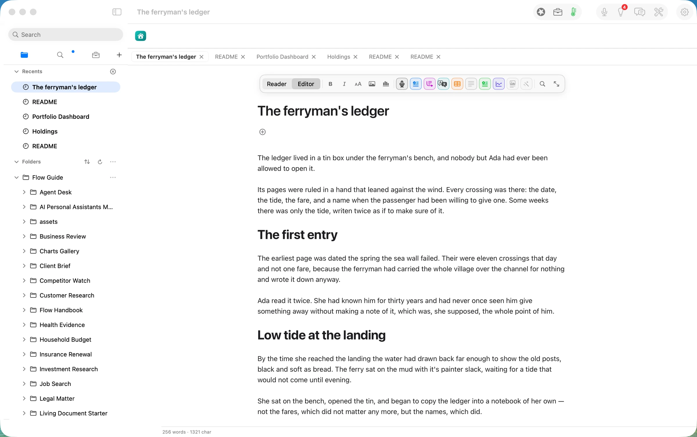

## Step two: proofread the chapter

Agency ▸ Proofread (⌥⌘P) was pressed at 08:05:04 PDT. Flow picked `gemma-4-e4b-it-4bit` on Flow Runtime, a model on this Mac, and said so in the running notice (shot 06). The receipt records the route at 08:05:12.9: **about 9 seconds, 338 tokens in and 304 out, locality "localMachine"**.

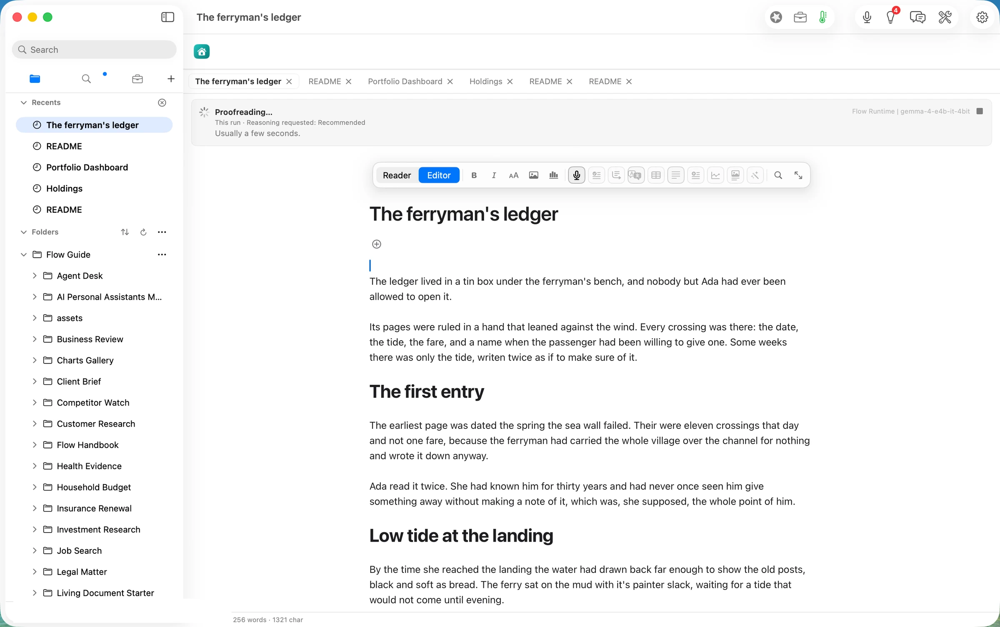

Review Changes opened with the corrections applied and highlighted in the document. The proposal is described as "6 words added or removed; original: 256 words". That is three words out and three words in.

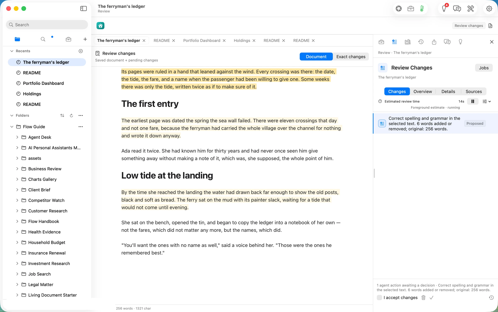

*Exact changes* is where you check a proofread, and it is short. Three lines changed and nothing else did: *writen* became *written*, *Their were* became *There were*, and *it's painter* became *its painter*. The dialogue, the em dash and the long sentences were all left alone.

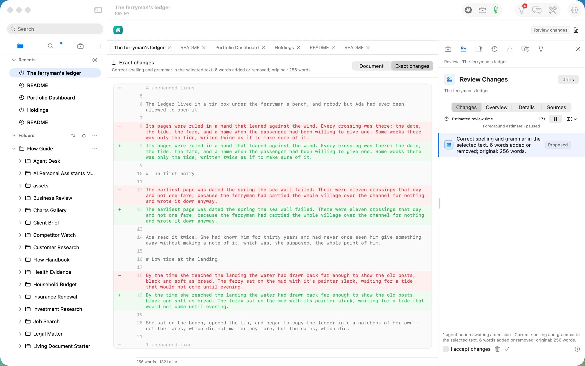

The corrections were kept at 08:06:31 PDT, after reading the diff. The saved chapter reads cleanly.

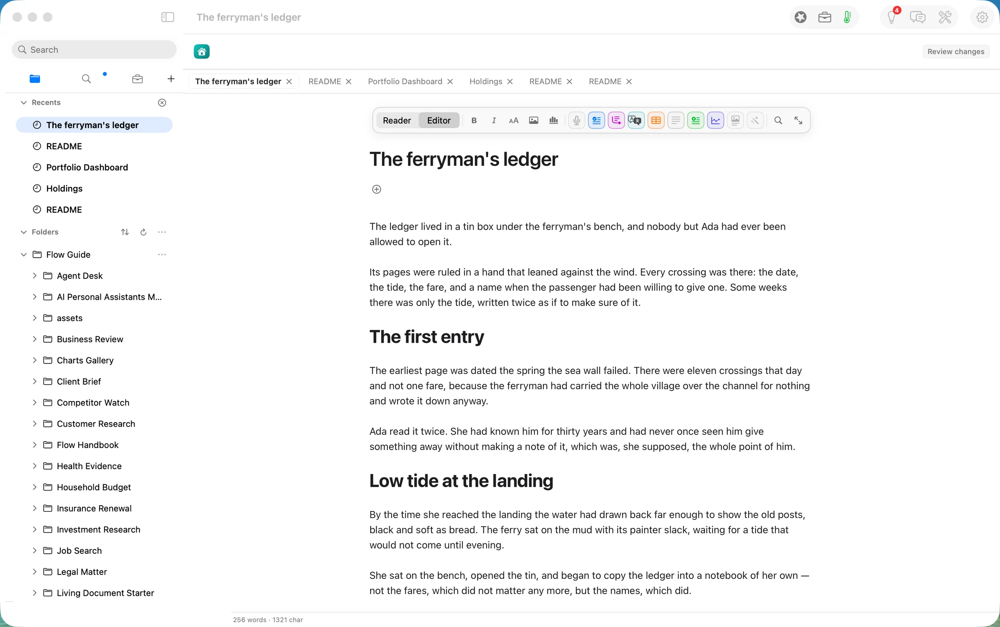

**What the README promises, and what you get.** The README says Review Changes "lets you keep each one or leave your voice as it is". In this build the three corrections come as one proposal with one Keep. You can read each line in *Exact changes*, but you cannot keep two and leave the third. The proposal also says "in the selected text" when nothing was selected. Both are filed as #841. On this chapter it did not matter, because all three corrections were right.

## Step three: generate a cover and publish the EPUB

**Choose the folder first.** File ▸ Publish Folder… publishes the folder that is marked in the sidebar, not the folder of the chapter you have open. Our first try published the whole `Flow` folder, 106 documents (#838). Clicking `chapters` in the sidebar first gave the right book: "Folder · 3 documents · 351 words".

The EPUB preview lists the three chapters in order: *The house on the estuary*, *Low water*, *The ferryman's ledger*. The new chapter's two section headings stayed inside it rather than becoming chapters of their own. The Title field starts as the folder's name, "chapters", and we typed *The Estuary*.

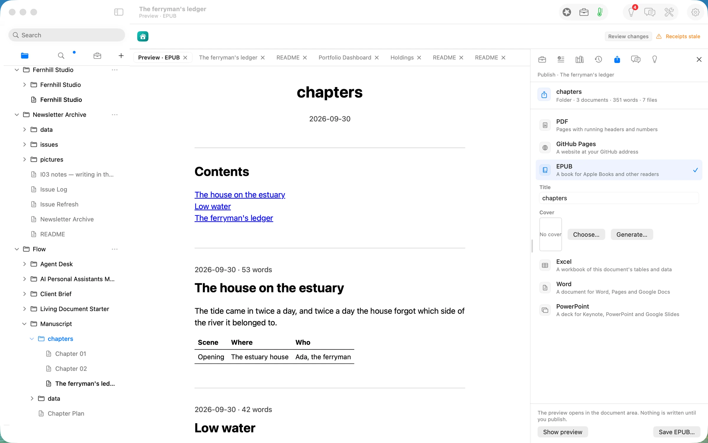

*Generate…* beside the Cover opens a short sheet: Title, Subtext and Author, which appear on the cover exactly as written, and Image, a description of the picture. The sheet started from the folder's name and no author, not from the title we had just typed (#839), so we filled it in: *The Estuary*, *A novel*, *Fictional author*, and "A tidal estuary at dusk, a small wooden ferry resting on the mud beside old black posts, muted watercolour, quiet and literary."

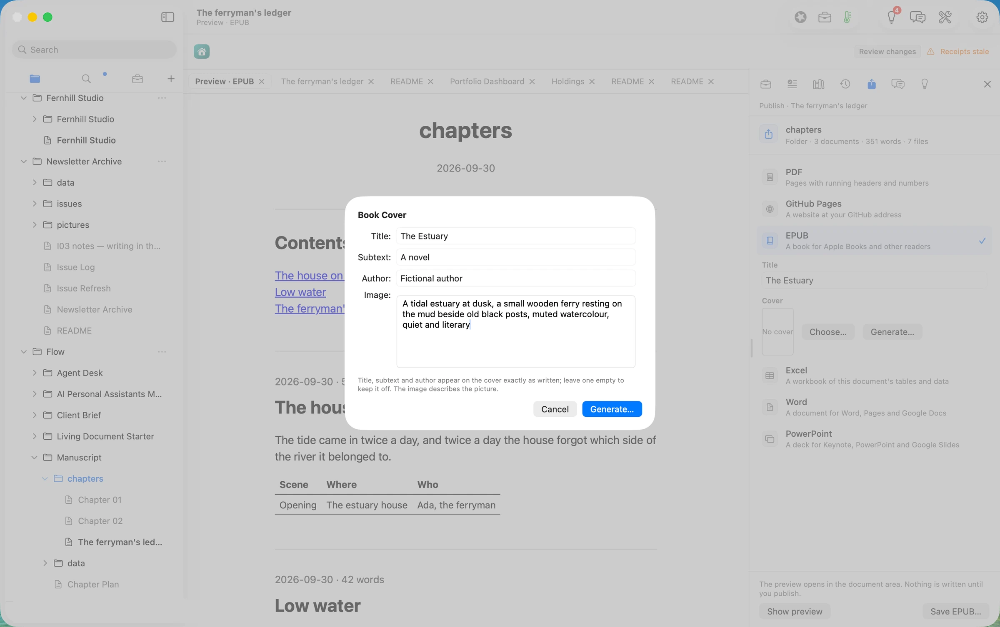

Picture generation goes through OpenRouter, and it is the only step on this path that leaves the Mac. Before anything was sent, Flow showed where it would go and what it would cost: **OpenRouter, Gemini 3.1 Flash Lite Image, 2 items, about 654 bytes, estimated $0.0336**. The operator pressed Allow Once. The receipt records the charge OpenRouter reported: **$0.033637**.

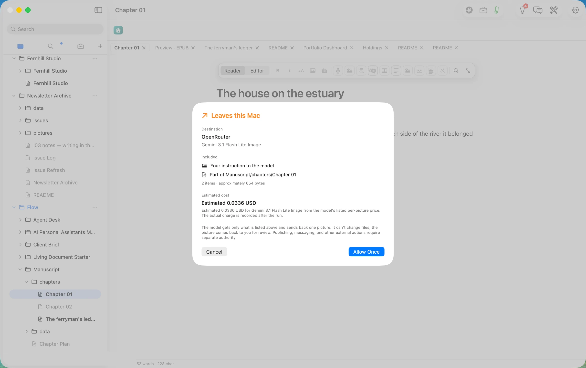

**Where the picture goes, and the trap.** A generated cover is not written anywhere until you press Keep. It waits on the Publish task's Cover line, with Keep and Discard beside it (shot 13). In this build, *Generate…* also brings the book's first chapter to the front, and the Workbench holding that Cover line leaves the screen. The "Making picture" notice disappears when the picture arrives, and nothing takes its place. On our first run we then reopened Publish from another tab. That rebuilt the task and dropped the waiting picture: $0.0336 billed, with no file. This is filed as #837. **Until it is fixed, click the tab you published from and nothing else, then press Keep.** That is what the second run did, and it worked.

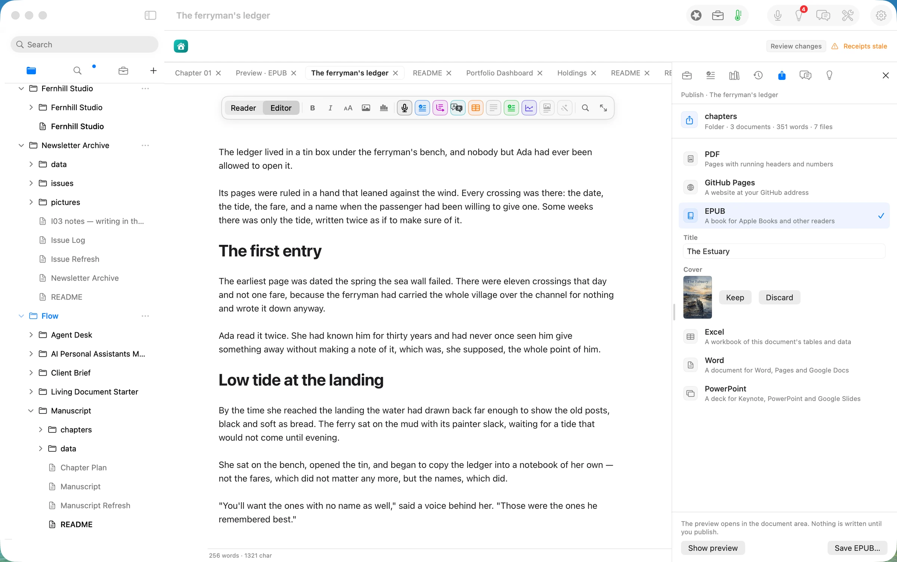

Keep wrote the picture into the book's folder at 08:22:23 PDT as `chapters/assets/Chapter-01-cover.jpg`: 848 × 1264 pixels, 2:3, 250 KB. The preview opened on the cover.

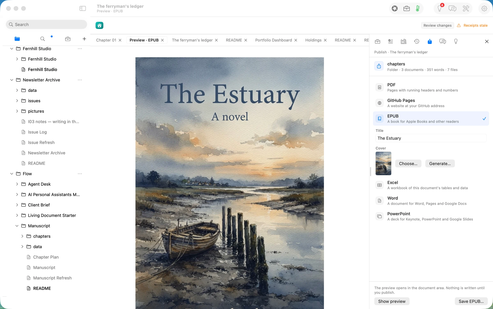

*Save EPUB…* wrote `The Estuary.epub` at 08:23:23 PDT: **256,405 bytes**, titled *The Estuary*, with a cover page, the cover image, a title page, a contents page, the three chapters in order, and an "About this book" page. That last page lists each chapter with its word count and how many history records back it. The saved book carries all three corrections.

**The second trap, and the one to watch for.** Between the Keep of the proofread and the save of the book, the chapter we had imported lost its front matter. That is its `title:` and `author:` lines, and nothing else in it. We first saw the loss just as File ▸ Publish Folder… was chosen with that chapter open in the editor. Its tab gained the unsaved dot, and Flow saved the change four seconds later as an ordinary edit. The ribbon then read "Receipts stale". The book was not harmed: the chapter's title comes from its file name. It has no author line, because the lost field was the only one. It was filed as #836, sev1, because it changed a document without anyone meaning to. Reproducing it later showed that Publish was not the cause. With the caret on the blank line under the title, two presses of Backspace deleted the whole title-and-author block. Flow's next build refuses that edit: the properties change only through their own row. **On 2.0.3, keep Backspace away from the line just under a chapter's title, and check its first lines before you publish.**

## The deliverable

- **The book.** `The Estuary.epub`, 256 KB, 3 chapters, a contents page and a generated cover. It opens in Apple Books or any EPUB reader.
- **The manuscript, as files.** `Manuscript/chapters/` holds one Markdown document per chapter, the new one proofread, plus `assets/` with the cover. Beside each document is the record of what ran on it (`.flow-receipts`) and what you decided (`.flow-review`).
- **The cover, yours.** A 2:3 JPEG in the book's folder. It is reused on the next publish, and it can be replaced with *Choose…* or *Generate…*.

## What it costs, measured

| | Machine time | Tokens in / out | Model cost |
|---|---|---|---|
| Import the Word chapter | ~1 s | none | $0.00 |
| Proofread (gemma-4-e4b on this Mac) | ~9 s | 338 / 304 | $0.00 |
| **Same tokens on Claude Opus 5.5** ($4 / $20 per M) | | | **$0.0074** |
| **Same tokens on Claude Sonnet 5** ($2 / $10 per M) | | | **$0.0037** |
| Generate the cover (Gemini 3.1 Flash Lite Image via OpenRouter) | ~70 s wall clock, consent included | one picture | **$0.033637** |
| Build and save the EPUB | ~1 s after Save | none | $0.00 |

The honest reading: the text work is small and runs locally. A chapter of 256 words is a short prompt, and a laptop model handles it in seconds, for nothing. At cloud prices it would also cost less than a cent. The cover is the only paid step, and it is paid per picture. Our walk paid for it twice, $0.067 in total, because the first picture was lost to #837. Proofreading a whole novel one chapter at a time is not something we measured, and we make no claim about it.

## FAQ

**What leaves my Mac?** For the import and the proofread, nothing: both run on the laptop. For the cover, the consent sheet lists exactly what is sent to OpenRouter: your instruction to the model and one more item, about 654 bytes in total, and you allow it once or cancel. The sheet names that item as "Part of Manuscript/chapters/Chapter 01". We did not inspect the request to confirm whether any chapter text was included, so we make no claim either way.

**Does the proofread change my style?** Not in our walk. It changed three words and left everything else as written. It is still one proposal for the whole chapter in this build (#841), so read the exact diff before you keep it.

**Can I use my own cover?** Yes. *Choose…* picks a picture from the book's documents or folder, so add your own picture there first.

**Can I edit after publishing?** Yes. The chapters are ordinary Markdown documents. Publish again and the EPUB is rebuilt from them.

**What does it cost?** Reading, writing, searching, organising and exporting are free forever. Proofread is Flow Pro, Import is Flow Import, and EPUB is Flow Publish. Flow Pro includes 10 Pro Days to start, then costs $10 a month or $96 a year. Picture generation is billed by your OpenRouter account, per picture.

## Evidence

| Claim | Value | Label | Source |
|---|---|---|---|
| Input | `The Estuary — Chapter 03.docx`, 37,332 B; title, 2 × Heading 1, 7 paragraphs; slips *writen*, *Their were*, *it's painter* | verified | `articles/_inputs/generate.py` `manuscript()`; `ls -la ~/flow-demo/inputs/11-manuscript/` |
| Path copy made | the path copy `Manuscript/` with `chapters/Chapter 01.md`, `Chapter 02.md`, mtime 08:03:31 | verified | `ls -laT` |
| Import preview | "2 headings, 7 paragraphs"; Adds to Flow ▸ Manuscript ▸ chapters; left out: "Underline, colour and highlight … (2 passages)" | verified | shot 04 |
| Import written | `The ferryman's ledger.md` 1,387 B at 08:04:41; `document.change` 15:04:41.737Z | verified | `ls -laT`; `.flow-receipts` |
| Proofread route | pressed 08:05:04; `model.route` 15:05:12.939Z, flow-runtime, gemma-4-e4b-it-4bit, localMachine, 338 / 304 | verified | `date`; receipts |
| Corrections | writen→written, Their→There, it's→its; nothing else | verified | shot 08; `.flow-review` `packets/0` base vs proposed |
| Kept | Approve & Save 08:06:31; `document.change` 15:06:31.961Z; disk holds the three fixes | verified | `date`; receipts; `grep` |
| Front matter lost | 08:08:30 rewrite, 1,387 → 1,323 B, `title:`/`author:` gone, no receipt after 15:06:33Z | verified | `ls -laT`; `head`; receipts |
| Cause of the loss | Two Backspaces under the properties row delete the block; Publish Folder… alone does not | verified (09-30, builds 0249-17 and 0249-18) | webprobe keydowns; file size and md5 |
| Wrong folder | first Publish Folder…: "Flow · 106 documents in 11 sections · 22 charts" | verified | capture 08:08:44 |
| Right folder | "chapters · Folder · 3 documents · 351 words · 7 files" | verified | shot 10 |
| Consent | OpenRouter, Gemini 3.1 Flash Lite Image, 2 items ≈654 bytes, estimated 0.0336 USD | verified | shot 12 |
| Catalog price | $0.0336 per picture | verified | `Sources/FlowCore/Agency/ProviderCredentials.swift` picture entries |
| Cover 1 (lost) | `model.token-cost` 15:17:43.376Z, $0.033637 reported, 848×1264; no file written | verified | Chapter 01 receipts; `ls` of `chapters/` |
| Cover 2 (kept) | `model.token-cost` 15:21:48.236Z, $0.033637; Keep wrote `assets/Chapter-01-cover.jpg` 250,021 B at 08:22:23 | verified | receipts; `ls -laT` |
| EPUB | `The Estuary.epub` 256,405 B, 08:23:23; `publish.output` 15:23:23.030Z; `dc:title` The Estuary, no `dc:creator`; files cover.xhtml, images/cover.jpg, title, contents, nav, 3 chapters, colophon | verified | `ls -la`; `unzip`; `content.opf` |
| EPUB carries the fixes | "written twice" in `the-ferryman-s-ledger.html` | verified | text extract |
| Cloud prices | Opus 5.5 $4/$20, Sonnet 5 $2/$10 per M tokens | assumed | rates as used in articles 9–10; not re-verified 09-30 |
| Wall clock | 08:02–08:23 PDT | verified | `date` stamps in the session |
