## The press release we would want to write

**Investors can now keep a portfolio dashboard current from the spreadsheet their broker already exports, without sending their positions to anyone.** Orionfold Flow imports the export as an editable table, fetches each holding's daily prices and the headlines from the addresses written in a definition you can read, and redraws the dashboard's tables and charts from the dated capture it saves in your folder. A model on your Mac writes a short note on the tables. Flow checks every number in that note against the data before it is written, and nothing on the page changes for good until you keep it. In our walk the quotes for ten holdings arrived 4.2 seconds after pressing Run, the page was redrawn 15 seconds after the press, and the note was written about 2 minutes 37 seconds after it. The model cost was $0.00.

> "Show me what needs attention in the holdings I already chose, without handing my positions to anyone."
> — *The path's own brief, from the Flow Guide. Illustrative, not from a customer.*

## The answer first

The dashboard is a document that rebuilds itself from your files. It is not a web portfolio tracker that holds your positions.

1. **The export comes in as a table.** File ▸ Import… turned a 10-row Excel sheet into an editable Markdown table in the path's folder in about a second.
2. **Run Jobs gathers and redraws.** One press ran five Jobs. Two gathered data: 10 price series, 10 name lookups, 8 macro series and the S&P 500, plus 30 headlines. Two more checked the watched sources and the data folder. The fifth wrote the note. Ten views on the page were redrawn: the at-a-glance tiles, the holdings table, five charts, the macro and headlines tables, and the data inventory.
3. **You keep or revert each change.** Every redrawn view and the note waited in Review Changes, with the exact line-by-line diff one click away. The note is written by `qwen3.8-27b-4bit` on the laptop, and Flow refused its first draft because one number could not be traced to the data.

**One caution before you start.** In this build, the path's first step does not do quite what its README says. We explain it under Step one, and it is filed as #828.

## The job

**The job:** a few times a week, see what the holdings you already own are worth, where the money sits, what moved, and whether anything needs attention. Do it without retyping positions into a website, and be able to check where every number came from.

**The usual way:** a broker's own screen, which knows only that broker's account, or a portfolio website that asks you to upload or type in your positions. We did not time either, so we make no claim about them.

**The Flow way:** the path *A portfolio that explains itself*, in three steps: import your holdings, gather quotes, and read the notes from a model on your Mac.

## Step one: import the holdings

Home's Money filter shows the path. Pressing Open at 06:38:40 PDT made `Stock Portfolio`, a copy of the Guide's folder that is yours to change (shot 02). The Guide keeps the original.

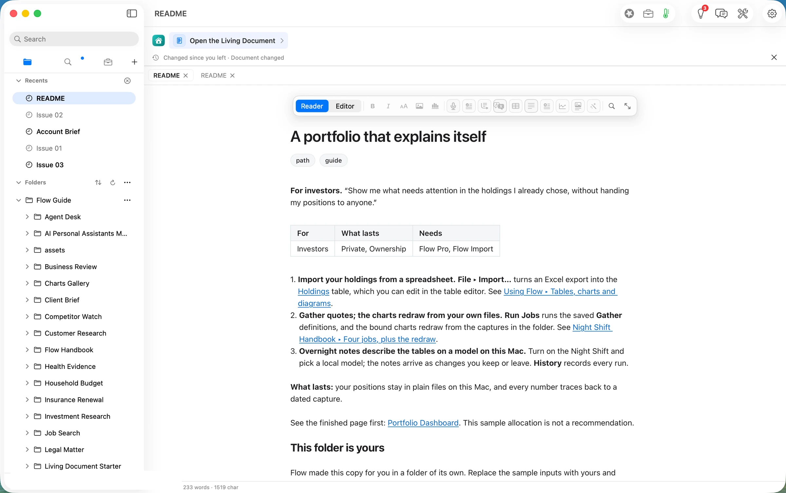

File ▸ Import… took `Brokerage export — positions.xlsx`, a synthetic export we generated for this walk. Compared with the Guide's sample, TSLA is gone, COST is new, and NVDA went from 60 shares to 75. The preview showed the sheet as it would land, with nothing written yet: one sheet, one table, ten rows. The destination was already *Flow ▸ Stock Portfolio*. Under *Left out* it said "Values only: formulas, formatting and charts stay in the workbook."

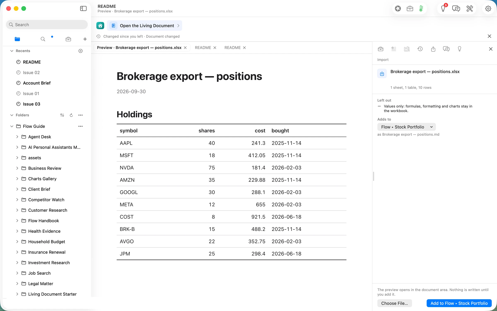

*Add to Flow ▸ Stock Portfolio* wrote `Brokerage export — positions.md` at 06:39:29 PDT, with its own history record, and opened it in the editor.

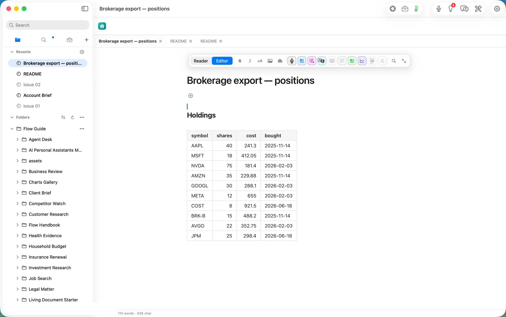

**What the README does not tell you.** The README says Import "turns an Excel export into the Holdings table". In this build it writes a new document beside `Holdings.md` and leaves `Holdings.md` alone. To make the dashboard price the imported lots, we pointed the `holdings` source of both saved definitions, *Portfolio Refresh* and *Headlines Refresh*, at the new table. File ▸ Edit Definition… opens each one as data, and the preview beside the source switched to the imported rows (COST in, TSLA out) before anything was saved. Both were saved by 06:42:30. That is enough for every price, chart and total on the page. It is not enough for one table, *What you declared*, which still reads `Holdings.md` directly and so still shows the Guide's sample lots. The alternative is to paste your rows into `Holdings.md` in the table editor. Either way it is one-time setup, and it is filed as #828.

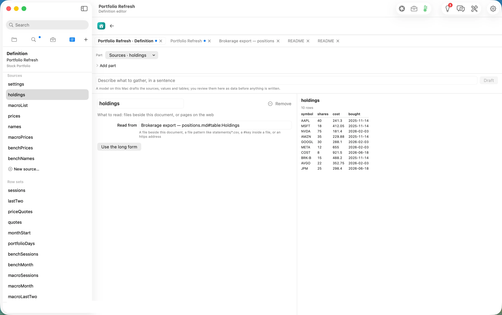

## Step two: gather quotes, and the charts redraw

The dashboard shows its Jobs in the row above the document: *1 Collect data*, *2 Collect data*, *3 Watch sources*, *4 List a folder's files*, *5 Overnight notes*, and *Run*.

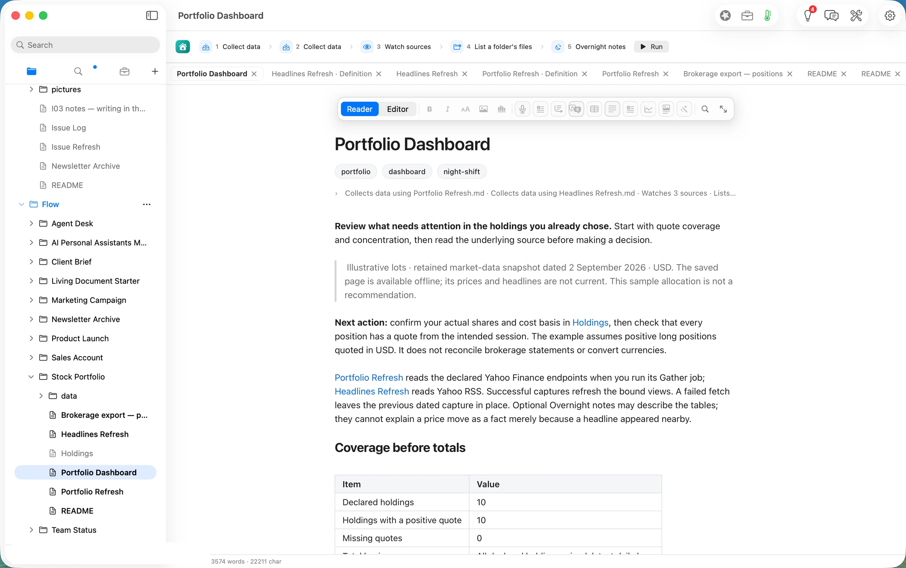

Run was pressed at 06:43:18 PDT. By the receipts Flow writes beside the document:

- **Collect data (prices)** saved `data/portfolio-2026-09-30.json` at 06:43:22.4, **4.2 s** after the press. It read 33 sources: the imported table and one Yahoo Finance address per holding, filled in from the one address written in the definition. The receipt lists each one, COST included.
- **Collect data (headlines)** saved `data/news-2026-09-30.json` about a second later, with 30 headlines (3 per holding).
- **Watch sources** and **List a folder's files** recorded fingerprints of `Holdings.md`, the data folder and one Federal Reserve page by 06:43:23.9.
- **The redraw** rewrote the page's bound views, one after another, by 06:43:33, about **15 s** after the press. Every one of them names its source under the chart: `data/portfolio-*.json, newest capture`.
- **Overnight notes** ran on Flow Runtime with `qwen3.8-27b-4bit` on this Mac. The first draft (7,532 tokens in, 250 out) was **refused**: 23 of its 24 numbers traced to the data, and one, "0.81", did not. The second draft (7,552 in, 152 out) traced 14 of 14 and was written at 06:45:54.9.

The banner then said *Document review ready · 11 awaiting a decision · Run progress 6 of 6 completed*.

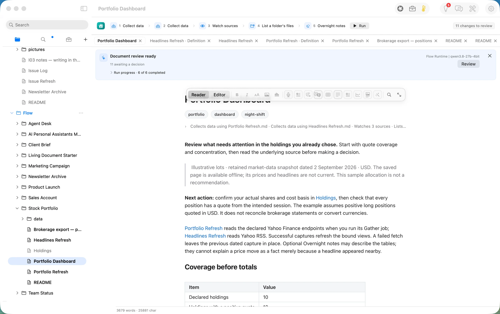

## Step three: read the note, and keep what you agree with

Review Changes lists every change the run made, each already applied to the page, with Revert and Keep beside it.

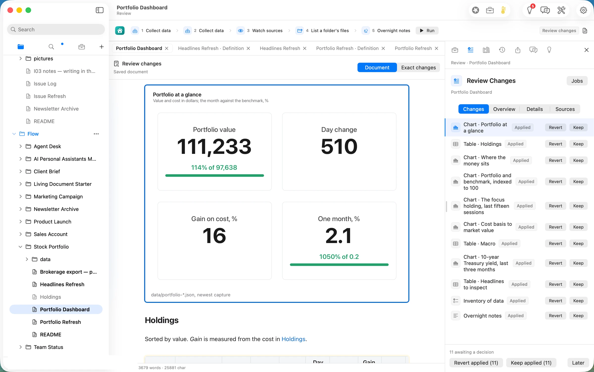

**At a glance**, from the capture. The figures are in US dollars; they are computed by the definition, not by a model.

| | Value | How it is worked out |
|---|---|---|
| Portfolio value | 111,233 | 10 positions at their latest price (98,733) plus 12,500 cash |
| Against cost | 97,638 | what the positions cost (85,138) plus the same cash |
| Gain on cost | 16% | 98,733 ÷ 85,138 − 1, positions only |
| Day change | 510 | shares × (latest − previous close), summed |
| One month | 2.1% (S&P 500: 0.2%) | 22 daily closes, today's share counts |

Every holding is priced, and the coverage table says so first: 10 declared, 10 with a positive quote, 0 missing. If a quote had failed, the totals, weights and allocation would have been withheld rather than drawn from nine of ten.

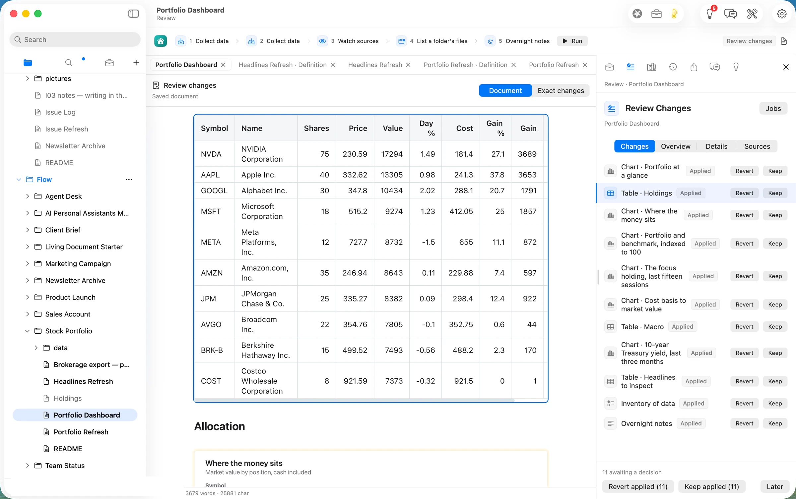

*Exact changes* shows what moved, line by line. TSLA left the table and COST arrived, NVDA's row now counts 75 shares, and every price and weight was replaced with the new session's.

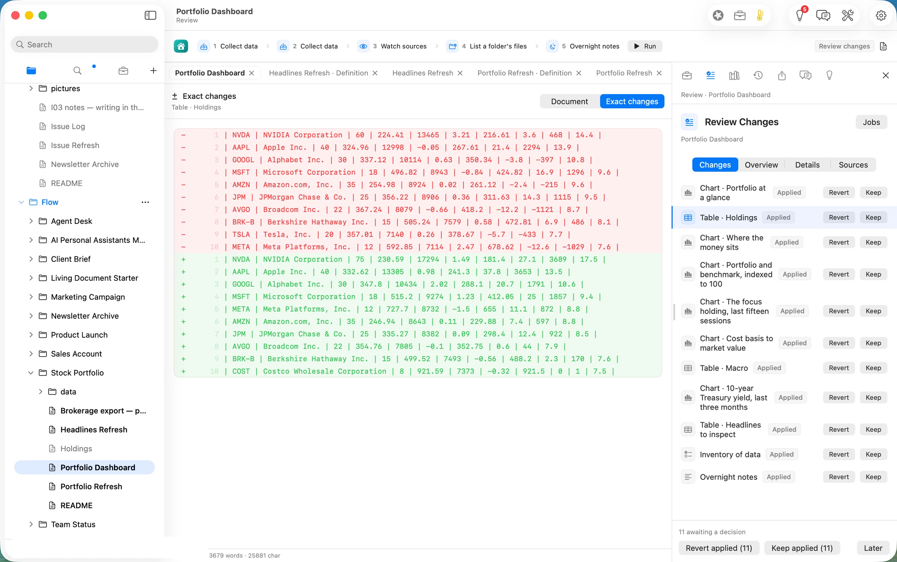

The note, as written by the model on the laptop:

> *"The portfolio value stands at 111233, reflecting a day change of 510 and a gain on cost of 16%. NVDA leads the allocation with a value of 17294, followed by AAPL at 13305 and GOOGL at 10434. In the macro environment, the S&P 500 closed at 7698.53 with a 0.36 change, while the Nasdaq Composite rose 0.56 to 26948.05. The 10-year Treasury yield is at 5.23, and the VIX decreased to 15.91."*

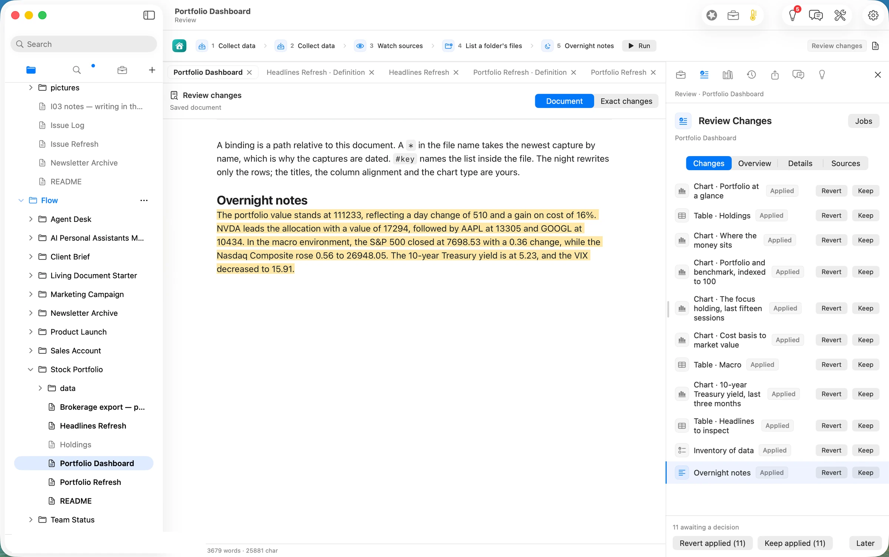

Every number in it matches the tables. It is still worth reading before you keep it. "0.36 change" and "rose 0.56" are percentages from the macro table's *Day %* column, and the note drops the % sign. Read as index points, they would be wrong by a factor of a hundred. Flow's check confirms that each number appears in the data, not what unit it carries. That gap is filed as #831. The note also does what the page asks and explains no move with a headline.

All eleven changes were kept at 06:47:28 PDT, after reading the diff and the note.

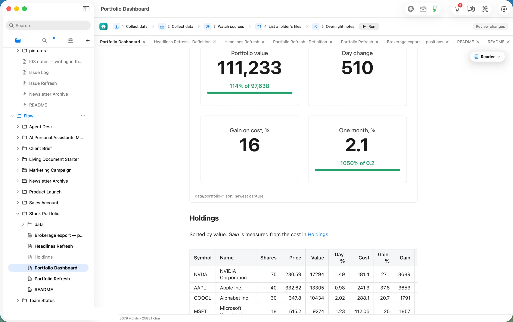

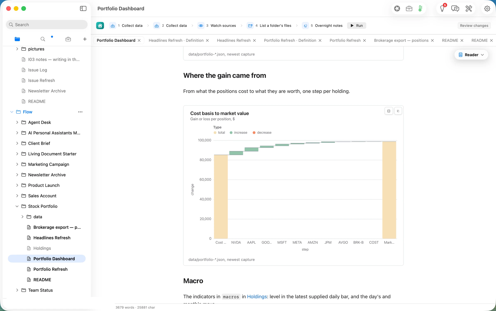

## The deliverable

- **The dashboard, current.** `Portfolio Dashboard.md` in the path's folder, with 10 views redrawn from today's capture and a traced note (11 kept changes). Beside it are the record of what ran (`.flow-receipts`, with every address read) and what you decided (`.flow-review`).
- **The captures, dated.** `data/portfolio-2026-09-30.json` and `data/news-2026-09-30.json` sit next to the Guide's 2 September snapshots. The newest capture wins, and the older ones remain as history.
- **Your holdings, as a file.** The imported table stays in the folder as plain Markdown, and the next run starts from it.

## What it costs, measured

| | Machine time | Tokens in / out | Model cost |
|---|---|---|---|
| Import the export | ~1 s | none | $0.00 |
| Gather prices + headlines (Yahoo Finance, public) | 4.2 s + ~1 s | none (no model) | $0.00 |
| Redraw the bound views | ~10 s | none | $0.00 |
| Overnight notes, 2 drafts (qwen3.8-27b-4bit on this Mac) | ~2 min 21 s | 15,084 / 402 | $0.00 |
| **Same tokens on Claude Opus 5.5** ($4 / $20 per M) | | | **$0.068** |
| **Same tokens on Claude Sonnet 5** ($2 / $10 per M) | | | **$0.034** |

The honest reading: the part of this path that matters to your money, the prices, totals, weights and charts, is a saved calculation. It runs in seconds, uses no model, and gives the same answer from the same capture every time. The model is used for one short paragraph, and it is the slowest part of the run by far: about 140 of the 157 seconds. Running it on the laptop is what keeps your positions off anyone's server. The tables themselves never needed a model.

## FAQ

**What leaves my Mac?** The ticker symbols, as part of the Yahoo Finance addresses written in the definition (one request per holding and per indicator). Your share counts, costs and totals are not sent anywhere. The note was written on the laptop. The receipt lists every address that was read.

**Are the prices real-time?** No. They are daily bars. Our run was at 06:43 PDT, 13 minutes after the US open, so "today's" bar was the session in progress, and the day change reflects its first minutes. The page says "latest daily bars" in its coverage table for that reason.

**Is this a return calculation?** No. "Gain on cost" measures from the average cost you entered. "One month" applies today's share counts to the last 22 daily closes, a fixed-basket price comparison that ignores transactions, cash and dividends. The page says so under each chart.

**What if a quote fails?** The holding stays in the table with blank market cells, the coverage table names the gap, and the totals, weights and allocation are withheld. An unreachable address stops the gather and keeps the previous dated capture. We did not provoke either case in this walk.

**Does it connect to my broker?** No. The input is the spreadsheet you export yourself.

**What does it cost?** Reading, writing, searching, organising and exporting are free forever. Jobs are Flow Pro and Import is Flow Import. Flow Pro includes 10 Pro Days to start, then costs $10 a month or $96 a year.

## Evidence

| Claim | Value | Label | Source |
|---|---|---|---|
| Input | `Brokerage export — positions.xlsx`, 5,295 B, sheet *Holdings*, 10 rows; TSLA out, COST in, NVDA 75 vs the Guide's sample | verified | `articles/_inputs/generate.py` `stock_portfolio()`; `ls -la ~/flow-demo/inputs/10-stock-portfolio/` 06:34 PDT |
| Path copy made | `~/flow-staging/Flow/Stock Portfolio/` absent at 06:38:40, present at 06:38:44 | verified | `ls` before and after the Open click |
| Import preview | "1 sheet, 1 table, 10 rows"; Adds to Flow ▸ Stock Portfolio; Left out: values only | verified | shot 03 |
| Import written | `Brokerage export — positions.md` 477 B, mtime 06:39:29; click at 06:39:29.4 | verified | `stat`; `.flow-receipts` `document.change` |
| Holdings.md untouched | 3,235 B, mtime 06:38 (the copy's) | verified | `ls -la` 06:43 |
| Definitions repointed | `holdings: "Brokerage export — positions.md#table:Holdings"` in Portfolio Refresh (saved 06:41:43) and Headlines Refresh (06:42:30) | verified | `grep`, `stat` |
| Run pressed | 06:43:18.2–18.8 PDT | verified | `date` beside `axpress ribbon-run-jobs` |
| Prices gathered | `nightshift.gather` 13:43:22.425Z, readCount 33, capture `data/portfolio-2026-09-30.json` | verified | `Portfolio Dashboard.md.flow-receipts` |
| Headlines gathered | `nightshift.gather` 13:43:23.462Z, `headlines: 30` | verified | receipts |
| Redraw | 11 `refresh-from-data` checks through 13:43:33.309Z: 9 "changed", coverage and the declared table "current"; Review listed 11 changes (10 views + the note) | verified | receipts |
| Declared table stale | `data:Holdings.md#table:Holdings` "current"; the kept page's lines 372–384 list TSLA 20, NVDA 60 | verified | receipts; `grep -n -A14` |
| Note, draft 1 | `model.route` 13:44:48.422Z, flow-runtime, qwen3.8-27b-4bit, localMachine, 7,532 / 250; `nightshift.notes` pass 1: 24 numbers, 23 traced, untraced "0.81" | verified | receipts |
| Note, draft 2 | `model.route` 13:45:54.488Z, 7,552 / 152; pass 2: 14 of 14 traced; "written" 13:45:54.854Z | verified | receipts |
| At a glance | value 111,233, goal 97,638; day 510; gain on cost 16; month 2.1 vs 0.2 | verified | `portfolio-2026-09-30.json` `summary` |
| Arithmetic | 98,733 + 12,500 = 111,233; 85,138 + 12,500 = 97,638; 98,733 ÷ 85,138 − 1 = 15.97% | verified | `bridge` rows; arithmetic |
| Coverage | 10 declared, 10 priced, 0 missing | verified | capture `coverage` |
| Kept | pressed 06:47:28; 11 `assessment.evidence` 13:47:29.262Z–31.695Z; `.flow-review` packets `[]` | verified | receipts; `.flow-review` |
| Market data | Yahoo Finance public chart and RSS endpoints at 06:43 PDT 09-30 | verified | receipt `read` list |
| Cloud prices | Opus 5.5 $4/$20, Sonnet 5 $2/$10 per M tokens | assumed | rates as used in article 9; not re-verified 09-30 |
| Wall clock | 06:38:40–06:47:31 | verified | `date` stamps in the session |
