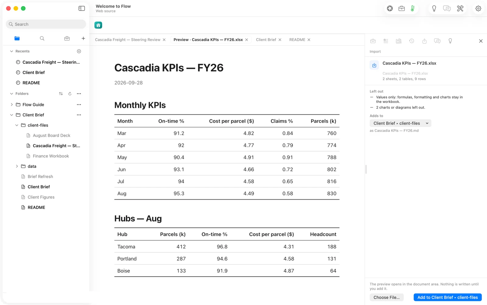
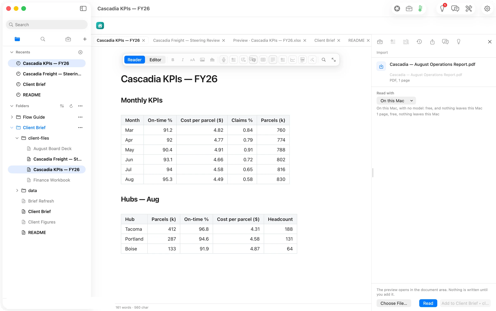
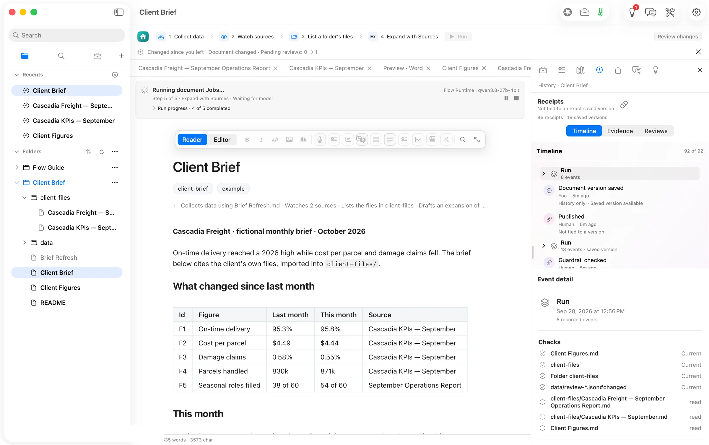
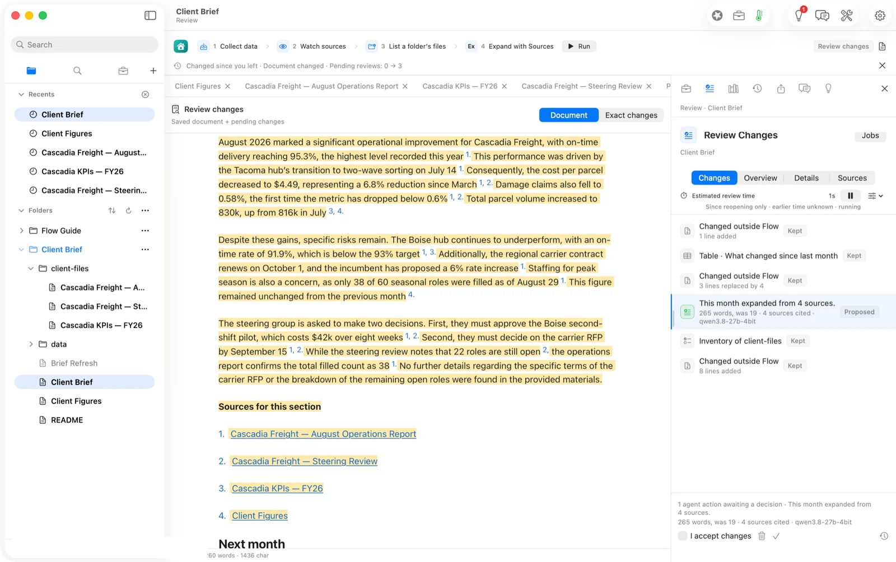
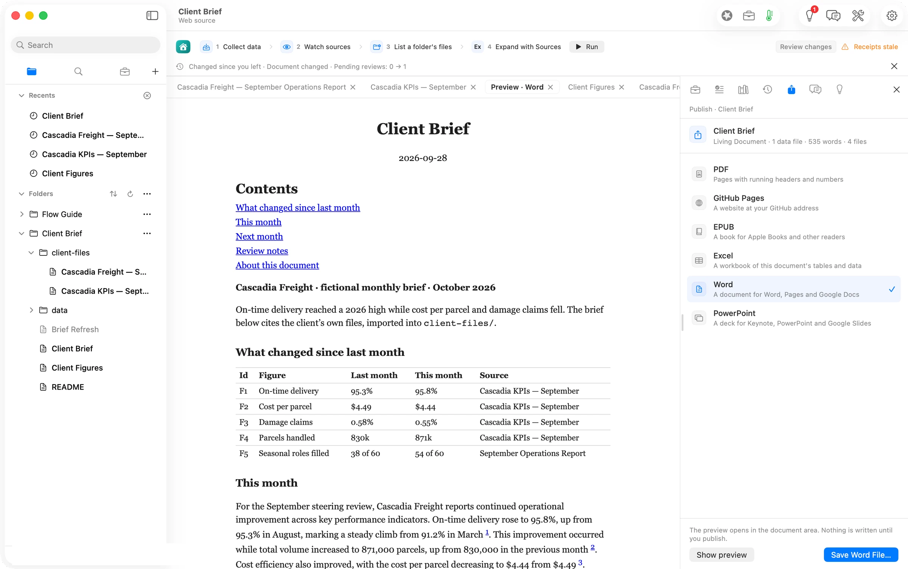
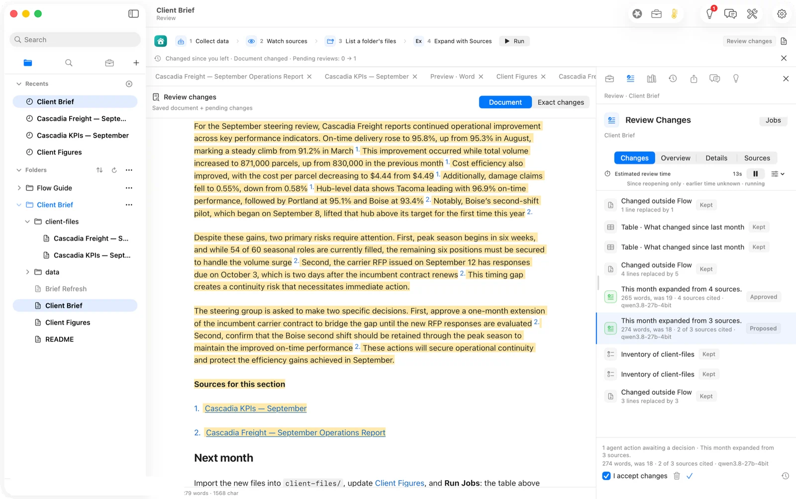
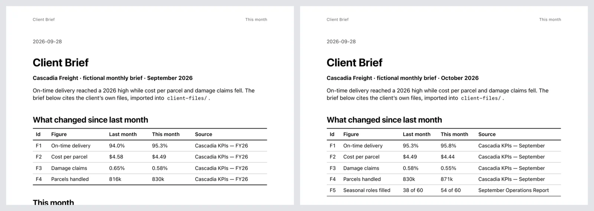
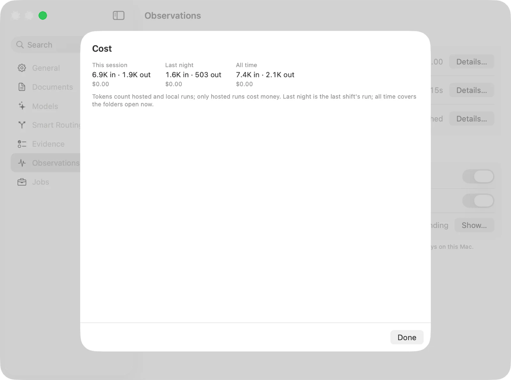

## The press release we would want to write

**Consultants can now turn a client's monthly PDFs, decks and spreadsheets into a signed-off brief without the client's files ever leaving their Mac.** Orionfold Flow imports the files as plain Markdown, drafts the brief's summary with a source on every claim, waits for the consultant to approve the exact words, and publishes the PDF or Word file the client receives. The next month, the consultant drops in the new files and presses Run: the figures table redraws itself and a fresh draft arrives in under a minute. In our own test, both months' drafts ran on an open model on a laptop, in 43 and 45 seconds, at a model cost of $0.00.

> "I used to rebuild the brief from a blank page every month. Now the brief remembers where every number came from, and I spend my time on the two paragraphs the client actually argues about."
> — *Illustrative quote, not from a customer.*

## The answer first

A recurring brief is the same job twelve times a year. Flow makes the eleventh time cost what it should: the few minutes it takes to read what changed. Three things make that true.

1. **The client's files come to you, and stay with you.** File ▸ Import reads Word, Excel, PowerPoint and PDF into the brief's own folder as Markdown you can search and cite. A PDF can be read on this Mac with no model at all: free, and nothing leaves the machine.
2. **The draft cites everything and waits for you.** Expand with Sources wrote 265 words from four files, footnoted sentence by sentence, in 43 seconds on a local open model. Nothing entered the document until we ticked *I accept changes*.
3. **Next month starts from this one.** New files in, Run pressed: the *What changed* table redrew from the new figures in under half a second, and a new, cited draft followed 45 seconds later.

## The job

A fractional operations advisor (call them the consultant) sends Cascadia Freight a steering brief every month. The inputs arrive the way inputs always arrive: an operations report as a PDF, a KPI workbook, last month's steering deck. The output is two pages the steering group will read before the meeting: what moved, what is at risk, what they are asked to decide.

The old way is familiar. Open three files. Copy the numbers into a table by hand. Write the summary from memory of what the files said. Hope nothing was transposed. Next month, do it again, because the brief is a document, not a system. *How long that takes is not something we measured; a figure of two to three hours a month is our assumption, labelled as such below.*

What the consultant needs is not a faster typist. It is a brief that keeps its own receipts.

## Month one: from three files to a brief you would sign

**Bring the files in.** Each file arrives as a preview first. Nothing is written until you add it, and the task says plainly what did not come across: a deck's animations, a workbook's formulas and charts.

For the PDF, Flow asks who should read it. The default offered a hosted model at "about under 1¢". We chose **On this Mac**, which reads the PDF's own text layer: free, nothing sent anywhere, and every figure written checked against its page ("25 figures checked").

**Draft with sources.** The brief carries its own Jobs in plain text at the top of the file: collect the figures, watch the sources, list the client's files, expand *This month* from them. Pressing Run did the first three in under half a second and then handed the fourth to Flow Runtime, the open model Flow runs on the Mac itself: qwen3.8-27b-4bit.

Forty-three seconds later the draft arrived as a proposal, not an edit. Every sentence carries a footnote to the file it came from. The review names what was done in the only terms that matter to a consultant: *This month expanded from 4 sources. 265 words, was 19. 4 sources cited.*

We checked each figure in the draft against the imported files. All of them held: 95.3% on time, $4.49 per parcel, 0.58% claims, Boise at 91.9% against a 93% target, the $42k pilot, the September 15 RFP decision. Two guardrails ran on approval, *unsupported citations* and *human review*, and both passed.

**Publish.** File ▸ Publish writes the file the client receives: PDF with running headers, or Word for a client who edits. The PDF took one save dialog. So did the Word file.

## Month two: the part that compounds

This is where a recurring brief either becomes a system or stays a chore.

The consultant moved August's imports aside, imported September's workbook and report, and updated five figures in the *Client Figures* table. Then Run.

The *What changed* table redrew from the new figures before the model had started. The draft followed: 274 words from the September files, 45 seconds, same local model, same $0.00. Boise's pilot, the RFP timing gap, 54 of 60 seasonal roles filled: all there, all cited.

Side by side, the two published briefs are the argument for the whole product. Same structure. New numbers. Every one traceable.

## What it costs, measured

Flow keeps a receipt for every write: who, when, from what, with which model, at what cost. These are the receipts' numbers, not estimates.

| | Month one (August) | Month two (September) |
|---|---|---|
| Deterministic steps (collect, watch, list, redraw) | under 0.5 s | under 0.5 s |
| Draft on this Mac (qwen3.8-27b-4bit) | 43.4 s | 45.1 s |
| Tokens in / out | 1,872 / 463 | 1,571 / 503 |
| Model cost on Flow Runtime | $0.00 | $0.00 |
| Same tokens on Claude Opus 5.5 ($4 / $20 per M) | $0.017 | $0.016 |
| Same tokens on Claude Sonnet 5 ($2 / $10 per M) | $0.008 | $0.008 |

The honest reading of that table: **running this brief on an open model saves about two cents a month.** A consultant with twelve clients saves about three dollars a year. Nobody should switch models for three dollars.

You choose the local model for a different reason. The client's operations report never went to anyone's server. There was no key to manage and no bill to forecast, and a re-run cost nothing, so we re-ran freely. The saving is not money. It is the question you no longer have to ask a client: *is it all right if I send your numbers to an AI company?*

## FAQ

**Does Flow write the brief for me?** It drafts the part you ask it to, from the files you gave it, and proposes it. You accept the exact words or you don't. Nothing becomes part of the brief without that tick.

**What happens to the client's files?** They become Markdown files in the brief's own folder on your Mac, beside the brief. With a local model, and a PDF read On this Mac, nothing is sent anywhere.

**Can I use a cloud model instead?** Yes. Flow names the model and the estimated price before a hosted run, and the receipt records what it actually cost. For this brief that would have been one to two cents a month.

**What do I need?** Flow Pro, with the Flow Import and Flow Publish add-ons: $10 a month each, or $96 a year. The Markdown documents themselves are never part of a plan.

**What if a figure is wrong?** Every sentence's footnote opens the file it came from, and History shows each version of the brief and who wrote it: you, a Job, or an outside editor.

## Update: build 0249-1 (2026-09-28, in Flow 2.1)

These shipped in **Flow 2.1** (build 3020, 30 September 2026). They were checked on a pre-release build (0249-1) on 28 September; the walk above describes 2.0.3.

- **PDF import keeps every line (#774).** Both Cascadia reports now come in whole: August's "…0.58% of shipments." and all three lines of September's Headline. A line that still went missing would be named under *Left out*. Checked through the Import route with the real PDFs (C3790), not on screen.
- **Run no longer refuses its own draft (#775).** A draft step now waits only for a change someone else made, and it waits *before* the model runs. On 0249-1, two runs applied the folder list and the date stamp and added nothing to Review.
- **A local model's lookup reply that cannot be read is asked for once more (#789).** In the 0249-1 check the draft did not finish because the lookup reply failed its format twice; 2.1 tells the model why and asks again.
- **Published footnotes read 1, 2, 3 (#777).** In PDF, web and EPUB the numbers follow first use, and a repeat keeps its number. Word keeps one note per source. Checked on this brief's published HTML and Word file; the PDF was not re-rendered on screen.
- **Import takes several files at once (#779).**
- **Also fixed:** Review opens on the change still waiting (#776, seen on screen); the Jobs banner names the step and why it ended (#780, seen); publishing no longer edits the brief, because its choices now sit in `Client Brief.md.flow-publish` (#778).

## Evidence

| Claim | Value | Label | Source |
|---|---|---|---|
| Draft time, month one | 43.4 s | verified | receipts: `nightshift.gather` 19:34:06.4Z → `model.route` 19:34:49.85Z, `Client Brief.md.flow-receipts` |
| Draft time, month two | 45.1 s | verified | receipts: 19:48:04.7Z → 19:48:49.8Z |
| Deterministic steps | < 0.5 s | verified | receipts: gather 19:32:08.071Z → last check 19:32:08.557Z |
| Model and locality | qwen3.8-27b-4bit, Flow Runtime, localMachine | verified | `model.route` payloads |
| Tokens month one / two | 1,872 in · 463 out / 1,571 in · 503 out | verified | two `model.route` rows per run, summed |
| Model cost | $0.00 | verified | Settings ▸ Observations ▸ Cost, 12:52 PDT (shot 16) |
| Cloud equivalents | Opus 5.5 $0.017/$0.016; Sonnet 5 $0.008/$0.008 | derived | `ModelPricing.swift` v4 (verified 2026-09-22) × the token counts |
| Draft size | 265 words from 4 sources; 274 words, 2 of 3 cited | verified | Review rows (shots 10, 15) |
| Figures in the draft match the files | all | verified | read against `client-files/*.md`, 12:35 and 12:49 PDT |
| Guardrails passed | unsupported-citations, human-review | verified | `guardrail.assessment` receipts 19:38:37Z, 19:50:36Z |
| PDF read free, on this Mac | "1 page, free, nothing leaves this Mac" | verified | Import task (shot 04) |
| Hosted PDF read price | "about under 1¢" per page | verified (UI estimate) | Import task, Claude Sonnet 5 route |
| Published files | PDF 52,920 B, 3 pages; Word 8,254 B; October PDF 52,794 B | verified | `publish.output` receipts; `pdfinfo` |
| Price of Pro and add-ons | $10/month or $96/year each | verified | Settings ▸ General ▸ Add-ons (12:21 PDT); `Server/…/catalog.ts:49` |
| Twelve clients save ~$3/year | 12 × 12 × ~$0.02 | derived | from the rows above |
| Manual brief takes 2–3 hours | — | assumed | not measured |
| Human review time | 13 s estimate (month two) | unknown as a human figure | Flow's estimate measured an agent, not a person |
