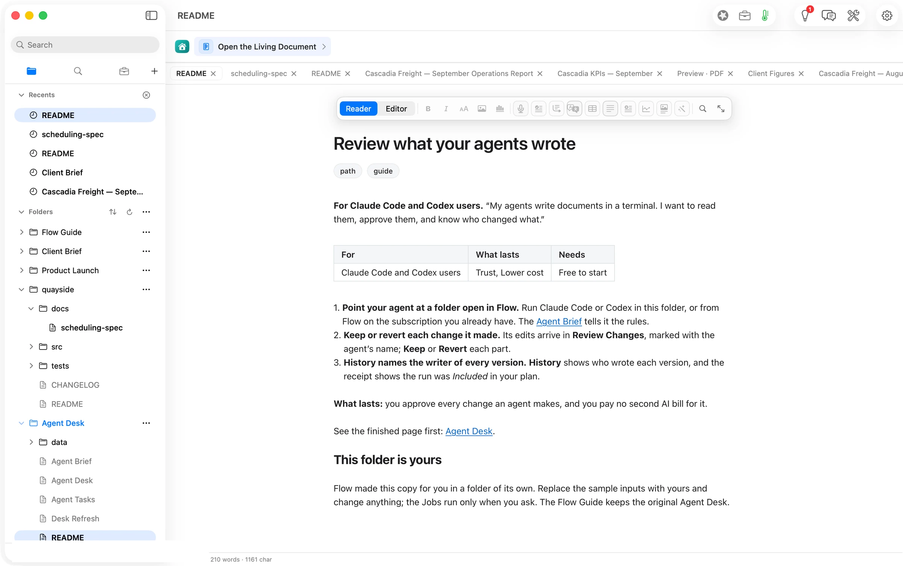
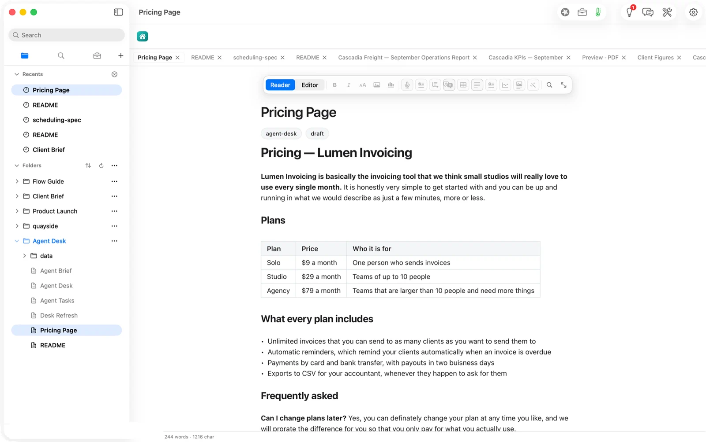
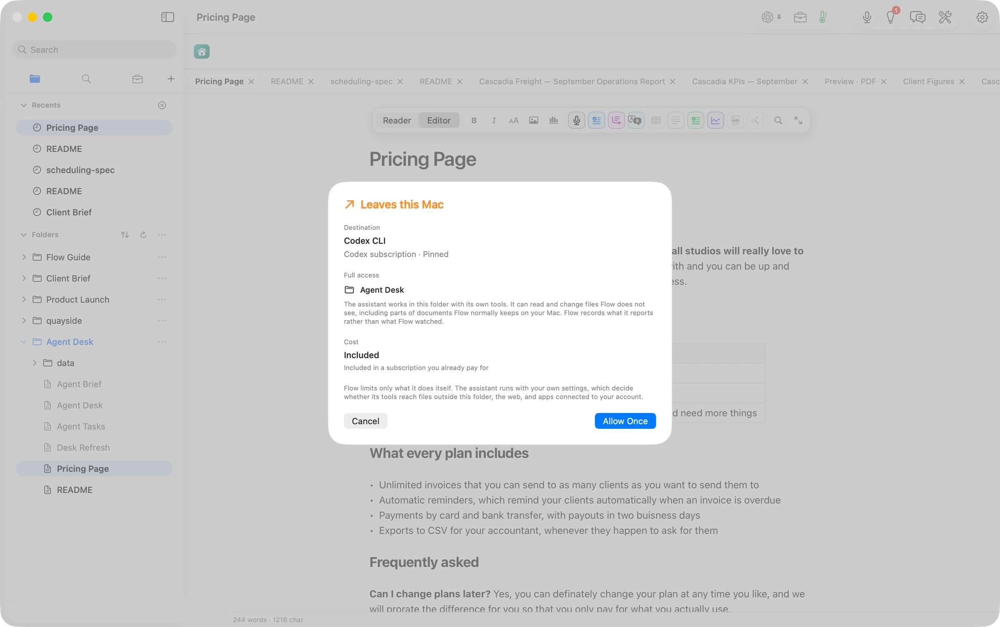
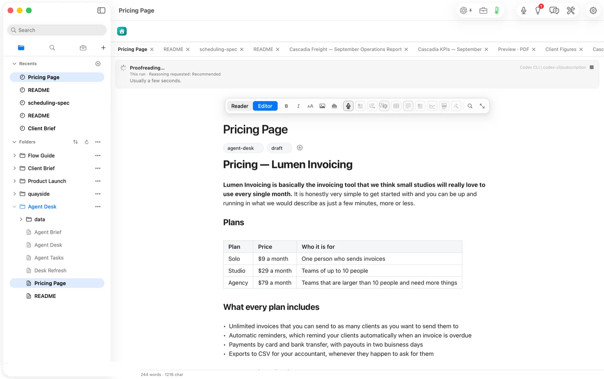
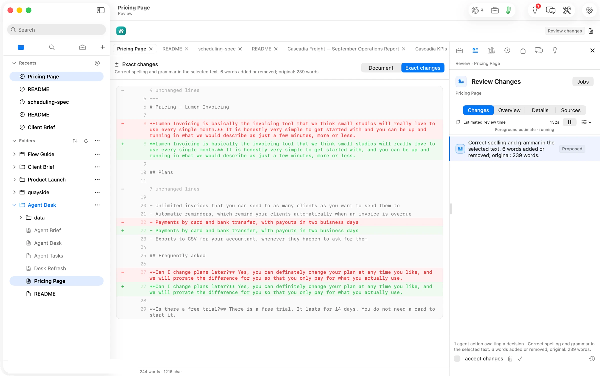
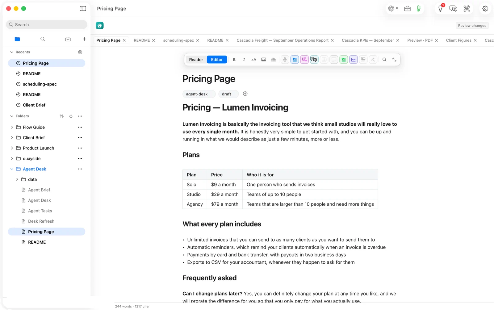
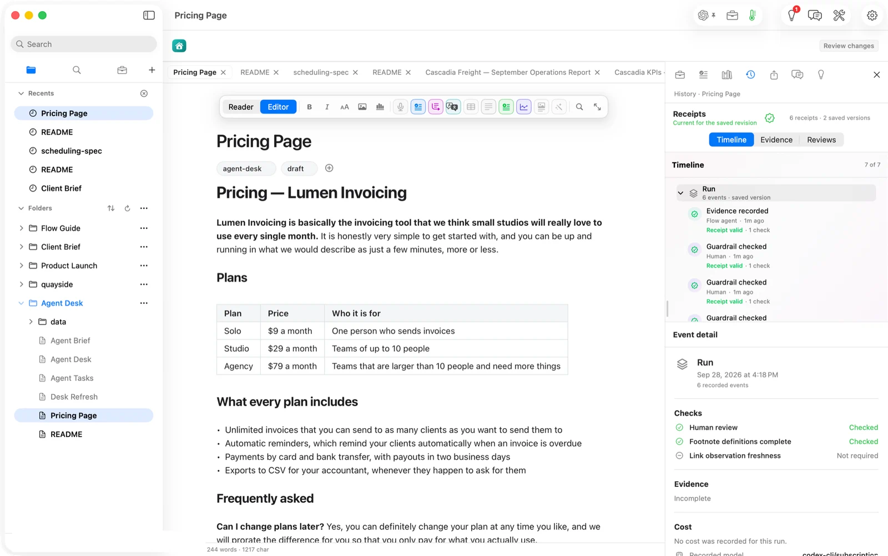

## The press release we would want to write

**People who already pay for Claude Code or Codex can now let those agents work on their documents without handing over the last word.** Orionfold Flow runs the agent you already use, in a folder you choose, with its own tools and settings. Before it starts, Flow says where the work goes, what the agent may touch and what it costs. What the agent writes comes back as a proposal you keep or throw away, and every run leaves a receipt: which model, how many tokens, which checks passed. In our test, Codex proofread a pricing page in 27 seconds. Its three changes waited in review until we approved them, and the run was included in the Codex plan we already had.

> "My agents are fast and mostly right. 'Mostly' is the problem. I want every change in front of me, and a record of who made it, before it goes near a customer."
> — *Illustrative quote, not from a customer.*

## The answer first

If you use a coding agent for writing, the risk isn't speed or cost. It's a change you never read. Flow puts review between the agent and the document, and it does this without adding a second AI bill. Three things make that true.

1. **You see the terms before the agent starts.** One sheet names the agent (Codex CLI, your subscription), the folder it may work in (*Agent Desk*, with full access), and the cost (*Included in a subscription you already pay for*). Nothing runs until you press Allow Once.
2. **What it writes waits for you.** The agent's output arrives in Review Changes. *Exact changes* shows every added and removed line. The file on disk stayed exactly as it was until we ticked *I accept changes* and approved.
3. **The run leaves a record.** History shows the run with its checks (human review: checked) and the model that did the work (`codex-cli/subscription`). The draft that came before it is recorded as the work of *an outside writer*: us, from a terminal.

## The job

You hand small writing jobs to an agent all day: tighten this page, fix the FAQ, update the changelog. The agent does them in a terminal, and you find out what changed by diffing files, if you look at all. For code there's git and a pull request. For a pricing page, a README or a client memo, usually there's nothing between the agent and the file.

What you need is what a pull request gives code: the change, shown exactly, with a yes-or-no, and a history of who wrote each version. It should come with the agent you already pay for, not a second model on a second meter.

## The walk: one task, end to end

We opened the path from Home. Flow made a working folder for it, *Agent Desk*, with a brief that sets the rules ("write only inside this folder; one task per change; cite the file you read") and a task list.

Into that folder we put a page that needed an editor: a pricing page for a made-up invoicing product, 239 words long, with two misspellings and the usual filler.

In Flow's model switcher we chose *Codex subscription*. In Settings ▸ Models, Codex CLI was already set to **Full access**, which means Codex works in the folder with its own tools, settings and permissions. Then we pressed Proofread. Before anything ran, Flow showed the terms:

That sheet does more than ask for permission. It tells you something Flow can't enforce: the agent "can read and change files Flow does not see", and "Flow records what it reports rather than what Flow watched". So you give full access knowing what it means. We pressed Allow Once at 16:13:46.

The receipt was written at 16:14:12.7: **26.7 seconds** for the run. The review opened with one proposal: *Correct spelling and grammar in the selected text. 6 words added or removed; original: 239 words.* *Exact changes* shows it line by line: a comma after "get started with", "buisness" to "business", "definately" to "definitely". Everything else is marked unchanged.

We ticked *I accept changes* and approved at 16:18:30. The file was saved one second later. Until then, the file on disk still had its old modification time: the agent's words existed only as a proposal.

## Who wrote what

History is where the path's third promise lives. For this page it shows two saved versions and six receipts. The **Run** groups the evidence Flow recorded and the checks it passed: human review checked, footnote definitions complete. The event detail names the model that did the work, `codex-cli/subscription`. Below that, the first version is recorded as saved by *an outside writer*, sixteen minutes before we opened History. That's correct: we wrote the draft from a terminal, and Flow didn't pretend to know who we were.

## What it costs, measured

| | This run |
|---|---|
| Wall time, Allow Once → receipt | 26.7 s |
| Tokens in / out | 21,831 / 485 |
| Charged by Flow | nothing; included in the Codex plan |
| Same tokens on Claude Opus 5.5 ($4 / $20 per M) | $0.097 |
| Same tokens on Claude Sonnet 5 ($2 / $10 per M) | $0.048 |

Two things stand out. First, **21,831 tokens went in for a 239-word page.** An agent run carries the agent's own working context, not just your text. On a metered API that overhead is what you pay for, about ten cents a pass on Opus-class pricing. Proofread five pages a day on a metered key and you've paid for a small subscription by the end of the month. *(That comparison is arithmetic on the prices above, not a measured bill.)*

Second, the subscription route makes that overhead someone else's problem. Flow didn't meter this run and the Codex plan absorbed it. The real saving isn't the ten cents. It's that you can run the agent as often as review needs, and the gate is your attention, not your budget.

## FAQ

**Does the agent write straight into my files?** With Full access it can: it works in the folder with its own tools. When you start it from a Flow action, as here, its answer came back as a proposal and the file stayed untouched until we approved. When an agent writes into a document Flow holds, from a terminal or anywhere else, Flow brings that change home for review with Keep and Revert.

**Which agents?** Claude Code and Codex, signed in on this Mac, on the plans you already have. Flow shows which ones it has verified in Settings ▸ Models. On our Mac, Codex was verified; Claude Code was installed but "not yet verified", so this walk used Codex.

**Is this another AI subscription?** No. The run was billed to the Codex plan. Flow's consent sheet says *Included* before you allow the run.

**What does "Full access" risk?** Flow tells you in the sheet: the agent runs with your own settings, and those decide whether its tools reach files outside the folder, the web, or apps connected to your account. Flow limits only what Flow itself does. Choose the folder with that in mind.

**Can I undo a change after keeping it?** History keeps every saved version, with the receipt of the run that made it.

## Evidence

| Claim | Value | Label | Source |
|---|---|---|---|
| Run time | 26.7 s | verified | Allow Once clicked 16:13:46 PDT (`date`); `model.route` receipt `recordedAt` 23:14:12.702Z, `Pricing Page.md.flow-receipts` |
| Tokens in / out | 21,831 / 485 | verified | same receipt, `payload.inputTokens` / `outputTokens` |
| Route | provider `codex-cli`, model `codex-cli/subscription`, `connectionSource: subscription`, locality cloud | verified | same receipt |
| Consent terms | Codex CLI · Codex subscription · Pinned; Full access · Agent Desk; Cost · Included | verified | consent sheet (shot 04) |
| Codex set to Full access; Claude Code not verified | as stated | verified | Settings ▸ Models, 16:06 PDT |
| Proposal size | 6 words added or removed; original 239 words | verified | Review Changes row (shot 07) |
| Edited lines | 3 (comma; business; definitely) | verified | Exact changes (shot 07) |
| File untouched until approval | mtime 16:02:31 during review; 16:18:31 after approve at 16:18:30 | verified | `stat -f %Sm` before and after |
| History contents | Run: 6 events; human review and footnote definitions checked; 6 receipts, 2 saved versions; earlier version by "An outside writer" | verified | History tab (shots 09, 10) |
| Recorded model in History | `codex-cli/subscription` | verified | Event detail (shot 10) |
| Charged by Flow | nothing | verified | receipt carries no cost; consent sheet "Included"; History "No cost was recorded" (#786) |
| Cloud equivalents | Opus 5.5 $0.097; Sonnet 5 $0.048 | derived | `ModelPricing.swift` v4 (verified 2026-09-22) × the token counts |
| Five pages a day ≈ a small subscription a month | ~$14.50/month at Opus 5.5 rates | derived | 5 × 30 × $0.097; no subscription price asserted |
| Terminal-run attribution "Changed outside Flow" | — | not witnessed | shipped per Guide Changelog; see reviewer notes |
| Tier needed for this path | — | unknown | dev build holds a Pro licence |
| Human review time | 131 s (Flow's estimate) | unknown as a human figure | Flow's foreground estimate; not a measured person |
