## The press release we would want to write

**Team leads can now turn the week's attachments and their own notes into a status the team can open in Word, without uploading a single file.** Orionfold Flow imports the vendor's Word update and the sprint review PDF as documents in the team's folder, reading the PDF on the Mac. You add your notes, ask what changed across the team's updates, and let an open model on the laptop summarize it all. You approve the summary word for word, and Publish writes a Word file. In our test the three model steps took about 16 seconds in total, for a model cost of $0.00.

> "Friday status used to be an afternoon of copying from six places. Now it's reading one summary and fixing one sentence."
> — *Illustrative quote, not from a customer.*

## The answer first

A weekly status is where confidential work meets a deadline: vendor terms, unreleased numbers and who is blocked. Flow keeps all of it on the Mac and still does the writing.

1. **The attachments come in as documents, read on the Mac.** File ▸ Import read the vendor's Word update in seconds, and the sprint review PDF in under four, with *On this Mac*: "free, and nothing leaves this Mac." Flow checked 16 figures against the PDF's own page.
2. **Ask and Summarize run on an open model on the laptop.** Ask answered "what changed this week" from the team's rollup in about 5 seconds. Summarize turned 259 words of notes into a six-point status in about 6 seconds. Both ran on Gemma 4 E4B through Flow Runtime.
3. **Nothing reaches the document until you approve it, and the Word file is one click.** The summary arrived as a proposal. We ticked *I accept changes*, pressed *Approve & Save*, and Publish wrote a 6.6 KB Word file with a real bulleted list.

## The job

**The job:** send the team a short, correct status every week, built from what arrived that week: a vendor update, a sprint review and what was said at stand-up.

**The usual way:** open each attachment, copy the numbers, type up your notes, paste it all into a chat assistant to tidy, and paste the result into an email. The attachments go to a cloud service on the way. We did not time the usual way, so we make no claim about it.

**The Flow way:** the path *Status from what you already have* in three steps: import the attachments and add your notes; ask what changed and summarize; publish a Word file. The model work ran on the laptop.

## Step one: bring the attachments in, add your notes

From Home, the **Teams** chip shows the path. **Open** makes the team's folder your own copy, *Team Status*, with four people's updates and a rollup document that already gathers them.

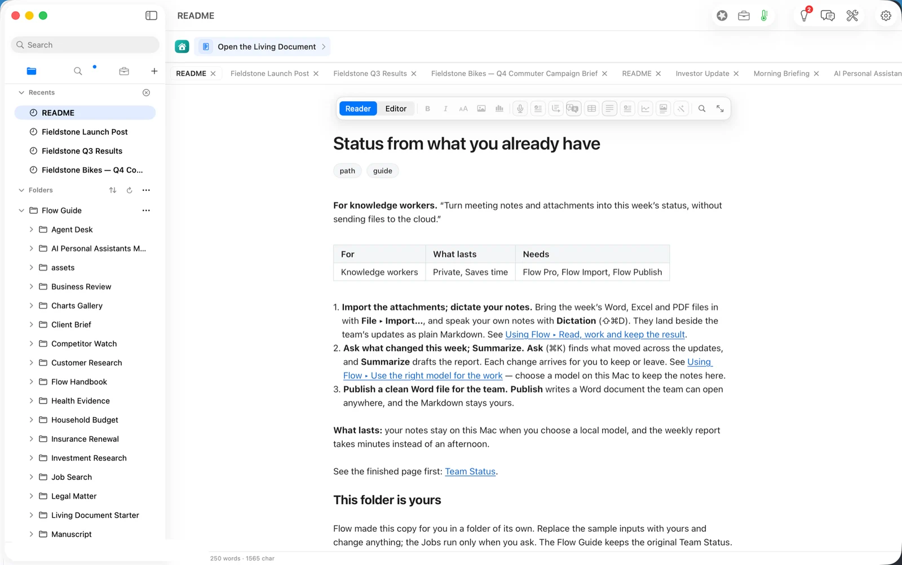

**File ▸ Import…** on the vendor's Word update showed a preview before anything was written: *2 headings, 1 paragraph, 3 list items, 1 table*. It also said what stayed behind: underline, colour and highlight on two passages. *Add to Team Status* saved it as a Markdown document, `Kestrel Payments — Integration Update`.

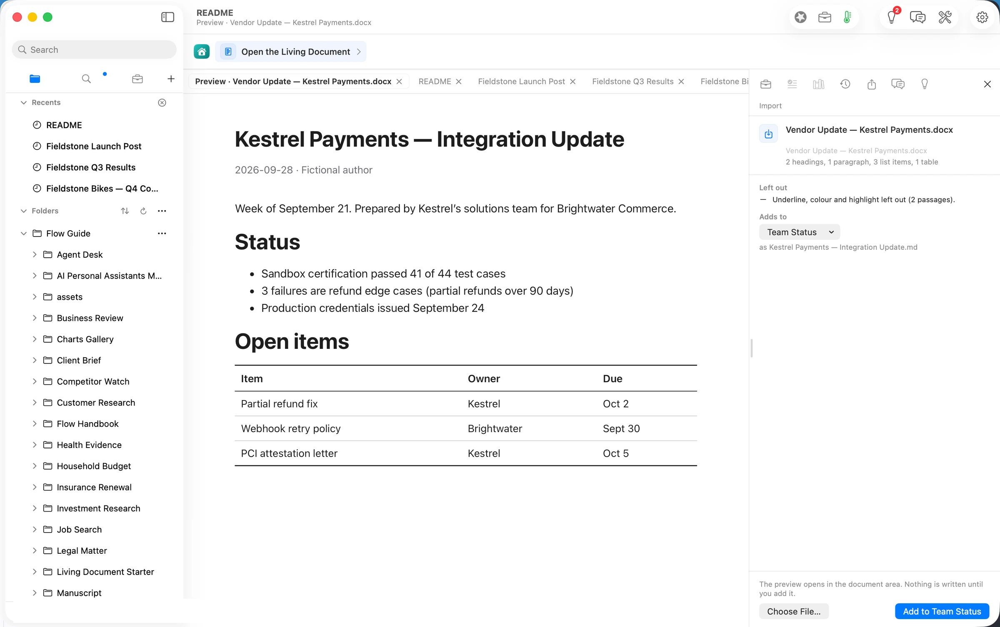

The sprint review is a PDF, and a PDF can be read by a model or on the Mac. Flow lists the choices with the reader's cost and where the pages go. For this path we chose **On this Mac**: "free, and nothing leaves this Mac".

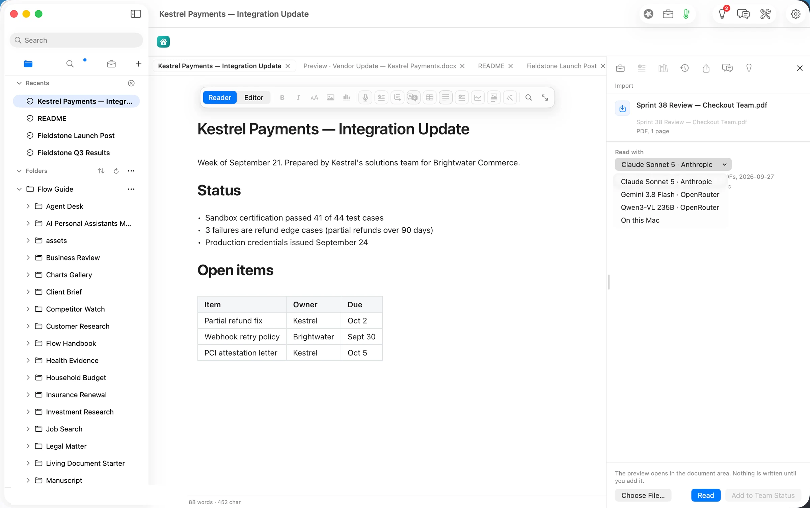

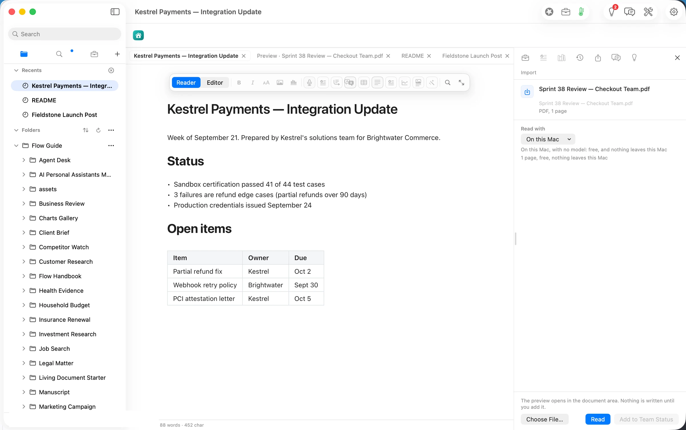

The read took under four seconds: *1 page, 1 table, 16 figures checked*. The table came through intact (Kestrel integration 5 stories done, 1 carried; saved carts 3 done; accessibility 7 done, 2 carried), and so did the headline: *3.9% conversion on the new checkout against 3.4% on the old flow, 18,240 sessions over 9 days*.

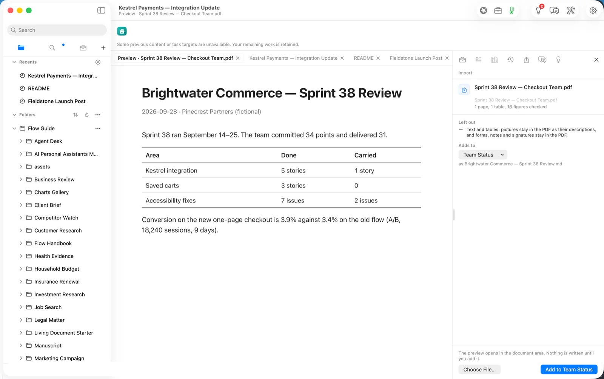

Then your notes. A new document, *My notes — week of September 28*, took the stand-up notes as dictation would enter them: who is waiting on what, the headline you want and the question to ask before quoting a number.

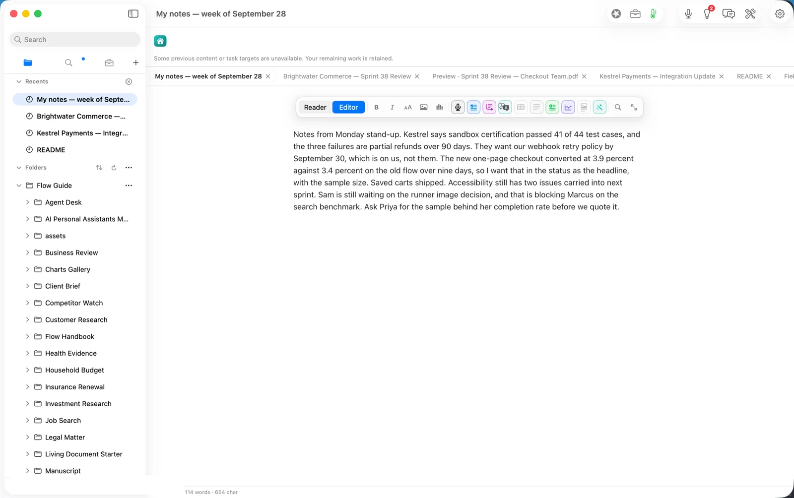

## Step two: ask what changed, then summarize

**Ask** (⌘K) answers questions about the document in front of you. Asked from the notes, it could only summarize the notes, which it said plainly.

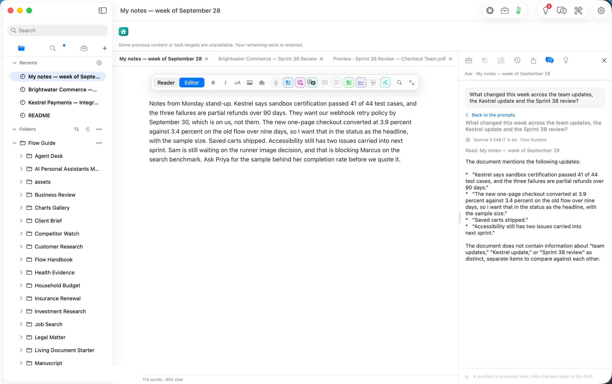
 Asked from **Team Status**, the rollup the path gives you, it listed each person's week in about 5 seconds, on Gemma 4 E4B:

- **Dana Okafor:** annual plan pricing is live in the checkout; the receipt email now carries the seat count.
- **Marcus Chen:** rebuilt the index writer; the rebuild on the 40,000-note vault is at 48 s against a 30 s target.
- **Priya Raman:** shipped the first-run walkthrough to the beta group; two of three flows measured under a minute.
- **Sam Whitaker:** the signing pipeline broke on the new runner image; two days lost to a certificate.

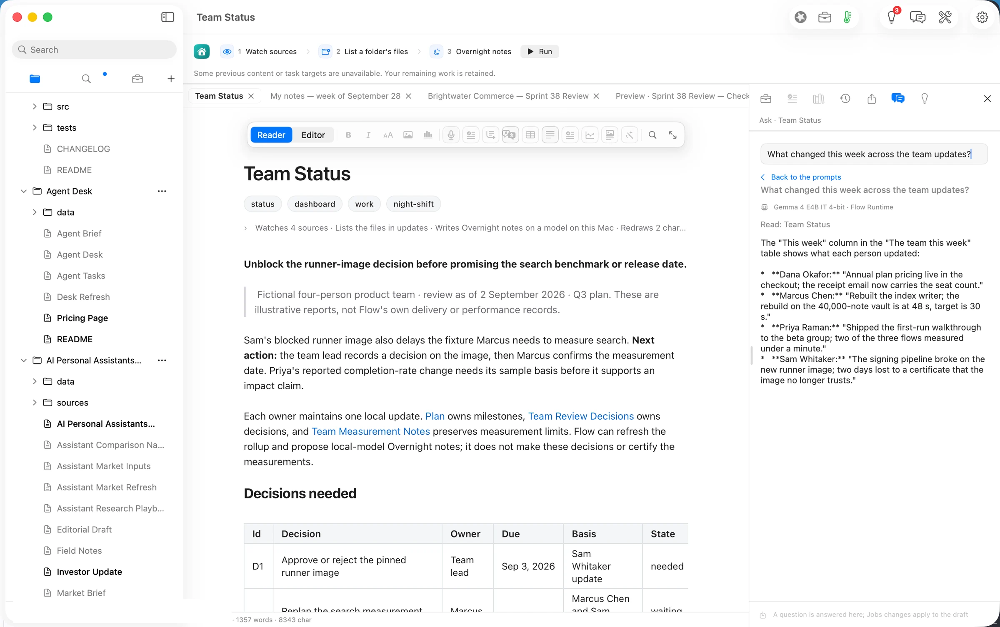

We pasted that answer and the attachments' facts into the notes (259 words) and ran **Agency ▸ Summarize**. In about 6 seconds it proposed a six-point status. Nothing changed until we approved it.

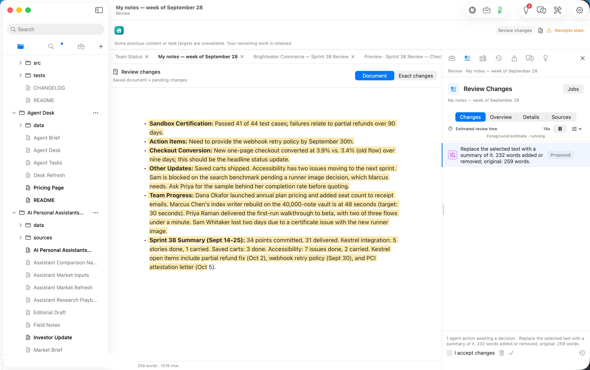

We checked every figure against its source: 41 of 44 test cases, 3.9% against 3.4% over nine days, 34 points committed and 31 delivered, 5 done and 1 carried, 7 done and 2 carried, 48 s against 30 s, and the three Kestrel dates (September 30, October 2, October 5). All held. One sentence was wrong about *who*: it said Sam is blocked on the search benchmark, when Sam's runner image is what blocks Marcus. That is the kind of line a review exists to catch. We approved the summary to show the flow; a team lead would fix that line first.

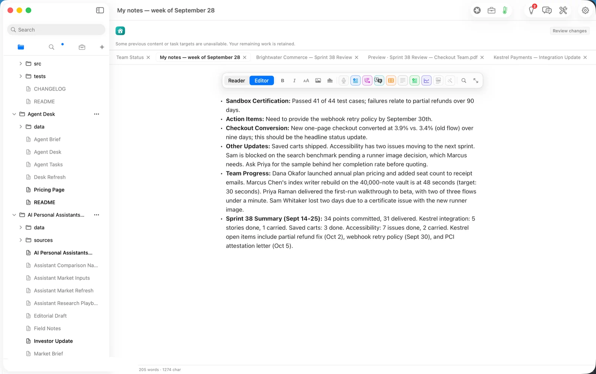

## The deliverable

**File ▸ Publish… ▸ Word** shows a preview first, including an *About this document* note with the date, what made it and a digest of the source. *Save Word File…* wrote `My notes — week of September 28.docx`: 6,593 bytes, a real Word bulleted list, 230 words including the note. It opens in Word, Pages or Google Docs, and the Markdown stays in the folder.

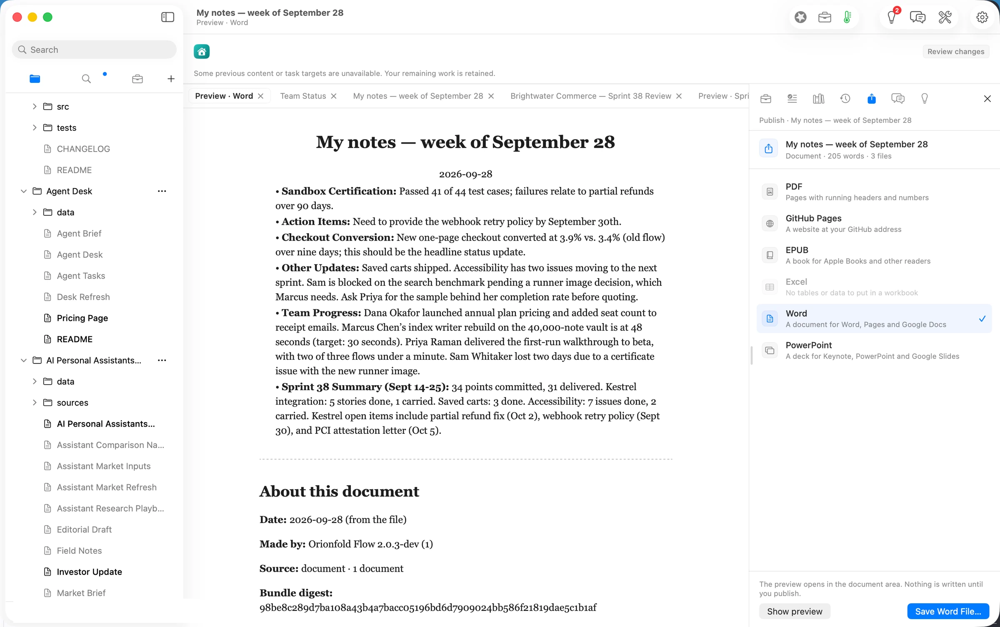

## What it costs, measured

| | Machine time | Tokens in / out | Model cost |
|---|---|---|---|
| Import the Word update (Flow's reader) | seconds | none | $0.00 |
| Read the PDF on this Mac | under 4 s | none | $0.00 |
| Ask, from the notes | ~5 s | 250 / 145 | $0.00 |
| Ask, from Team Status | ~5 s | 2,440 / 151 | $0.00 |
| Summarize | ~6 s | 422 / 320 | $0.00 |
| **Same tokens on Claude Opus 5.5** ($4 / $20 per M) | | 3,112 / 616 | **$0.025** |
| **Same tokens on Claude Sonnet 5** ($2 / $10 per M) | | | **$0.012** |
| The PDF read on Claude Sonnet 5 instead | | | **$0.0097** (measured) |

The honest reading: the open model saved about three cents. Cost is not the reason to run this on the laptop. The reason is that a vendor's integration status, an unreleased conversion number and who is blocked never left the Mac.

## FAQ

**Does it work offline?** The steps we ran did: the Word and PDF reads use Flow's own reader, and Ask and Summarize ran on a model on the laptop. Choose a model on this Mac in Settings to keep it that way.

**Can Ask read every file in the folder?** Ask answers about the document in front of you. The path's *Team Status* rollup already gathers the team's updates, so ask there.

**Will the summary be right?** Its numbers were, all 22 of them. One sentence got the blocker the wrong way round. You approve the exact words, so read it as you would a colleague's draft.

**Can I use a cloud model?** Yes, and Flow shows the model and its estimated cost first. For this status that would have been one to three cents, plus about a cent for the PDF.

**What does it need?** Flow Pro, with Flow Import and Flow Publish: $10 a month or $96 a year each. Markdown documents are never part of a plan.

## Evidence

| Claim | Value | Label | Source |
|---|---|---|---|
| Word import | 2 headings, 1 paragraph, 3 list items, 1 table; underline/colour/highlight left out (2 passages) | verified | Import task 22:32:34 PDT (shot 03); added 05:33:10.3Z |
| PDF read on this Mac | Read 22:47:36 PDT → result on screen by 22:47:40; 1 page, 1 table, 16 figures checked; reader "flow" | verified | shot 06; receipt 05:48:10.8Z `figuresChecked 16` |
| PDF table intact | `\| Saved carts \| 3 stories \| 0 \|` and the other two rows | verified | `Brightwater Commerce — Sprint 38 Review.md` read 22:48 |
| Cloud PDF read | claude-sonnet-5, $0.0097; set aside | verified | receipt (`~/flow-staging/0247-raw/04/cloud-read/`) |
| Notes | 114 words, entered 22:49:56 PDT | verified | file word count; shot 07 |
| Ask, from the notes | pressed 22:50:48 → receipt 05:50:53.1Z (≈5 s); gemma-4-e4b-it-4bit, Flow Runtime, 250 / 145 | verified | notes receipts |
| Ask, from Team Status | pressed 22:53:24 → receipt 05:53:29.3Z (≈5 s); gemma-4-e4b-it-4bit, 2,440 / 151 | verified | `Team Status.md.flow-receipts` |
| Summarize | pressed 22:55:19.7 → proposal 05:55:25.6Z (≈6 s); gemma-4-e4b-it-4bit, 422 / 320 | verified | notes receipts |
| Summary figures | all 22 digit runs found in the sources, and read against them in context; one wrong attribution (Sam/Marcus) | verified | script over the approved text vs the imports and `updates/*.md`, 23:05 PDT; read 22:57 PDT |
| Approval | I accept changes + Approve & Save, 05:56:11.6Z; 205 words after | verified | notes receipts; shot 11 |
| Word file | 6,593 B, 22:57:58 PDT; Word list (numPr); 230 words with the provenance note | verified | `ls -la`; python-docx read |
| Model cost | $0.00 | verified | local route for every model call used here |
| Cloud equivalents | Opus 5.5 $0.025; Sonnet 5 $0.012 | derived | `ModelPricing.swift` (Opus 5.5 $4/$20, Sonnet 5 $2/$10 per M) × 3,112 in / 616 out |
| Price of Pro and add-ons | $10/month or $96/year each | verified | Home ▸ Add-ons (shot 01) |
| The usual way's time | — | assumed | not measured |
| Human review time | — | unknown | not measured for a person |
