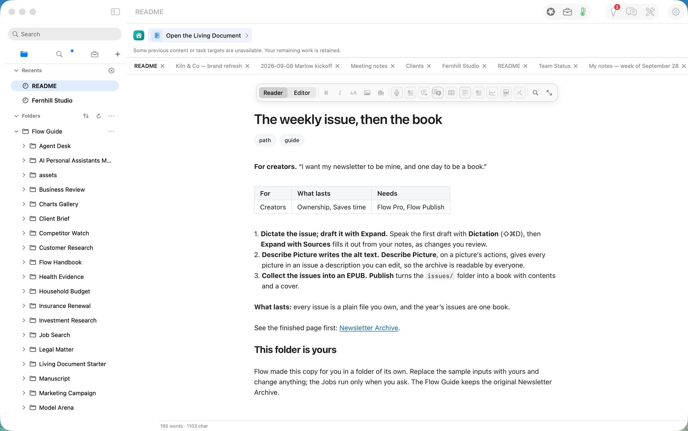
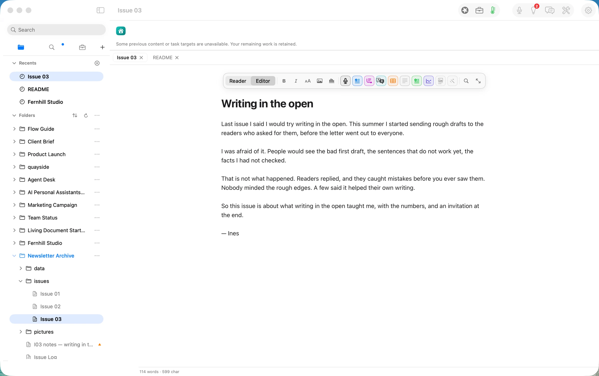
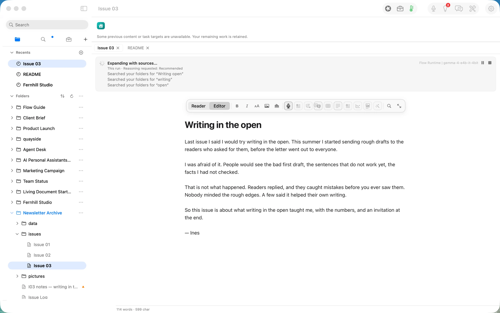
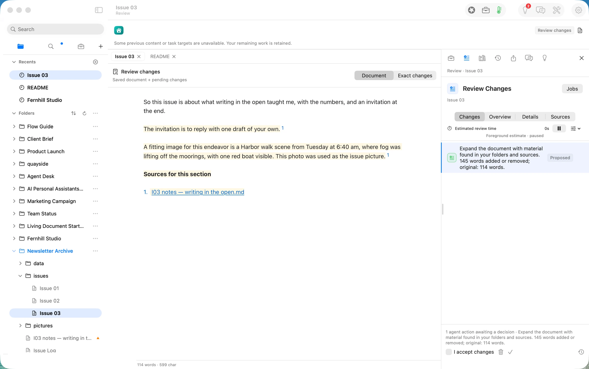
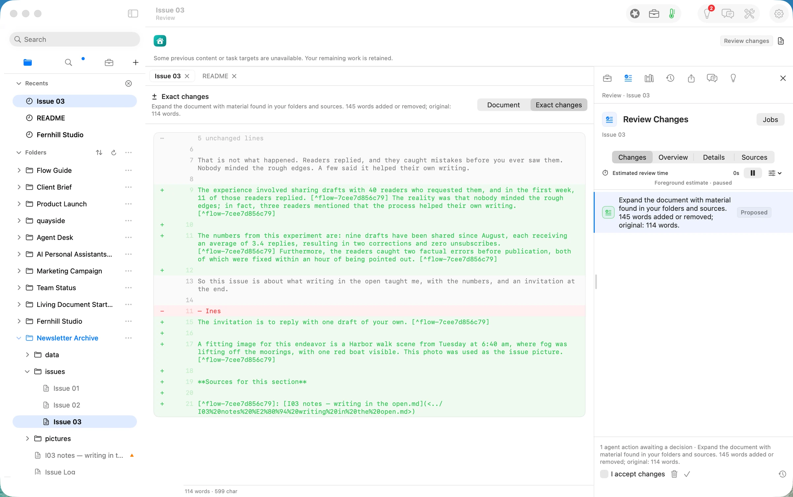
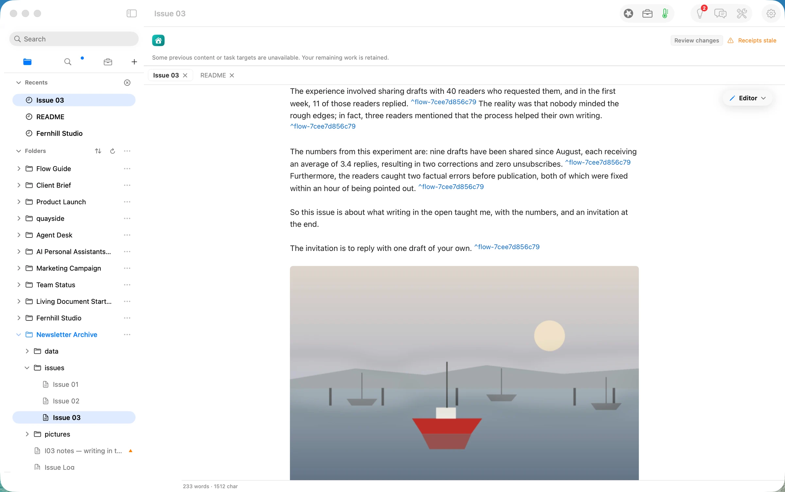
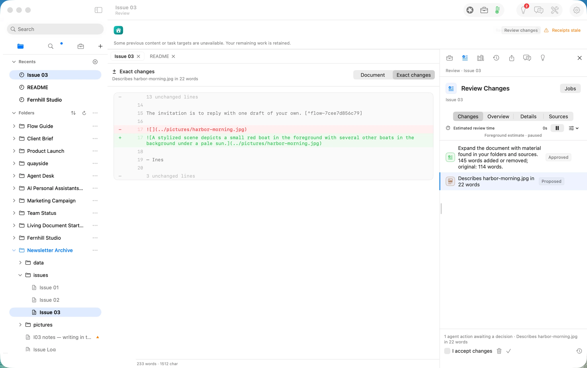
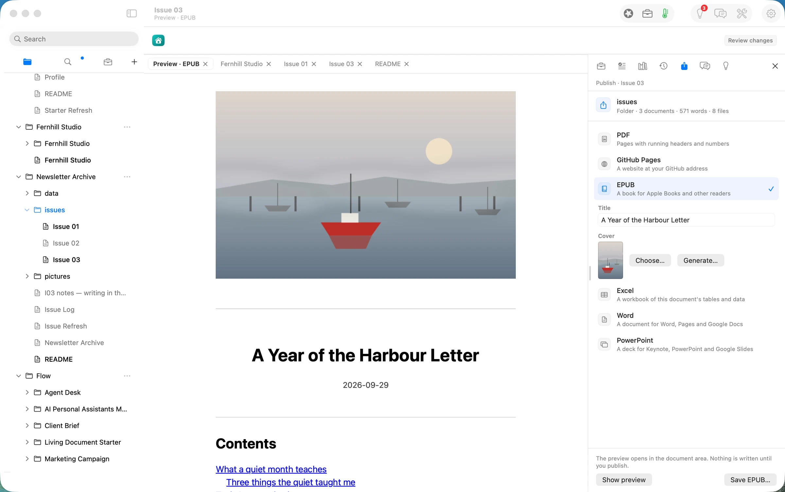
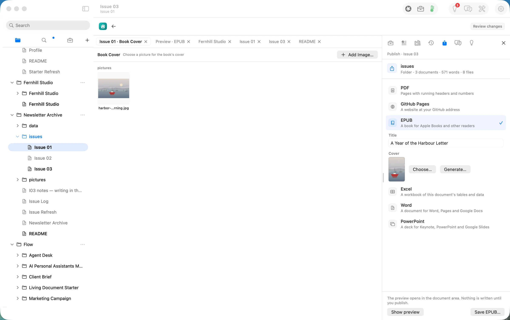

## The press release we would want to write

**Newsletter writers can now draft each issue by voice, keep every issue as a plain file they own, and turn a year of them into a book without leaving the app.** Orionfold Flow takes a spoken first draft, fills it out from the writer's own notes as a change they approve, writes a description for every picture, and collects the issues folder into an EPUB with a contents page and a cover. In our test, both AI steps ran on a model on the laptop in about 18 seconds together, for a model cost of $0.00, and every figure the model added matched the writer's notes.

> "The newsletter platform can change its terms. My issues are files in a folder, and the year is a book I can hand to someone."
> — *Illustrative quote, not from a customer.*

## The answer first

A newsletter usually lives on the platform that sends it. This path keeps the writing on your side: each issue is a Markdown file, and the year's issues become one book.

1. **Speak the draft, then fill it out from your notes.** A 114-word spoken draft became a 267-word issue with *Expand with Sources*. It read one notes file, added seven figures, cited the notes for each one, and waited for approval. Every figure matched the notes.
2. **Every picture gets a description.** *Describe Picture* wrote the harbour picture's alt text in about 3.5 seconds, as a change you approve.
3. **The folder becomes a book.** *Publish Folder* turned the three issues into an EPUB: a cover taken from the issue's own picture, a title page, a contents page and one chapter per issue.

## The job

**The job:** send a short weekly letter to a few hundred readers, keep every issue somewhere that will still open in ten years, and one day collect the year into something you can give away or sell.

**The usual way:** write in the newsletter platform's editor, which keeps the archive on its servers, and later copy the issues out one by one into a book tool. We did not time the usual way, so we make no claim about it.

**The Flow way:** the path *The weekly issue, then the book* in three steps: dictate the issue and draft it with Expand, let Describe Picture write the alt text, collect the issues into an EPUB.

## Step one: dictate the issue, then fill it out with Expand

The path's own copy holds an `issues/` folder with two earlier issues, a notes file for the third, and a `pictures/` folder. **Open** on Home gives you your own copy of the guide and its folders.

*New Document* in `issues/` opened Issue 03 in the editor. The first draft was spoken with **Dictation** (⇧⌘D): four short paragraphs and a sign-off, 114 words.

**Agency ▸ Expand with Sources** searched the folders for material on the draft's subject and found the notes file. The run line named the model: *Flow Runtime | gemma-4-e4b-it-4bit*, an open model running on the laptop.

About 14 seconds later the result came back as a proposal, not an edit: 145 words added or removed from a 114-word original, highlighted in the page and listed in **Review Changes**, with the notes file cited under *Sources for this section*.

**Exact changes** shows what the model added: the 40 readers and 11 replies in the first week, the three readers it helped, 9 drafts since August at 3.4 replies each, 2 corrections, 0 unsubscribes, and the two errors fixed within the hour. Each figure carries a footnote to the notes file, and each one matches it. The draft's own sentences stayed as spoken.

It also took two liberties that a writer would fix by hand. It dropped the "— Ines" sign-off, and it turned the note *"use it as the issue picture"* into a sentence about the picture instead of the picture itself. We approved the proposal, then replaced that sentence with the harbour picture and put the sign-off back.

## Step two: Describe Picture writes the alt text

A picture dropped into Markdown has no description. Readers using a screen reader hear only the file name. **Describe Picture**, on the picture's actions, sent the picture to the same model on the laptop. About 3.5 seconds later it proposed a 22-word description: *"A stylized scene depicts a small red boat in the foreground with several other boats in the background under a pale sun."* It is accurate, and it is written into the Markdown where any reader, feed or book will carry it.

We approved it. The issue was finished: 254 words, one picture with its description, every added figure sourced.

## Step three: collect the issues into an EPUB

With the `issues/` folder selected, **File ▸ Publish Folder…** opened the Publish panel on the folder itself: *3 documents · 571 words · 8 files*. We chose **EPUB** and typed the book's title, *A Year of the Harbour Letter*. The cover came from the harbour picture. The preview on the left is the book as it will read: the cover, a dated title page, then the contents with one chapter per issue.

**Choose…** beside the cover opens the **Book Cover** gallery. It lists the pictures the book's documents already use, so the cover can be one you have already published. *Add Image…* takes a new one from disk.

The panel says it plainly: *"The preview opens in the document area. Nothing is written until you publish."* **Save EPUB…** wrote the book.

## The deliverable

The deliverable is two things that last.

- **The issues, as files.** `issues/Issue 01.md`, `Issue 02.md` and `Issue 03.md`: plain Markdown that any editor opens, the picture in `pictures/`, and beside Issue 03 the record of what the model did (`.flow-receipts`) and its review state (`.flow-review`).
- **The book.** `A Year of the Harbour Letter.epub`, 120 KB. Inside: the cover, a title page, a contents page, three chapters named for the issues' own headings (*What a quiet month teaches*, *Tools I stopped using*, *Writing in the open*), the harbour picture with its description, and a colophon. It opens in Apple Books and any other EPUB reader.

## What it costs, measured

| | Machine time | Tokens in / out | Model cost |
|---|---|---|---|
| Dictate the draft | as long as you speak | none | $0.00 |
| Expand with Sources (Gemma 4 E4B on this Mac) | ~14 s | 4,031 / 407 | $0.00 |
| Describe Picture (Gemma 4 E4B on this Mac) | ~3.5 s | 403 / 23 | $0.00 |
| Publish the folder as an EPUB | seconds | none | $0.00 |
| **Same tokens on Claude Opus 5.5** ($4 / $20 per M) | | | **$0.026** |
| **Same tokens on Claude Sonnet 5** ($2 / $10 per M) | | | **$0.013** |

The honest reading: at a few cents an issue, cost is not the reason to write this way. The reasons are that the issues are files you keep whatever platform you send them with, that the model runs on your laptop, and that nothing it writes lands until you have read it.

## FAQ

**Does Flow send the newsletter?** No. Flow writes and keeps the issues and makes the book. You send each issue with whatever service you use now.

**Do I have to use my voice?** No. Dictation is one way to get a first draft down. Typing works the same, and so does pasting a draft from elsewhere.

**Will Expand make things up?** It fills out the draft from the files it finds and footnotes each addition to its source, and the whole change waits for your approval. In this walk every added figure matched the notes. It did drop a sign-off and misread one note, which is why the exact change is shown before anything is saved.

**Does it work offline?** Writing, dictation, publishing the book and both AI steps above did, because the model ran on the laptop. Keep *this Mac first* in Smart Routing to stay that way.

**What does it cost?** Reading, writing, searching, organising and exporting are free forever. The AI steps are Flow Pro, and the EPUB is Flow Publish. Flow Pro includes 10 Pro Days to start, then costs $10 a month or $96 a year.

## Evidence

| Claim | Value | Label | Source |
|---|---|---|---|
| Inputs | I01, I02 by "Ines", I03 notes (6 bullets), `harbor-morning.jpg` 1600×1000 | verified | `~/flow-demo/inputs/08-newsletter/` listing; generated for the walk |
| Spoken draft | 114 words, 599 characters | verified | status bar, shot 03 (build 0249-10, 12:05 PDT) |
| Expand with Sources | pressed 12:05:38 PDT → `model.route` 19:05:51.583Z (≈14 s); gemma-4-e4b-it-4bit, flow-runtime, localMachine, 4,031 / 407, reasoning off | verified | `issues/Issue 03.md.flow-receipts` |
| Size of the change | 145 words added or removed; original 114 words | verified | Review Changes, shots 05–06 |
| Figures faithful | 40, 11, first week, three, 9, August, 3.4, 2 corrections, 0 unsubscribes, two errors, within the hour — all in the notes | verified | read against `I03 notes — writing in the open.md` about 17:08 PDT |
| Sign-off dropped | "— Ines" removed in the proposal | verified | shot 06; ISSUES #813 |
| Approved length | 267 words after approval | verified | STATE record, 12:07:58 PDT |
| Describe Picture | ≈12:10:51 PDT → receipt ≈3.5 s; gemma-4-e4b-it-4bit, localMachine, 403 / 23; picture 1600×1000 sent as 1568×980 | verified | `model.route` receipt (`pictures[0]`) |
| Alt text | 22 words, accurate to the picture | verified | shot 08; the picture read by eye |
| Finished issue | 254 words | verified | `wc -w "Issue 03.md"` about 17:08 PDT |
| Publish panel | "Folder · 3 documents · 571 words · 8 files"; EPUB; Title; Cover | verified | shot 09 (build 0249-14, 17:06:28 PDT) |
| Book Cover gallery | lists `harbor-morning.jpg` from `pictures` | verified | shot 10 (build 0249-14, 17:07:04 PDT) |
| The book | 120,105 B; `dc:title` "A Year of the Harbour Letter"; `images/cover.jpg` + the chapter picture; title, contents, 3 chapters, colophon | verified | saved 16:06 PDT on 0249-12; `unzip` + `grep dc:title` about 17:08 PDT |
| Model cost | $0.00 | verified | local route (`locality: localMachine`) on both runs |
| Cloud equivalents | Opus 5.5 $0.026; Sonnet 5 $0.013 | derived | `ModelPricing.swift` (Opus 5.5 $4/$20, Sonnet 5 $2/$10 per M) × 4,434 in / 430 out |
| Free and Pro | free forever for reading, writing, searching, organising, exporting; Pro adds the AI, 10 Pro Days to start; $10/month or $96/year; EPUB needs Flow Publish | verified | path README "Needs: Flow Pro, Flow Publish" (shot 02); Guide Changelog.md |
| Opens in Apple Books | — | assumed | not opened on this walk; standard EPUB 3 structure |
| The usual way's time | — | assumed | not measured |
| Human writing time | — | unknown | not measured for a person |
