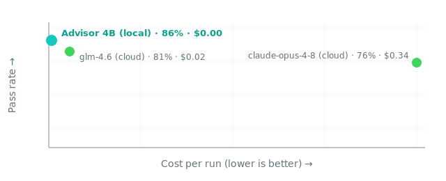
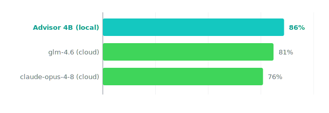

The quiet failure in a memory-backed model is a confident answer built on nothing. This test is about catching that before it reaches you.

## The test we locked

Twenty-one hard questions on a fixed set of documents. Some of them are traps: the documents do not hold the answer, so the only honest move is to refuse. A passing model looks at what it was given, decides the question is not supported, and says so plainly instead of guessing. We froze the test before we trained, so the score cannot have been shaped to it later.

## What happened

*The local Advisor sits top-left: it passes the most and costs the least. The bigger cloud model is far to the right, where each run costs real money for a lower score.*

*Same picture, just the pass rate. The 4B model you run for free leads the two cloud models.*

The local 4B Advisor passed 18 of 21 overall and ran for free. On the trap questions, where the documents did not support an answer, it refused rather than fill the gap with something that sounded right.

| Model | Where it runs | Pass rate | Cost per run |
| --- | --- | --- | --- |
| Advisor 4B (ours) | Local, on your machine | 86% (18/21) | $0.00 |
| z-ai/glm-4.6 | Cloud | 81% (17/21) | $0.02 |
| claude-opus-4-8 | Cloud | 76% (16/21) | $0.34 |

## The honest part

We need to be careful about what this proves. The test measures refuse-when-unsupported: does the model decline when the documents do not back the question? It does not measure a model grading how good its own memory is, or scoring its own recall confidence. That gate does not exist in this run, so we are not claiming it. The real, narrower behavior is still the one that matters: the model checks what it can answer from what it was handed, and stops when the answer is not there.

Refusing is also not the same as being right. A model can refuse well and still reason poorly when it does answer. What this removes is one specific trap: the confident answer the model never should have given.

## A few of the questions

Straight from the run, failures first, in the order the bench scored them. We do not reorder to flatter.

| # | The question | What we wanted | What the model did | Result |
| --- | --- | --- | --- | --- |
| 4 | How many H100s does a full fine-tune of a 100B model need? | A cited answer from the source | Refused, though the answer was actually there | fail |
| 8 | Which doc defines how the Arena cockpit is built? | Route to the right guide | Answered but pointed at the wrong place | fail |
| 8 | Same routing question, bigger cloud model | Route to the right guide | Also pointed at the wrong place | fail |
| 0 | Did the small MoE or the dense model win for serving? | The MoE won | Correctly named the MoE | pass |
| 0 | Same serving question, second pass | The MoE won | Correctly named the MoE | pass |

## Why this can be trusted

The test was locked before any training, so it cannot have been tuned to. The run carries a config hash, and the same inputs reproduce the same hash, so anyone can rerun it. We show the misses next to the wins. One of those misses is worth dwelling on: on question 4, the model refused a question whose answer was in the documents. It erred toward caution, not invention. We left it in, because a receipt that hides its over-cautious miss is not honest about how the model behaves.

## Rerun it

Pull the locked governance bench and read the refusal gate. Feed the model a question the documents do not support, and check that it refuses rather than answering as if the note were solid. Config hash `f63fde7be801` reproduces these exact inputs.
