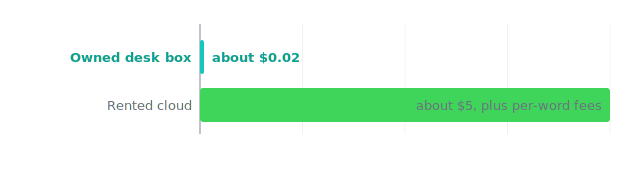

The cheapest part of this whole story is the electricity.

## The test we locked

We queued fifty experiments to run one after another with no person watching. A local model drove the loop: it proposed a small change to a training setup, ran it, checked whether the change helped, and either kept it or threw it away, fifty times in a row.

We measured two plain things: how long the whole run took on the desk box, and how much electricity it pulled from the wall.

## What happened

*Same loop, same work. On a box you own it costs pennies. On rented chips it costs dollars, and every word in and out leaves your machine to get there.*

The box finished all fifty in 73 minutes. It drew about 0.07 kilowatt-hours over that time, which at a normal home rate is about two cents.

The loop was real work, not a screensaver. Of the fifty tries, it kept 8 that made the training a little better and threw away 42 that did not. The best keep improved the score by about 0.93%. Nothing crashed, and nothing left the machine.

The same loop on rented cloud chips runs to about five dollars of compute, plus a fee for every single word the model reads and writes. That is roughly 250 times the cost of the desk run, before you count the per-word fees. And every one of those words has to leave your machine to get billed.

## The honest part

Two cents is the power bill, not the price of the box. The point is not that this work is free. It is that once you own the box, the cost of trying something drops so low that you stop rationing your own curiosity. A run that costs a fraction of a penny is a run you do not have to justify to anyone.

We will also be straight about the result itself. A 0.93% gain over fifty tries is a small, useful signal, not a breakthrough, and each try was a short timing run rather than a full training. The win we are standing behind is the cost of asking the question, not the size of this one answer.

This ran on Orionfold Arena, the local-AI cockpit, on a desk box you can own. [See Arena](/software/arena/).

## Why this can be trusted

Both numbers come straight off the machine. The 73 minutes is the wall-clock the run log recorded, and the two cents is measured power, not an estimate of what it should have used. We counted the keeps and the throwaways honestly, 8 and 42, instead of reporting only the tries that worked.

We also named the limits of the run in plain sight: the gain was small, the tries were short, and the safety rails never had to stop anything. None of that changes the one thing the receipt is about, which is that the loop ran itself, overnight, for the price of two pennies, without sending a word anywhere.

## Rerun it

Queue the same batch overnight, then read the wall-clock time off the run log and the power draw off the meter. Work out the kilowatt-hours and multiply by your rate. Then price the same batch on rented cloud chips, paying per word in and out, and put the two numbers side by side. If your numbers do not match ours, tell us.
