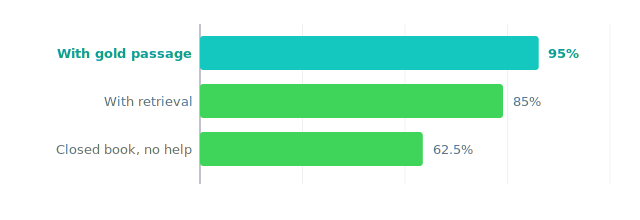

An answer is one thing. The path to it is what tells you whether the next answer will hold.

## The test we locked

We gave the model patent questions that take more than one step. A passing model shows those steps in order, so a person can follow the logic and find where it would break, instead of trusting a single answer that appeared with no path behind it.

On the multiple-choice questions, this model writes out its thinking first: a few thousand characters where it walks through each option, knocks out the wrong ones, and lands on a letter. That working is right there in the output to read.

To check that the visible steps actually track the answer, we ran the same questions three ways: with no help, with a search step that pulls in source documents, and with the exact right passage handed to the model. If the reasoning is real, more and better source should move the score in a clear direction.

## What happened

*The score climbs in a clean line as the model gets better source. That is what real reasoning looks like from the outside: it uses what you give it, instead of guessing the same way no matter what.*

With no help, the model got 62.5% of the multiple-choice questions right from what it already knew. Add a search step that pulls in source documents and it rose to 85%. Hand it the exact right passage and it reached 95%. The steps it shows are readable the whole way, so on any single question you can follow its working and see whether the answer follows from it.

This is the star on the "shows step-by-step reasoning" row, for both this model and Kepler on its own space-math problems. The worked examples live on each model's page.

## The honest part

Shown steps can still be wrong steps, and a clean climb in score is not the same as legal expertise. This is a baseline measurement, taken before any fine-tuning. At 62.5% with no help, the model knows some patent rules of thumb better than a coin flip, but that is well below what you would call a passing grade for the field.

We will be straight about one more thing. On the structured-argument questions the model scored full marks, but that score checks the shape of the answer, the ordered issue, rule, analysis, and conclusion, not whether the law it cites is actually the right law. That is a property of how the answer is laid out, not proof that the reasoning is correct. The receipt here is narrower and real: the model shows its work, and its score moves in a checkable way with the source you give it.

This ran on Orionfold Arena, the local-AI cockpit, on a desk box you can own. [See Arena](/software/arena/).

## Why this can be trusted

The climb from 62.5% to 85% to 95% is the tell. A model that was guessing would score about the same no matter what source it was given. This one improves in a clear line as the source gets better, which is what it looks like when a model is actually using what it reads. And because the steps are printed before the answer, you can check that link yourself on any single question.

We also named the limits in plain sight: this is a pre-fine-tuning baseline, the no-help score is below a passing grade, and the perfect score on structured arguments grades format, not legal correctness. None of that is hidden behind the headline. The claim we stand behind is that the path is visible and the score is checkable, not that the model is an attorney.

## Rerun it

Give the model a multi-step patent question and read the steps it shows before the answer. Then run it three ways on the same set of questions: with no help, with a search step that pulls in source documents, and with the exact right passage handed to it. Score each run and check that the steps you can read line up with the answer it lands on. If your numbers do not match ours, tell us.
