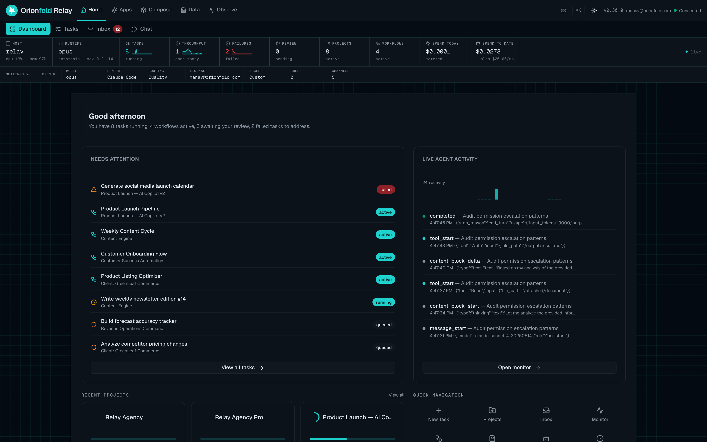
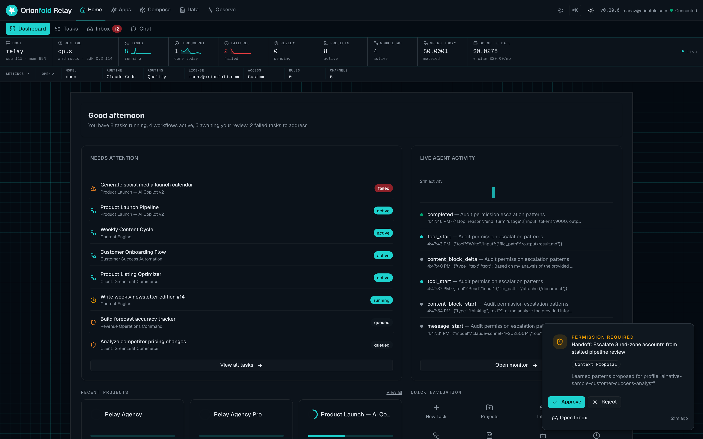
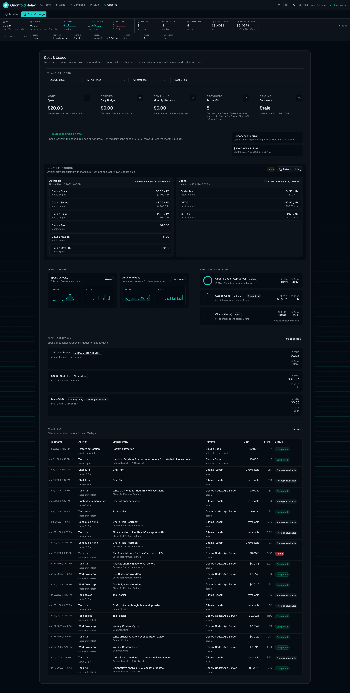

The AI you rent to run your client work can see your client work.

I could not stop thinking about that. I run small jobs for clients through AI agents. The agents are good. But the tool I rented to run them phones home, and the people who own that model can watch where the value shows up. So the better my workflows got, the more I was handing my best ideas to the same place that rents a tool to my rival. You cannot rent judgment from a landlord who also rents to the person across the street.

That is the trap. It does not feel like a trap at first, because the tool just works. It feels like a trap later, once the work is worth stealing.

## So I built the opposite

Orionfold Relay is a free, open engine you run on your own machine. You start it with one line:

```
npx orionfold-relay
```

Then you point it at the models you already use. Local Ollama on your own box. Claude. Codex. They are swappable underneath, so you are never locked to one. Relay is the layer on top that turns those models into real, billable client work, and keeps that work on your side of the door.

Nothing leaves your machine. You own it forever. And because it runs where you can watch it, you can verify every network call yourself. I am not asking you to trust me. I am handing you the thing that lets you check.



## Every result waits for you

Here is the part I like most. An agent does not get to act on its own. Every result it produces waits at an approval gate until you say yes. You give each agent its own tool permissions. You set a budget it cannot cross. There is an audit trail of what ran and what it cost. Nothing reaches a client until you release it.

That is the difference between an agent that helps you and an agent that speaks for you without asking. I wanted the first one.



## See the real margin

Client work is a business, so the number that matters is what each client actually costs you to serve. Relay rolls that up on its own. For one of my clients it reads five cents. Six runs, 32,150 tokens, five cents of model cost, against a retainer of about 500 dollars a month.

Sit with that. Five cents of compute inside a 500 dollar engagement, and I can see it per client, in the cockpit, without adding it up by hand. No other agent tool I have used shows you real per-client margin. Most of them are the reason you cannot see it, because the cost lives on someone else's bill.



## Own your vertical

Relay ships with an Agency Pack today. That is the present, working capability, not a promise. The pack is how you own a vertical: the workflows, the guardrails, and the per-client audit built for the kind of clients you serve, so you are not wiring it from scratch.

The pack rail is the bigger idea. As the packs grow, you pick the one that fits your field and run your practice on it, on hardware you own, with the margin in plain view.

## We are live on Product Hunt today

The free engine is the front door. Run `npx orionfold-relay` and you are going in a minute, no sales call, no wall. The rest is a click away on the [Relay page](/relay/) when you want the packs.

And today is launch day. Orionfold Relay is live on Product Hunt right now, and I would love for you to come see it and tell me what you think. Not a favor, a look. If you run client work through AI, I want to know the first workflow you would put behind an approval gate, and whether you would trust a shared model to see it.

Keep the data. See the margin. That is the whole idea.
